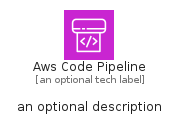
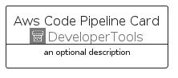
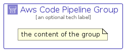

# AwsCodePipeline


```text
aws/Architecture/DeveloperTools/AwsCodePipeline
```

```text
include('aws/Architecture/DeveloperTools/AwsCodePipeline')
```


| Illustration | AwsCodePipeline | AwsCodePipelineCard | AwsCodePipelineGroup |
| :---: | :---: | :---: | :---: |
|  |  |  |  |


## Sprites
The item provides the following sriptes:

- `<$AwsCodePipelineXs>`
- `<$AwsCodePipelineSm>`
- `<$AwsCodePipelineMd>`
- `<$AwsCodePipelineLg>`


## AwsCodePipeline

### Load remotely
```plantuml
@startuml
' configures the library
!global $LIB_BASE_LOCATION="https://raw.githubusercontent.com/tmorin/plantuml-libs/master/distribution"

' loads the library's bootstrap
!include $LIB_BASE_LOCATION/bootstrap.puml

' loads the package bootstrap
include('aws/bootstrap')

' loads the Item which embeds the element AwsCodePipeline
include('aws/Architecture/DeveloperTools/AwsCodePipeline')

' renders the element
AwsCodePipeline('AwsCodePipeline', 'Aws Code Pipeline', 'an optional tech label', 'an optional description')
@enduml
```

### Load locally
```plantuml
@startuml
' configures the library
!global $INCLUSION_MODE="local"
!global $LIB_BASE_LOCATION="../../.."

' loads the library's bootstrap
!include $LIB_BASE_LOCATION/bootstrap.puml

' loads the package bootstrap
include('aws/bootstrap')

' loads the Item which embeds the element AwsCodePipeline
include('aws/Architecture/DeveloperTools/AwsCodePipeline')

' renders the element
AwsCodePipeline('AwsCodePipeline', 'Aws Code Pipeline', 'an optional tech label', 'an optional description')
@enduml
```

## AwsCodePipelineCard

### Load remotely
```plantuml
@startuml
' configures the library
!global $LIB_BASE_LOCATION="https://raw.githubusercontent.com/tmorin/plantuml-libs/master/distribution"

' loads the library's bootstrap
!include $LIB_BASE_LOCATION/bootstrap.puml

' loads the package bootstrap
include('aws/bootstrap')

' loads the Item which embeds the element AwsCodePipelineCard
include('aws/Architecture/DeveloperTools/AwsCodePipeline')

' renders the element
AwsCodePipelineCard('AwsCodePipelineCard', 'Aws Code Pipeline Card', 'an optional description')
@enduml
```

### Load locally
```plantuml
@startuml
' configures the library
!global $INCLUSION_MODE="local"
!global $LIB_BASE_LOCATION="../../.."

' loads the library's bootstrap
!include $LIB_BASE_LOCATION/bootstrap.puml

' loads the package bootstrap
include('aws/bootstrap')

' loads the Item which embeds the element AwsCodePipelineCard
include('aws/Architecture/DeveloperTools/AwsCodePipeline')

' renders the element
AwsCodePipelineCard('AwsCodePipelineCard', 'Aws Code Pipeline Card', 'an optional description')
@enduml
```

## AwsCodePipelineGroup

### Load remotely
```plantuml
@startuml
' configures the library
!global $LIB_BASE_LOCATION="https://raw.githubusercontent.com/tmorin/plantuml-libs/master/distribution"

' loads the library's bootstrap
!include $LIB_BASE_LOCATION/bootstrap.puml

' loads the package bootstrap
include('aws/bootstrap')

' loads the Item which embeds the element AwsCodePipelineGroup
include('aws/Architecture/DeveloperTools/AwsCodePipeline')

' renders the element
AwsCodePipelineGroup('AwsCodePipelineGroup', 'Aws Code Pipeline Group', 'an optional tech label') {
    note as note
        the content of the group
    end note
}
@enduml
```

### Load locally
```plantuml
@startuml
' configures the library
!global $INCLUSION_MODE="local"
!global $LIB_BASE_LOCATION="../../.."

' loads the library's bootstrap
!include $LIB_BASE_LOCATION/bootstrap.puml

' loads the package bootstrap
include('aws/bootstrap')

' loads the Item which embeds the element AwsCodePipelineGroup
include('aws/Architecture/DeveloperTools/AwsCodePipeline')

' renders the element
AwsCodePipelineGroup('AwsCodePipelineGroup', 'Aws Code Pipeline Group', 'an optional tech label') {
    note as note
        the content of the group
    end note
}
@enduml
```

