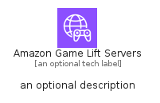
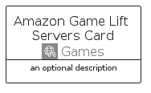
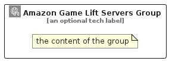

# AmazonGameLiftServers


```text
aws/Architecture/Games/AmazonGameLiftServers
```

```text
include('aws/Architecture/Games/AmazonGameLiftServers')
```


| Illustration | AmazonGameLiftServers | AmazonGameLiftServersCard | AmazonGameLiftServersGroup |
| :---: | :---: | :---: | :---: |
|  |  |  |  |


## Sprites
The item provides the following sriptes:

- `<$AmazonGameLiftServersXs>`
- `<$AmazonGameLiftServersSm>`
- `<$AmazonGameLiftServersMd>`
- `<$AmazonGameLiftServersLg>`


## AmazonGameLiftServers

### Load remotely
```plantuml
@startuml
' configures the library
!global $LIB_BASE_LOCATION="https://raw.githubusercontent.com/tmorin/plantuml-libs/master/distribution"

' loads the library's bootstrap
!include $LIB_BASE_LOCATION/bootstrap.puml

' loads the package bootstrap
include('aws/bootstrap')

' loads the Item which embeds the element AmazonGameLiftServers
include('aws/Architecture/Games/AmazonGameLiftServers')

' renders the element
AmazonGameLiftServers('AmazonGameLiftServers', 'Amazon Game Lift Servers', 'an optional tech label', 'an optional description')
@enduml
```

### Load locally
```plantuml
@startuml
' configures the library
!global $INCLUSION_MODE="local"
!global $LIB_BASE_LOCATION="../../.."

' loads the library's bootstrap
!include $LIB_BASE_LOCATION/bootstrap.puml

' loads the package bootstrap
include('aws/bootstrap')

' loads the Item which embeds the element AmazonGameLiftServers
include('aws/Architecture/Games/AmazonGameLiftServers')

' renders the element
AmazonGameLiftServers('AmazonGameLiftServers', 'Amazon Game Lift Servers', 'an optional tech label', 'an optional description')
@enduml
```

## AmazonGameLiftServersCard

### Load remotely
```plantuml
@startuml
' configures the library
!global $LIB_BASE_LOCATION="https://raw.githubusercontent.com/tmorin/plantuml-libs/master/distribution"

' loads the library's bootstrap
!include $LIB_BASE_LOCATION/bootstrap.puml

' loads the package bootstrap
include('aws/bootstrap')

' loads the Item which embeds the element AmazonGameLiftServersCard
include('aws/Architecture/Games/AmazonGameLiftServers')

' renders the element
AmazonGameLiftServersCard('AmazonGameLiftServersCard', 'Amazon Game Lift Servers Card', 'an optional description')
@enduml
```

### Load locally
```plantuml
@startuml
' configures the library
!global $INCLUSION_MODE="local"
!global $LIB_BASE_LOCATION="../../.."

' loads the library's bootstrap
!include $LIB_BASE_LOCATION/bootstrap.puml

' loads the package bootstrap
include('aws/bootstrap')

' loads the Item which embeds the element AmazonGameLiftServersCard
include('aws/Architecture/Games/AmazonGameLiftServers')

' renders the element
AmazonGameLiftServersCard('AmazonGameLiftServersCard', 'Amazon Game Lift Servers Card', 'an optional description')
@enduml
```

## AmazonGameLiftServersGroup

### Load remotely
```plantuml
@startuml
' configures the library
!global $LIB_BASE_LOCATION="https://raw.githubusercontent.com/tmorin/plantuml-libs/master/distribution"

' loads the library's bootstrap
!include $LIB_BASE_LOCATION/bootstrap.puml

' loads the package bootstrap
include('aws/bootstrap')

' loads the Item which embeds the element AmazonGameLiftServersGroup
include('aws/Architecture/Games/AmazonGameLiftServers')

' renders the element
AmazonGameLiftServersGroup('AmazonGameLiftServersGroup', 'Amazon Game Lift Servers Group', 'an optional tech label') {
    note as note
        the content of the group
    end note
}
@enduml
```

### Load locally
```plantuml
@startuml
' configures the library
!global $INCLUSION_MODE="local"
!global $LIB_BASE_LOCATION="../../.."

' loads the library's bootstrap
!include $LIB_BASE_LOCATION/bootstrap.puml

' loads the package bootstrap
include('aws/bootstrap')

' loads the Item which embeds the element AmazonGameLiftServersGroup
include('aws/Architecture/Games/AmazonGameLiftServers')

' renders the element
AmazonGameLiftServersGroup('AmazonGameLiftServersGroup', 'Amazon Game Lift Servers Group', 'an optional tech label') {
    note as note
        the content of the group
    end note
}
@enduml
```

