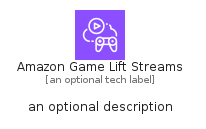
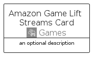
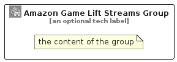

# AmazonGameLiftStreams


```text
aws/Architecture/Games/AmazonGameLiftStreams
```

```text
include('aws/Architecture/Games/AmazonGameLiftStreams')
```


| Illustration | AmazonGameLiftStreams | AmazonGameLiftStreamsCard | AmazonGameLiftStreamsGroup |
| :---: | :---: | :---: | :---: |
|  |  |  |  |


## Sprites
The item provides the following sriptes:

- `<$AmazonGameLiftStreamsXs>`
- `<$AmazonGameLiftStreamsSm>`
- `<$AmazonGameLiftStreamsMd>`
- `<$AmazonGameLiftStreamsLg>`


## AmazonGameLiftStreams

### Load remotely
```plantuml
@startuml
' configures the library
!global $LIB_BASE_LOCATION="https://raw.githubusercontent.com/tmorin/plantuml-libs/master/distribution"

' loads the library's bootstrap
!include $LIB_BASE_LOCATION/bootstrap.puml

' loads the package bootstrap
include('aws/bootstrap')

' loads the Item which embeds the element AmazonGameLiftStreams
include('aws/Architecture/Games/AmazonGameLiftStreams')

' renders the element
AmazonGameLiftStreams('AmazonGameLiftStreams', 'Amazon Game Lift Streams', 'an optional tech label', 'an optional description')
@enduml
```

### Load locally
```plantuml
@startuml
' configures the library
!global $INCLUSION_MODE="local"
!global $LIB_BASE_LOCATION="../../.."

' loads the library's bootstrap
!include $LIB_BASE_LOCATION/bootstrap.puml

' loads the package bootstrap
include('aws/bootstrap')

' loads the Item which embeds the element AmazonGameLiftStreams
include('aws/Architecture/Games/AmazonGameLiftStreams')

' renders the element
AmazonGameLiftStreams('AmazonGameLiftStreams', 'Amazon Game Lift Streams', 'an optional tech label', 'an optional description')
@enduml
```

## AmazonGameLiftStreamsCard

### Load remotely
```plantuml
@startuml
' configures the library
!global $LIB_BASE_LOCATION="https://raw.githubusercontent.com/tmorin/plantuml-libs/master/distribution"

' loads the library's bootstrap
!include $LIB_BASE_LOCATION/bootstrap.puml

' loads the package bootstrap
include('aws/bootstrap')

' loads the Item which embeds the element AmazonGameLiftStreamsCard
include('aws/Architecture/Games/AmazonGameLiftStreams')

' renders the element
AmazonGameLiftStreamsCard('AmazonGameLiftStreamsCard', 'Amazon Game Lift Streams Card', 'an optional description')
@enduml
```

### Load locally
```plantuml
@startuml
' configures the library
!global $INCLUSION_MODE="local"
!global $LIB_BASE_LOCATION="../../.."

' loads the library's bootstrap
!include $LIB_BASE_LOCATION/bootstrap.puml

' loads the package bootstrap
include('aws/bootstrap')

' loads the Item which embeds the element AmazonGameLiftStreamsCard
include('aws/Architecture/Games/AmazonGameLiftStreams')

' renders the element
AmazonGameLiftStreamsCard('AmazonGameLiftStreamsCard', 'Amazon Game Lift Streams Card', 'an optional description')
@enduml
```

## AmazonGameLiftStreamsGroup

### Load remotely
```plantuml
@startuml
' configures the library
!global $LIB_BASE_LOCATION="https://raw.githubusercontent.com/tmorin/plantuml-libs/master/distribution"

' loads the library's bootstrap
!include $LIB_BASE_LOCATION/bootstrap.puml

' loads the package bootstrap
include('aws/bootstrap')

' loads the Item which embeds the element AmazonGameLiftStreamsGroup
include('aws/Architecture/Games/AmazonGameLiftStreams')

' renders the element
AmazonGameLiftStreamsGroup('AmazonGameLiftStreamsGroup', 'Amazon Game Lift Streams Group', 'an optional tech label') {
    note as note
        the content of the group
    end note
}
@enduml
```

### Load locally
```plantuml
@startuml
' configures the library
!global $INCLUSION_MODE="local"
!global $LIB_BASE_LOCATION="../../.."

' loads the library's bootstrap
!include $LIB_BASE_LOCATION/bootstrap.puml

' loads the package bootstrap
include('aws/bootstrap')

' loads the Item which embeds the element AmazonGameLiftStreamsGroup
include('aws/Architecture/Games/AmazonGameLiftStreams')

' renders the element
AmazonGameLiftStreamsGroup('AmazonGameLiftStreamsGroup', 'Amazon Game Lift Streams Group', 'an optional tech label') {
    note as note
        the content of the group
    end note
}
@enduml
```

