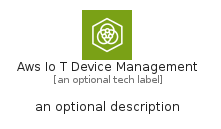
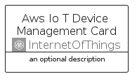
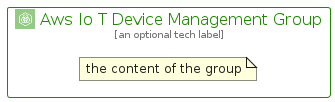

# AwsIoTDeviceManagement


```text
aws/Architecture/InternetOfThings/AwsIoTDeviceManagement
```

```text
include('aws/Architecture/InternetOfThings/AwsIoTDeviceManagement')
```


| Illustration | AwsIoTDeviceManagement | AwsIoTDeviceManagementCard | AwsIoTDeviceManagementGroup |
| :---: | :---: | :---: | :---: |
|  |  |  |  |


## Sprites
The item provides the following sriptes:

- `<$AwsIoTDeviceManagementXs>`
- `<$AwsIoTDeviceManagementSm>`
- `<$AwsIoTDeviceManagementMd>`
- `<$AwsIoTDeviceManagementLg>`


## AwsIoTDeviceManagement

### Load remotely
```plantuml
@startuml
' configures the library
!global $LIB_BASE_LOCATION="https://raw.githubusercontent.com/tmorin/plantuml-libs/master/distribution"

' loads the library's bootstrap
!include $LIB_BASE_LOCATION/bootstrap.puml

' loads the package bootstrap
include('aws/bootstrap')

' loads the Item which embeds the element AwsIoTDeviceManagement
include('aws/Architecture/InternetOfThings/AwsIoTDeviceManagement')

' renders the element
AwsIoTDeviceManagement('AwsIoTDeviceManagement', 'Aws Io T Device Management', 'an optional tech label', 'an optional description')
@enduml
```

### Load locally
```plantuml
@startuml
' configures the library
!global $INCLUSION_MODE="local"
!global $LIB_BASE_LOCATION="../../.."

' loads the library's bootstrap
!include $LIB_BASE_LOCATION/bootstrap.puml

' loads the package bootstrap
include('aws/bootstrap')

' loads the Item which embeds the element AwsIoTDeviceManagement
include('aws/Architecture/InternetOfThings/AwsIoTDeviceManagement')

' renders the element
AwsIoTDeviceManagement('AwsIoTDeviceManagement', 'Aws Io T Device Management', 'an optional tech label', 'an optional description')
@enduml
```

## AwsIoTDeviceManagementCard

### Load remotely
```plantuml
@startuml
' configures the library
!global $LIB_BASE_LOCATION="https://raw.githubusercontent.com/tmorin/plantuml-libs/master/distribution"

' loads the library's bootstrap
!include $LIB_BASE_LOCATION/bootstrap.puml

' loads the package bootstrap
include('aws/bootstrap')

' loads the Item which embeds the element AwsIoTDeviceManagementCard
include('aws/Architecture/InternetOfThings/AwsIoTDeviceManagement')

' renders the element
AwsIoTDeviceManagementCard('AwsIoTDeviceManagementCard', 'Aws Io T Device Management Card', 'an optional description')
@enduml
```

### Load locally
```plantuml
@startuml
' configures the library
!global $INCLUSION_MODE="local"
!global $LIB_BASE_LOCATION="../../.."

' loads the library's bootstrap
!include $LIB_BASE_LOCATION/bootstrap.puml

' loads the package bootstrap
include('aws/bootstrap')

' loads the Item which embeds the element AwsIoTDeviceManagementCard
include('aws/Architecture/InternetOfThings/AwsIoTDeviceManagement')

' renders the element
AwsIoTDeviceManagementCard('AwsIoTDeviceManagementCard', 'Aws Io T Device Management Card', 'an optional description')
@enduml
```

## AwsIoTDeviceManagementGroup

### Load remotely
```plantuml
@startuml
' configures the library
!global $LIB_BASE_LOCATION="https://raw.githubusercontent.com/tmorin/plantuml-libs/master/distribution"

' loads the library's bootstrap
!include $LIB_BASE_LOCATION/bootstrap.puml

' loads the package bootstrap
include('aws/bootstrap')

' loads the Item which embeds the element AwsIoTDeviceManagementGroup
include('aws/Architecture/InternetOfThings/AwsIoTDeviceManagement')

' renders the element
AwsIoTDeviceManagementGroup('AwsIoTDeviceManagementGroup', 'Aws Io T Device Management Group', 'an optional tech label') {
    note as note
        the content of the group
    end note
}
@enduml
```

### Load locally
```plantuml
@startuml
' configures the library
!global $INCLUSION_MODE="local"
!global $LIB_BASE_LOCATION="../../.."

' loads the library's bootstrap
!include $LIB_BASE_LOCATION/bootstrap.puml

' loads the package bootstrap
include('aws/bootstrap')

' loads the Item which embeds the element AwsIoTDeviceManagementGroup
include('aws/Architecture/InternetOfThings/AwsIoTDeviceManagement')

' renders the element
AwsIoTDeviceManagementGroup('AwsIoTDeviceManagementGroup', 'Aws Io T Device Management Group', 'an optional tech label') {
    note as note
        the content of the group
    end note
}
@enduml
```

