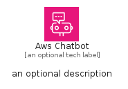
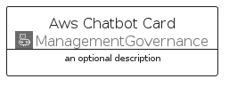
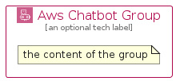

# AwsChatbot


```text
aws/Architecture/ManagementGovernance/AwsChatbot
```

```text
include('aws/Architecture/ManagementGovernance/AwsChatbot')
```


| Illustration | AwsChatbot | AwsChatbotCard | AwsChatbotGroup |
| :---: | :---: | :---: | :---: |
|  |  |  |  |


## Sprites
The item provides the following sriptes:

- `<$AwsChatbotXs>`
- `<$AwsChatbotSm>`
- `<$AwsChatbotMd>`
- `<$AwsChatbotLg>`


## AwsChatbot

### Load remotely
```plantuml
@startuml
' configures the library
!global $LIB_BASE_LOCATION="https://raw.githubusercontent.com/tmorin/plantuml-libs/master/distribution"

' loads the library's bootstrap
!include $LIB_BASE_LOCATION/bootstrap.puml

' loads the package bootstrap
include('aws/bootstrap')

' loads the Item which embeds the element AwsChatbot
include('aws/Architecture/ManagementGovernance/AwsChatbot')

' renders the element
AwsChatbot('AwsChatbot', 'Aws Chatbot', 'an optional tech label', 'an optional description')
@enduml
```

### Load locally
```plantuml
@startuml
' configures the library
!global $INCLUSION_MODE="local"
!global $LIB_BASE_LOCATION="../../.."

' loads the library's bootstrap
!include $LIB_BASE_LOCATION/bootstrap.puml

' loads the package bootstrap
include('aws/bootstrap')

' loads the Item which embeds the element AwsChatbot
include('aws/Architecture/ManagementGovernance/AwsChatbot')

' renders the element
AwsChatbot('AwsChatbot', 'Aws Chatbot', 'an optional tech label', 'an optional description')
@enduml
```

## AwsChatbotCard

### Load remotely
```plantuml
@startuml
' configures the library
!global $LIB_BASE_LOCATION="https://raw.githubusercontent.com/tmorin/plantuml-libs/master/distribution"

' loads the library's bootstrap
!include $LIB_BASE_LOCATION/bootstrap.puml

' loads the package bootstrap
include('aws/bootstrap')

' loads the Item which embeds the element AwsChatbotCard
include('aws/Architecture/ManagementGovernance/AwsChatbot')

' renders the element
AwsChatbotCard('AwsChatbotCard', 'Aws Chatbot Card', 'an optional description')
@enduml
```

### Load locally
```plantuml
@startuml
' configures the library
!global $INCLUSION_MODE="local"
!global $LIB_BASE_LOCATION="../../.."

' loads the library's bootstrap
!include $LIB_BASE_LOCATION/bootstrap.puml

' loads the package bootstrap
include('aws/bootstrap')

' loads the Item which embeds the element AwsChatbotCard
include('aws/Architecture/ManagementGovernance/AwsChatbot')

' renders the element
AwsChatbotCard('AwsChatbotCard', 'Aws Chatbot Card', 'an optional description')
@enduml
```

## AwsChatbotGroup

### Load remotely
```plantuml
@startuml
' configures the library
!global $LIB_BASE_LOCATION="https://raw.githubusercontent.com/tmorin/plantuml-libs/master/distribution"

' loads the library's bootstrap
!include $LIB_BASE_LOCATION/bootstrap.puml

' loads the package bootstrap
include('aws/bootstrap')

' loads the Item which embeds the element AwsChatbotGroup
include('aws/Architecture/ManagementGovernance/AwsChatbot')

' renders the element
AwsChatbotGroup('AwsChatbotGroup', 'Aws Chatbot Group', 'an optional tech label') {
    note as note
        the content of the group
    end note
}
@enduml
```

### Load locally
```plantuml
@startuml
' configures the library
!global $INCLUSION_MODE="local"
!global $LIB_BASE_LOCATION="../../.."

' loads the library's bootstrap
!include $LIB_BASE_LOCATION/bootstrap.puml

' loads the package bootstrap
include('aws/bootstrap')

' loads the Item which embeds the element AwsChatbotGroup
include('aws/Architecture/ManagementGovernance/AwsChatbot')

' renders the element
AwsChatbotGroup('AwsChatbotGroup', 'Aws Chatbot Group', 'an optional tech label') {
    note as note
        the content of the group
    end note
}
@enduml
```

