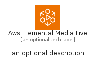
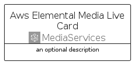
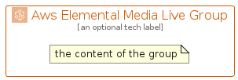

# AwsElementalMediaLive


```text
aws/Architecture/MediaServices/AwsElementalMediaLive
```

```text
include('aws/Architecture/MediaServices/AwsElementalMediaLive')
```


| Illustration | AwsElementalMediaLive | AwsElementalMediaLiveCard | AwsElementalMediaLiveGroup |
| :---: | :---: | :---: | :---: |
|  |  |  |  |


## Sprites
The item provides the following sriptes:

- `<$AwsElementalMediaLiveXs>`
- `<$AwsElementalMediaLiveSm>`
- `<$AwsElementalMediaLiveMd>`
- `<$AwsElementalMediaLiveLg>`


## AwsElementalMediaLive

### Load remotely
```plantuml
@startuml
' configures the library
!global $LIB_BASE_LOCATION="https://raw.githubusercontent.com/tmorin/plantuml-libs/master/distribution"

' loads the library's bootstrap
!include $LIB_BASE_LOCATION/bootstrap.puml

' loads the package bootstrap
include('aws/bootstrap')

' loads the Item which embeds the element AwsElementalMediaLive
include('aws/Architecture/MediaServices/AwsElementalMediaLive')

' renders the element
AwsElementalMediaLive('AwsElementalMediaLive', 'Aws Elemental Media Live', 'an optional tech label', 'an optional description')
@enduml
```

### Load locally
```plantuml
@startuml
' configures the library
!global $INCLUSION_MODE="local"
!global $LIB_BASE_LOCATION="../../.."

' loads the library's bootstrap
!include $LIB_BASE_LOCATION/bootstrap.puml

' loads the package bootstrap
include('aws/bootstrap')

' loads the Item which embeds the element AwsElementalMediaLive
include('aws/Architecture/MediaServices/AwsElementalMediaLive')

' renders the element
AwsElementalMediaLive('AwsElementalMediaLive', 'Aws Elemental Media Live', 'an optional tech label', 'an optional description')
@enduml
```

## AwsElementalMediaLiveCard

### Load remotely
```plantuml
@startuml
' configures the library
!global $LIB_BASE_LOCATION="https://raw.githubusercontent.com/tmorin/plantuml-libs/master/distribution"

' loads the library's bootstrap
!include $LIB_BASE_LOCATION/bootstrap.puml

' loads the package bootstrap
include('aws/bootstrap')

' loads the Item which embeds the element AwsElementalMediaLiveCard
include('aws/Architecture/MediaServices/AwsElementalMediaLive')

' renders the element
AwsElementalMediaLiveCard('AwsElementalMediaLiveCard', 'Aws Elemental Media Live Card', 'an optional description')
@enduml
```

### Load locally
```plantuml
@startuml
' configures the library
!global $INCLUSION_MODE="local"
!global $LIB_BASE_LOCATION="../../.."

' loads the library's bootstrap
!include $LIB_BASE_LOCATION/bootstrap.puml

' loads the package bootstrap
include('aws/bootstrap')

' loads the Item which embeds the element AwsElementalMediaLiveCard
include('aws/Architecture/MediaServices/AwsElementalMediaLive')

' renders the element
AwsElementalMediaLiveCard('AwsElementalMediaLiveCard', 'Aws Elemental Media Live Card', 'an optional description')
@enduml
```

## AwsElementalMediaLiveGroup

### Load remotely
```plantuml
@startuml
' configures the library
!global $LIB_BASE_LOCATION="https://raw.githubusercontent.com/tmorin/plantuml-libs/master/distribution"

' loads the library's bootstrap
!include $LIB_BASE_LOCATION/bootstrap.puml

' loads the package bootstrap
include('aws/bootstrap')

' loads the Item which embeds the element AwsElementalMediaLiveGroup
include('aws/Architecture/MediaServices/AwsElementalMediaLive')

' renders the element
AwsElementalMediaLiveGroup('AwsElementalMediaLiveGroup', 'Aws Elemental Media Live Group', 'an optional tech label') {
    note as note
        the content of the group
    end note
}
@enduml
```

### Load locally
```plantuml
@startuml
' configures the library
!global $INCLUSION_MODE="local"
!global $LIB_BASE_LOCATION="../../.."

' loads the library's bootstrap
!include $LIB_BASE_LOCATION/bootstrap.puml

' loads the package bootstrap
include('aws/bootstrap')

' loads the Item which embeds the element AwsElementalMediaLiveGroup
include('aws/Architecture/MediaServices/AwsElementalMediaLive')

' renders the element
AwsElementalMediaLiveGroup('AwsElementalMediaLiveGroup', 'Aws Elemental Media Live Group', 'an optional tech label') {
    note as note
        the content of the group
    end note
}
@enduml
```

