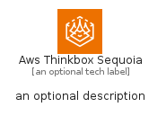
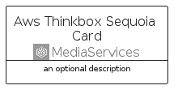
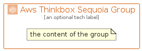

# AwsThinkboxSequoia


```text
aws/Architecture/MediaServices/AwsThinkboxSequoia
```

```text
include('aws/Architecture/MediaServices/AwsThinkboxSequoia')
```


| Illustration | AwsThinkboxSequoia | AwsThinkboxSequoiaCard | AwsThinkboxSequoiaGroup |
| :---: | :---: | :---: | :---: |
|  |  |  |  |


## Sprites
The item provides the following sriptes:

- `<$AwsThinkboxSequoiaXs>`
- `<$AwsThinkboxSequoiaSm>`
- `<$AwsThinkboxSequoiaMd>`
- `<$AwsThinkboxSequoiaLg>`


## AwsThinkboxSequoia

### Load remotely
```plantuml
@startuml
' configures the library
!global $LIB_BASE_LOCATION="https://raw.githubusercontent.com/tmorin/plantuml-libs/master/distribution"

' loads the library's bootstrap
!include $LIB_BASE_LOCATION/bootstrap.puml

' loads the package bootstrap
include('aws/bootstrap')

' loads the Item which embeds the element AwsThinkboxSequoia
include('aws/Architecture/MediaServices/AwsThinkboxSequoia')

' renders the element
AwsThinkboxSequoia('AwsThinkboxSequoia', 'Aws Thinkbox Sequoia', 'an optional tech label', 'an optional description')
@enduml
```

### Load locally
```plantuml
@startuml
' configures the library
!global $INCLUSION_MODE="local"
!global $LIB_BASE_LOCATION="../../.."

' loads the library's bootstrap
!include $LIB_BASE_LOCATION/bootstrap.puml

' loads the package bootstrap
include('aws/bootstrap')

' loads the Item which embeds the element AwsThinkboxSequoia
include('aws/Architecture/MediaServices/AwsThinkboxSequoia')

' renders the element
AwsThinkboxSequoia('AwsThinkboxSequoia', 'Aws Thinkbox Sequoia', 'an optional tech label', 'an optional description')
@enduml
```

## AwsThinkboxSequoiaCard

### Load remotely
```plantuml
@startuml
' configures the library
!global $LIB_BASE_LOCATION="https://raw.githubusercontent.com/tmorin/plantuml-libs/master/distribution"

' loads the library's bootstrap
!include $LIB_BASE_LOCATION/bootstrap.puml

' loads the package bootstrap
include('aws/bootstrap')

' loads the Item which embeds the element AwsThinkboxSequoiaCard
include('aws/Architecture/MediaServices/AwsThinkboxSequoia')

' renders the element
AwsThinkboxSequoiaCard('AwsThinkboxSequoiaCard', 'Aws Thinkbox Sequoia Card', 'an optional description')
@enduml
```

### Load locally
```plantuml
@startuml
' configures the library
!global $INCLUSION_MODE="local"
!global $LIB_BASE_LOCATION="../../.."

' loads the library's bootstrap
!include $LIB_BASE_LOCATION/bootstrap.puml

' loads the package bootstrap
include('aws/bootstrap')

' loads the Item which embeds the element AwsThinkboxSequoiaCard
include('aws/Architecture/MediaServices/AwsThinkboxSequoia')

' renders the element
AwsThinkboxSequoiaCard('AwsThinkboxSequoiaCard', 'Aws Thinkbox Sequoia Card', 'an optional description')
@enduml
```

## AwsThinkboxSequoiaGroup

### Load remotely
```plantuml
@startuml
' configures the library
!global $LIB_BASE_LOCATION="https://raw.githubusercontent.com/tmorin/plantuml-libs/master/distribution"

' loads the library's bootstrap
!include $LIB_BASE_LOCATION/bootstrap.puml

' loads the package bootstrap
include('aws/bootstrap')

' loads the Item which embeds the element AwsThinkboxSequoiaGroup
include('aws/Architecture/MediaServices/AwsThinkboxSequoia')

' renders the element
AwsThinkboxSequoiaGroup('AwsThinkboxSequoiaGroup', 'Aws Thinkbox Sequoia Group', 'an optional tech label') {
    note as note
        the content of the group
    end note
}
@enduml
```

### Load locally
```plantuml
@startuml
' configures the library
!global $INCLUSION_MODE="local"
!global $LIB_BASE_LOCATION="../../.."

' loads the library's bootstrap
!include $LIB_BASE_LOCATION/bootstrap.puml

' loads the package bootstrap
include('aws/bootstrap')

' loads the Item which embeds the element AwsThinkboxSequoiaGroup
include('aws/Architecture/MediaServices/AwsThinkboxSequoia')

' renders the element
AwsThinkboxSequoiaGroup('AwsThinkboxSequoiaGroup', 'Aws Thinkbox Sequoia Group', 'an optional tech label') {
    note as note
        the content of the group
    end note
}
@enduml
```

