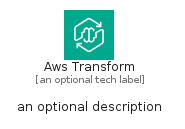
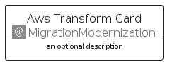
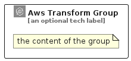

# AwsTransform


```text
aws/Architecture/MigrationModernization/AwsTransform
```

```text
include('aws/Architecture/MigrationModernization/AwsTransform')
```


| Illustration | AwsTransform | AwsTransformCard | AwsTransformGroup |
| :---: | :---: | :---: | :---: |
|  |  |  |  |


## Sprites
The item provides the following sriptes:

- `<$AwsTransformXs>`
- `<$AwsTransformSm>`
- `<$AwsTransformMd>`
- `<$AwsTransformLg>`


## AwsTransform

### Load remotely
```plantuml
@startuml
' configures the library
!global $LIB_BASE_LOCATION="https://raw.githubusercontent.com/tmorin/plantuml-libs/master/distribution"

' loads the library's bootstrap
!include $LIB_BASE_LOCATION/bootstrap.puml

' loads the package bootstrap
include('aws/bootstrap')

' loads the Item which embeds the element AwsTransform
include('aws/Architecture/MigrationModernization/AwsTransform')

' renders the element
AwsTransform('AwsTransform', 'Aws Transform', 'an optional tech label', 'an optional description')
@enduml
```

### Load locally
```plantuml
@startuml
' configures the library
!global $INCLUSION_MODE="local"
!global $LIB_BASE_LOCATION="../../.."

' loads the library's bootstrap
!include $LIB_BASE_LOCATION/bootstrap.puml

' loads the package bootstrap
include('aws/bootstrap')

' loads the Item which embeds the element AwsTransform
include('aws/Architecture/MigrationModernization/AwsTransform')

' renders the element
AwsTransform('AwsTransform', 'Aws Transform', 'an optional tech label', 'an optional description')
@enduml
```

## AwsTransformCard

### Load remotely
```plantuml
@startuml
' configures the library
!global $LIB_BASE_LOCATION="https://raw.githubusercontent.com/tmorin/plantuml-libs/master/distribution"

' loads the library's bootstrap
!include $LIB_BASE_LOCATION/bootstrap.puml

' loads the package bootstrap
include('aws/bootstrap')

' loads the Item which embeds the element AwsTransformCard
include('aws/Architecture/MigrationModernization/AwsTransform')

' renders the element
AwsTransformCard('AwsTransformCard', 'Aws Transform Card', 'an optional description')
@enduml
```

### Load locally
```plantuml
@startuml
' configures the library
!global $INCLUSION_MODE="local"
!global $LIB_BASE_LOCATION="../../.."

' loads the library's bootstrap
!include $LIB_BASE_LOCATION/bootstrap.puml

' loads the package bootstrap
include('aws/bootstrap')

' loads the Item which embeds the element AwsTransformCard
include('aws/Architecture/MigrationModernization/AwsTransform')

' renders the element
AwsTransformCard('AwsTransformCard', 'Aws Transform Card', 'an optional description')
@enduml
```

## AwsTransformGroup

### Load remotely
```plantuml
@startuml
' configures the library
!global $LIB_BASE_LOCATION="https://raw.githubusercontent.com/tmorin/plantuml-libs/master/distribution"

' loads the library's bootstrap
!include $LIB_BASE_LOCATION/bootstrap.puml

' loads the package bootstrap
include('aws/bootstrap')

' loads the Item which embeds the element AwsTransformGroup
include('aws/Architecture/MigrationModernization/AwsTransform')

' renders the element
AwsTransformGroup('AwsTransformGroup', 'Aws Transform Group', 'an optional tech label') {
    note as note
        the content of the group
    end note
}
@enduml
```

### Load locally
```plantuml
@startuml
' configures the library
!global $INCLUSION_MODE="local"
!global $LIB_BASE_LOCATION="../../.."

' loads the library's bootstrap
!include $LIB_BASE_LOCATION/bootstrap.puml

' loads the package bootstrap
include('aws/bootstrap')

' loads the Item which embeds the element AwsTransformGroup
include('aws/Architecture/MigrationModernization/AwsTransform')

' renders the element
AwsTransformGroup('AwsTransformGroup', 'Aws Transform Group', 'an optional tech label') {
    note as note
        the content of the group
    end note
}
@enduml
```

