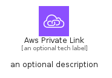
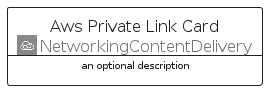
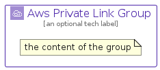

# AwsPrivateLink


```text
aws/Architecture/NetworkingContentDelivery/AwsPrivateLink
```

```text
include('aws/Architecture/NetworkingContentDelivery/AwsPrivateLink')
```


| Illustration | AwsPrivateLink | AwsPrivateLinkCard | AwsPrivateLinkGroup |
| :---: | :---: | :---: | :---: |
|  |  |  |  |


## Sprites
The item provides the following sriptes:

- `<$AwsPrivateLinkXs>`
- `<$AwsPrivateLinkSm>`
- `<$AwsPrivateLinkMd>`
- `<$AwsPrivateLinkLg>`


## AwsPrivateLink

### Load remotely
```plantuml
@startuml
' configures the library
!global $LIB_BASE_LOCATION="https://raw.githubusercontent.com/tmorin/plantuml-libs/master/distribution"

' loads the library's bootstrap
!include $LIB_BASE_LOCATION/bootstrap.puml

' loads the package bootstrap
include('aws/bootstrap')

' loads the Item which embeds the element AwsPrivateLink
include('aws/Architecture/NetworkingContentDelivery/AwsPrivateLink')

' renders the element
AwsPrivateLink('AwsPrivateLink', 'Aws Private Link', 'an optional tech label', 'an optional description')
@enduml
```

### Load locally
```plantuml
@startuml
' configures the library
!global $INCLUSION_MODE="local"
!global $LIB_BASE_LOCATION="../../.."

' loads the library's bootstrap
!include $LIB_BASE_LOCATION/bootstrap.puml

' loads the package bootstrap
include('aws/bootstrap')

' loads the Item which embeds the element AwsPrivateLink
include('aws/Architecture/NetworkingContentDelivery/AwsPrivateLink')

' renders the element
AwsPrivateLink('AwsPrivateLink', 'Aws Private Link', 'an optional tech label', 'an optional description')
@enduml
```

## AwsPrivateLinkCard

### Load remotely
```plantuml
@startuml
' configures the library
!global $LIB_BASE_LOCATION="https://raw.githubusercontent.com/tmorin/plantuml-libs/master/distribution"

' loads the library's bootstrap
!include $LIB_BASE_LOCATION/bootstrap.puml

' loads the package bootstrap
include('aws/bootstrap')

' loads the Item which embeds the element AwsPrivateLinkCard
include('aws/Architecture/NetworkingContentDelivery/AwsPrivateLink')

' renders the element
AwsPrivateLinkCard('AwsPrivateLinkCard', 'Aws Private Link Card', 'an optional description')
@enduml
```

### Load locally
```plantuml
@startuml
' configures the library
!global $INCLUSION_MODE="local"
!global $LIB_BASE_LOCATION="../../.."

' loads the library's bootstrap
!include $LIB_BASE_LOCATION/bootstrap.puml

' loads the package bootstrap
include('aws/bootstrap')

' loads the Item which embeds the element AwsPrivateLinkCard
include('aws/Architecture/NetworkingContentDelivery/AwsPrivateLink')

' renders the element
AwsPrivateLinkCard('AwsPrivateLinkCard', 'Aws Private Link Card', 'an optional description')
@enduml
```

## AwsPrivateLinkGroup

### Load remotely
```plantuml
@startuml
' configures the library
!global $LIB_BASE_LOCATION="https://raw.githubusercontent.com/tmorin/plantuml-libs/master/distribution"

' loads the library's bootstrap
!include $LIB_BASE_LOCATION/bootstrap.puml

' loads the package bootstrap
include('aws/bootstrap')

' loads the Item which embeds the element AwsPrivateLinkGroup
include('aws/Architecture/NetworkingContentDelivery/AwsPrivateLink')

' renders the element
AwsPrivateLinkGroup('AwsPrivateLinkGroup', 'Aws Private Link Group', 'an optional tech label') {
    note as note
        the content of the group
    end note
}
@enduml
```

### Load locally
```plantuml
@startuml
' configures the library
!global $INCLUSION_MODE="local"
!global $LIB_BASE_LOCATION="../../.."

' loads the library's bootstrap
!include $LIB_BASE_LOCATION/bootstrap.puml

' loads the package bootstrap
include('aws/bootstrap')

' loads the Item which embeds the element AwsPrivateLinkGroup
include('aws/Architecture/NetworkingContentDelivery/AwsPrivateLink')

' renders the element
AwsPrivateLinkGroup('AwsPrivateLinkGroup', 'Aws Private Link Group', 'an optional tech label') {
    note as note
        the content of the group
    end note
}
@enduml
```

