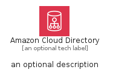
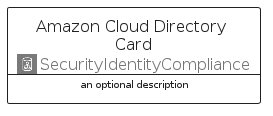
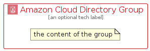

# AmazonCloudDirectory


```text
aws/Architecture/SecurityIdentityCompliance/AmazonCloudDirectory
```

```text
include('aws/Architecture/SecurityIdentityCompliance/AmazonCloudDirectory')
```


| Illustration | AmazonCloudDirectory | AmazonCloudDirectoryCard | AmazonCloudDirectoryGroup |
| :---: | :---: | :---: | :---: |
|  |  |  |  |


## Sprites
The item provides the following sriptes:

- `<$AmazonCloudDirectoryXs>`
- `<$AmazonCloudDirectorySm>`
- `<$AmazonCloudDirectoryMd>`
- `<$AmazonCloudDirectoryLg>`


## AmazonCloudDirectory

### Load remotely
```plantuml
@startuml
' configures the library
!global $LIB_BASE_LOCATION="https://raw.githubusercontent.com/tmorin/plantuml-libs/master/distribution"

' loads the library's bootstrap
!include $LIB_BASE_LOCATION/bootstrap.puml

' loads the package bootstrap
include('aws/bootstrap')

' loads the Item which embeds the element AmazonCloudDirectory
include('aws/Architecture/SecurityIdentityCompliance/AmazonCloudDirectory')

' renders the element
AmazonCloudDirectory('AmazonCloudDirectory', 'Amazon Cloud Directory', 'an optional tech label', 'an optional description')
@enduml
```

### Load locally
```plantuml
@startuml
' configures the library
!global $INCLUSION_MODE="local"
!global $LIB_BASE_LOCATION="../../.."

' loads the library's bootstrap
!include $LIB_BASE_LOCATION/bootstrap.puml

' loads the package bootstrap
include('aws/bootstrap')

' loads the Item which embeds the element AmazonCloudDirectory
include('aws/Architecture/SecurityIdentityCompliance/AmazonCloudDirectory')

' renders the element
AmazonCloudDirectory('AmazonCloudDirectory', 'Amazon Cloud Directory', 'an optional tech label', 'an optional description')
@enduml
```

## AmazonCloudDirectoryCard

### Load remotely
```plantuml
@startuml
' configures the library
!global $LIB_BASE_LOCATION="https://raw.githubusercontent.com/tmorin/plantuml-libs/master/distribution"

' loads the library's bootstrap
!include $LIB_BASE_LOCATION/bootstrap.puml

' loads the package bootstrap
include('aws/bootstrap')

' loads the Item which embeds the element AmazonCloudDirectoryCard
include('aws/Architecture/SecurityIdentityCompliance/AmazonCloudDirectory')

' renders the element
AmazonCloudDirectoryCard('AmazonCloudDirectoryCard', 'Amazon Cloud Directory Card', 'an optional description')
@enduml
```

### Load locally
```plantuml
@startuml
' configures the library
!global $INCLUSION_MODE="local"
!global $LIB_BASE_LOCATION="../../.."

' loads the library's bootstrap
!include $LIB_BASE_LOCATION/bootstrap.puml

' loads the package bootstrap
include('aws/bootstrap')

' loads the Item which embeds the element AmazonCloudDirectoryCard
include('aws/Architecture/SecurityIdentityCompliance/AmazonCloudDirectory')

' renders the element
AmazonCloudDirectoryCard('AmazonCloudDirectoryCard', 'Amazon Cloud Directory Card', 'an optional description')
@enduml
```

## AmazonCloudDirectoryGroup

### Load remotely
```plantuml
@startuml
' configures the library
!global $LIB_BASE_LOCATION="https://raw.githubusercontent.com/tmorin/plantuml-libs/master/distribution"

' loads the library's bootstrap
!include $LIB_BASE_LOCATION/bootstrap.puml

' loads the package bootstrap
include('aws/bootstrap')

' loads the Item which embeds the element AmazonCloudDirectoryGroup
include('aws/Architecture/SecurityIdentityCompliance/AmazonCloudDirectory')

' renders the element
AmazonCloudDirectoryGroup('AmazonCloudDirectoryGroup', 'Amazon Cloud Directory Group', 'an optional tech label') {
    note as note
        the content of the group
    end note
}
@enduml
```

### Load locally
```plantuml
@startuml
' configures the library
!global $INCLUSION_MODE="local"
!global $LIB_BASE_LOCATION="../../.."

' loads the library's bootstrap
!include $LIB_BASE_LOCATION/bootstrap.puml

' loads the package bootstrap
include('aws/bootstrap')

' loads the Item which embeds the element AmazonCloudDirectoryGroup
include('aws/Architecture/SecurityIdentityCompliance/AmazonCloudDirectory')

' renders the element
AmazonCloudDirectoryGroup('AmazonCloudDirectoryGroup', 'Amazon Cloud Directory Group', 'an optional tech label') {
    note as note
        the content of the group
    end note
}
@enduml
```

