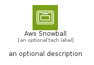
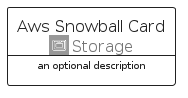
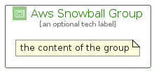

# AwsSnowball


```text
aws/Architecture/Storage/AwsSnowball
```

```text
include('aws/Architecture/Storage/AwsSnowball')
```


| Illustration | AwsSnowball | AwsSnowballCard | AwsSnowballGroup |
| :---: | :---: | :---: | :---: |
|  |  |  |  |


## Sprites
The item provides the following sriptes:

- `<$AwsSnowballXs>`
- `<$AwsSnowballSm>`
- `<$AwsSnowballMd>`
- `<$AwsSnowballLg>`


## AwsSnowball

### Load remotely
```plantuml
@startuml
' configures the library
!global $LIB_BASE_LOCATION="https://raw.githubusercontent.com/tmorin/plantuml-libs/master/distribution"

' loads the library's bootstrap
!include $LIB_BASE_LOCATION/bootstrap.puml

' loads the package bootstrap
include('aws/bootstrap')

' loads the Item which embeds the element AwsSnowball
include('aws/Architecture/Storage/AwsSnowball')

' renders the element
AwsSnowball('AwsSnowball', 'Aws Snowball', 'an optional tech label', 'an optional description')
@enduml
```

### Load locally
```plantuml
@startuml
' configures the library
!global $INCLUSION_MODE="local"
!global $LIB_BASE_LOCATION="../../.."

' loads the library's bootstrap
!include $LIB_BASE_LOCATION/bootstrap.puml

' loads the package bootstrap
include('aws/bootstrap')

' loads the Item which embeds the element AwsSnowball
include('aws/Architecture/Storage/AwsSnowball')

' renders the element
AwsSnowball('AwsSnowball', 'Aws Snowball', 'an optional tech label', 'an optional description')
@enduml
```

## AwsSnowballCard

### Load remotely
```plantuml
@startuml
' configures the library
!global $LIB_BASE_LOCATION="https://raw.githubusercontent.com/tmorin/plantuml-libs/master/distribution"

' loads the library's bootstrap
!include $LIB_BASE_LOCATION/bootstrap.puml

' loads the package bootstrap
include('aws/bootstrap')

' loads the Item which embeds the element AwsSnowballCard
include('aws/Architecture/Storage/AwsSnowball')

' renders the element
AwsSnowballCard('AwsSnowballCard', 'Aws Snowball Card', 'an optional description')
@enduml
```

### Load locally
```plantuml
@startuml
' configures the library
!global $INCLUSION_MODE="local"
!global $LIB_BASE_LOCATION="../../.."

' loads the library's bootstrap
!include $LIB_BASE_LOCATION/bootstrap.puml

' loads the package bootstrap
include('aws/bootstrap')

' loads the Item which embeds the element AwsSnowballCard
include('aws/Architecture/Storage/AwsSnowball')

' renders the element
AwsSnowballCard('AwsSnowballCard', 'Aws Snowball Card', 'an optional description')
@enduml
```

## AwsSnowballGroup

### Load remotely
```plantuml
@startuml
' configures the library
!global $LIB_BASE_LOCATION="https://raw.githubusercontent.com/tmorin/plantuml-libs/master/distribution"

' loads the library's bootstrap
!include $LIB_BASE_LOCATION/bootstrap.puml

' loads the package bootstrap
include('aws/bootstrap')

' loads the Item which embeds the element AwsSnowballGroup
include('aws/Architecture/Storage/AwsSnowball')

' renders the element
AwsSnowballGroup('AwsSnowballGroup', 'Aws Snowball Group', 'an optional tech label') {
    note as note
        the content of the group
    end note
}
@enduml
```

### Load locally
```plantuml
@startuml
' configures the library
!global $INCLUSION_MODE="local"
!global $LIB_BASE_LOCATION="../../.."

' loads the library's bootstrap
!include $LIB_BASE_LOCATION/bootstrap.puml

' loads the package bootstrap
include('aws/bootstrap')

' loads the Item which embeds the element AwsSnowballGroup
include('aws/Architecture/Storage/AwsSnowball')

' renders the element
AwsSnowballGroup('AwsSnowballGroup', 'Aws Snowball Group', 'an optional tech label') {
    note as note
        the content of the group
    end note
}
@enduml
```

