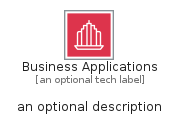
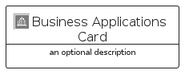
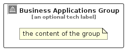

# BusinessApplications


```text
aws/Category/BusinessApplications
```

```text
include('aws/Category/BusinessApplications')
```


| Illustration | BusinessApplications | BusinessApplicationsCard | BusinessApplicationsGroup |
| :---: | :---: | :---: | :---: |
|  |  |  |  |


## Sprites
The item provides the following sriptes:

- `<$BusinessApplicationsXs>`
- `<$BusinessApplicationsSm>`
- `<$BusinessApplicationsMd>`
- `<$BusinessApplicationsLg>`


## BusinessApplications

### Load remotely
```plantuml
@startuml
' configures the library
!global $LIB_BASE_LOCATION="https://raw.githubusercontent.com/tmorin/plantuml-libs/master/distribution"

' loads the library's bootstrap
!include $LIB_BASE_LOCATION/bootstrap.puml

' loads the package bootstrap
include('aws/bootstrap')

' loads the Item which embeds the element BusinessApplications
include('aws/Category/BusinessApplications')

' renders the element
BusinessApplications('BusinessApplications', 'Business Applications', 'an optional tech label', 'an optional description')
@enduml
```

### Load locally
```plantuml
@startuml
' configures the library
!global $INCLUSION_MODE="local"
!global $LIB_BASE_LOCATION="../.."

' loads the library's bootstrap
!include $LIB_BASE_LOCATION/bootstrap.puml

' loads the package bootstrap
include('aws/bootstrap')

' loads the Item which embeds the element BusinessApplications
include('aws/Category/BusinessApplications')

' renders the element
BusinessApplications('BusinessApplications', 'Business Applications', 'an optional tech label', 'an optional description')
@enduml
```

## BusinessApplicationsCard

### Load remotely
```plantuml
@startuml
' configures the library
!global $LIB_BASE_LOCATION="https://raw.githubusercontent.com/tmorin/plantuml-libs/master/distribution"

' loads the library's bootstrap
!include $LIB_BASE_LOCATION/bootstrap.puml

' loads the package bootstrap
include('aws/bootstrap')

' loads the Item which embeds the element BusinessApplicationsCard
include('aws/Category/BusinessApplications')

' renders the element
BusinessApplicationsCard('BusinessApplicationsCard', 'Business Applications Card', 'an optional description')
@enduml
```

### Load locally
```plantuml
@startuml
' configures the library
!global $INCLUSION_MODE="local"
!global $LIB_BASE_LOCATION="../.."

' loads the library's bootstrap
!include $LIB_BASE_LOCATION/bootstrap.puml

' loads the package bootstrap
include('aws/bootstrap')

' loads the Item which embeds the element BusinessApplicationsCard
include('aws/Category/BusinessApplications')

' renders the element
BusinessApplicationsCard('BusinessApplicationsCard', 'Business Applications Card', 'an optional description')
@enduml
```

## BusinessApplicationsGroup

### Load remotely
```plantuml
@startuml
' configures the library
!global $LIB_BASE_LOCATION="https://raw.githubusercontent.com/tmorin/plantuml-libs/master/distribution"

' loads the library's bootstrap
!include $LIB_BASE_LOCATION/bootstrap.puml

' loads the package bootstrap
include('aws/bootstrap')

' loads the Item which embeds the element BusinessApplicationsGroup
include('aws/Category/BusinessApplications')

' renders the element
BusinessApplicationsGroup('BusinessApplicationsGroup', 'Business Applications Group', 'an optional tech label') {
    note as note
        the content of the group
    end note
}
@enduml
```

### Load locally
```plantuml
@startuml
' configures the library
!global $INCLUSION_MODE="local"
!global $LIB_BASE_LOCATION="../.."

' loads the library's bootstrap
!include $LIB_BASE_LOCATION/bootstrap.puml

' loads the package bootstrap
include('aws/bootstrap')

' loads the Item which embeds the element BusinessApplicationsGroup
include('aws/Category/BusinessApplications')

' renders the element
BusinessApplicationsGroup('BusinessApplicationsGroup', 'Business Applications Group', 'an optional tech label') {
    note as note
        the content of the group
    end note
}
@enduml
```

