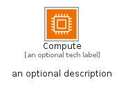
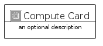
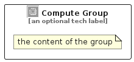

# Compute


```text
aws/Category/Compute
```

```text
include('aws/Category/Compute')
```


| Illustration | Compute | ComputeCard | ComputeGroup |
| :---: | :---: | :---: | :---: |
|  |  |  |  |


## Sprites
The item provides the following sriptes:

- `<$ComputeXs>`
- `<$ComputeSm>`
- `<$ComputeMd>`
- `<$ComputeLg>`


## Compute

### Load remotely
```plantuml
@startuml
' configures the library
!global $LIB_BASE_LOCATION="https://raw.githubusercontent.com/tmorin/plantuml-libs/master/distribution"

' loads the library's bootstrap
!include $LIB_BASE_LOCATION/bootstrap.puml

' loads the package bootstrap
include('aws/bootstrap')

' loads the Item which embeds the element Compute
include('aws/Category/Compute')

' renders the element
Compute('Compute', 'Compute', 'an optional tech label', 'an optional description')
@enduml
```

### Load locally
```plantuml
@startuml
' configures the library
!global $INCLUSION_MODE="local"
!global $LIB_BASE_LOCATION="../.."

' loads the library's bootstrap
!include $LIB_BASE_LOCATION/bootstrap.puml

' loads the package bootstrap
include('aws/bootstrap')

' loads the Item which embeds the element Compute
include('aws/Category/Compute')

' renders the element
Compute('Compute', 'Compute', 'an optional tech label', 'an optional description')
@enduml
```

## ComputeCard

### Load remotely
```plantuml
@startuml
' configures the library
!global $LIB_BASE_LOCATION="https://raw.githubusercontent.com/tmorin/plantuml-libs/master/distribution"

' loads the library's bootstrap
!include $LIB_BASE_LOCATION/bootstrap.puml

' loads the package bootstrap
include('aws/bootstrap')

' loads the Item which embeds the element ComputeCard
include('aws/Category/Compute')

' renders the element
ComputeCard('ComputeCard', 'Compute Card', 'an optional description')
@enduml
```

### Load locally
```plantuml
@startuml
' configures the library
!global $INCLUSION_MODE="local"
!global $LIB_BASE_LOCATION="../.."

' loads the library's bootstrap
!include $LIB_BASE_LOCATION/bootstrap.puml

' loads the package bootstrap
include('aws/bootstrap')

' loads the Item which embeds the element ComputeCard
include('aws/Category/Compute')

' renders the element
ComputeCard('ComputeCard', 'Compute Card', 'an optional description')
@enduml
```

## ComputeGroup

### Load remotely
```plantuml
@startuml
' configures the library
!global $LIB_BASE_LOCATION="https://raw.githubusercontent.com/tmorin/plantuml-libs/master/distribution"

' loads the library's bootstrap
!include $LIB_BASE_LOCATION/bootstrap.puml

' loads the package bootstrap
include('aws/bootstrap')

' loads the Item which embeds the element ComputeGroup
include('aws/Category/Compute')

' renders the element
ComputeGroup('ComputeGroup', 'Compute Group', 'an optional tech label') {
    note as note
        the content of the group
    end note
}
@enduml
```

### Load locally
```plantuml
@startuml
' configures the library
!global $INCLUSION_MODE="local"
!global $LIB_BASE_LOCATION="../.."

' loads the library's bootstrap
!include $LIB_BASE_LOCATION/bootstrap.puml

' loads the package bootstrap
include('aws/bootstrap')

' loads the Item which embeds the element ComputeGroup
include('aws/Category/Compute')

' renders the element
ComputeGroup('ComputeGroup', 'Compute Group', 'an optional tech label') {
    note as note
        the content of the group
    end note
}
@enduml
```

