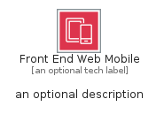
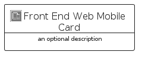
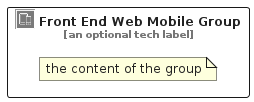

# FrontEndWebMobile


```text
aws/Category/FrontEndWebMobile
```

```text
include('aws/Category/FrontEndWebMobile')
```


| Illustration | FrontEndWebMobile | FrontEndWebMobileCard | FrontEndWebMobileGroup |
| :---: | :---: | :---: | :---: |
|  |  |  |  |


## Sprites
The item provides the following sriptes:

- `<$FrontEndWebMobileXs>`
- `<$FrontEndWebMobileSm>`
- `<$FrontEndWebMobileMd>`
- `<$FrontEndWebMobileLg>`


## FrontEndWebMobile

### Load remotely
```plantuml
@startuml
' configures the library
!global $LIB_BASE_LOCATION="https://raw.githubusercontent.com/tmorin/plantuml-libs/master/distribution"

' loads the library's bootstrap
!include $LIB_BASE_LOCATION/bootstrap.puml

' loads the package bootstrap
include('aws/bootstrap')

' loads the Item which embeds the element FrontEndWebMobile
include('aws/Category/FrontEndWebMobile')

' renders the element
FrontEndWebMobile('FrontEndWebMobile', 'Front End Web Mobile', 'an optional tech label', 'an optional description')
@enduml
```

### Load locally
```plantuml
@startuml
' configures the library
!global $INCLUSION_MODE="local"
!global $LIB_BASE_LOCATION="../.."

' loads the library's bootstrap
!include $LIB_BASE_LOCATION/bootstrap.puml

' loads the package bootstrap
include('aws/bootstrap')

' loads the Item which embeds the element FrontEndWebMobile
include('aws/Category/FrontEndWebMobile')

' renders the element
FrontEndWebMobile('FrontEndWebMobile', 'Front End Web Mobile', 'an optional tech label', 'an optional description')
@enduml
```

## FrontEndWebMobileCard

### Load remotely
```plantuml
@startuml
' configures the library
!global $LIB_BASE_LOCATION="https://raw.githubusercontent.com/tmorin/plantuml-libs/master/distribution"

' loads the library's bootstrap
!include $LIB_BASE_LOCATION/bootstrap.puml

' loads the package bootstrap
include('aws/bootstrap')

' loads the Item which embeds the element FrontEndWebMobileCard
include('aws/Category/FrontEndWebMobile')

' renders the element
FrontEndWebMobileCard('FrontEndWebMobileCard', 'Front End Web Mobile Card', 'an optional description')
@enduml
```

### Load locally
```plantuml
@startuml
' configures the library
!global $INCLUSION_MODE="local"
!global $LIB_BASE_LOCATION="../.."

' loads the library's bootstrap
!include $LIB_BASE_LOCATION/bootstrap.puml

' loads the package bootstrap
include('aws/bootstrap')

' loads the Item which embeds the element FrontEndWebMobileCard
include('aws/Category/FrontEndWebMobile')

' renders the element
FrontEndWebMobileCard('FrontEndWebMobileCard', 'Front End Web Mobile Card', 'an optional description')
@enduml
```

## FrontEndWebMobileGroup

### Load remotely
```plantuml
@startuml
' configures the library
!global $LIB_BASE_LOCATION="https://raw.githubusercontent.com/tmorin/plantuml-libs/master/distribution"

' loads the library's bootstrap
!include $LIB_BASE_LOCATION/bootstrap.puml

' loads the package bootstrap
include('aws/bootstrap')

' loads the Item which embeds the element FrontEndWebMobileGroup
include('aws/Category/FrontEndWebMobile')

' renders the element
FrontEndWebMobileGroup('FrontEndWebMobileGroup', 'Front End Web Mobile Group', 'an optional tech label') {
    note as note
        the content of the group
    end note
}
@enduml
```

### Load locally
```plantuml
@startuml
' configures the library
!global $INCLUSION_MODE="local"
!global $LIB_BASE_LOCATION="../.."

' loads the library's bootstrap
!include $LIB_BASE_LOCATION/bootstrap.puml

' loads the package bootstrap
include('aws/bootstrap')

' loads the Item which embeds the element FrontEndWebMobileGroup
include('aws/Category/FrontEndWebMobile')

' renders the element
FrontEndWebMobileGroup('FrontEndWebMobileGroup', 'Front End Web Mobile Group', 'an optional tech label') {
    note as note
        the content of the group
    end note
}
@enduml
```

