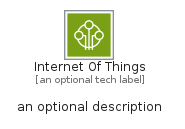
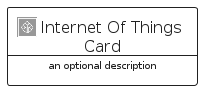
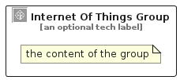

# InternetOfThings


```text
aws/Category/InternetOfThings
```

```text
include('aws/Category/InternetOfThings')
```


| Illustration | InternetOfThings | InternetOfThingsCard | InternetOfThingsGroup |
| :---: | :---: | :---: | :---: |
|  |  |  |  |


## Sprites
The item provides the following sriptes:

- `<$InternetOfThingsXs>`
- `<$InternetOfThingsSm>`
- `<$InternetOfThingsMd>`
- `<$InternetOfThingsLg>`


## InternetOfThings

### Load remotely
```plantuml
@startuml
' configures the library
!global $LIB_BASE_LOCATION="https://raw.githubusercontent.com/tmorin/plantuml-libs/master/distribution"

' loads the library's bootstrap
!include $LIB_BASE_LOCATION/bootstrap.puml

' loads the package bootstrap
include('aws/bootstrap')

' loads the Item which embeds the element InternetOfThings
include('aws/Category/InternetOfThings')

' renders the element
InternetOfThings('InternetOfThings', 'Internet Of Things', 'an optional tech label', 'an optional description')
@enduml
```

### Load locally
```plantuml
@startuml
' configures the library
!global $INCLUSION_MODE="local"
!global $LIB_BASE_LOCATION="../.."

' loads the library's bootstrap
!include $LIB_BASE_LOCATION/bootstrap.puml

' loads the package bootstrap
include('aws/bootstrap')

' loads the Item which embeds the element InternetOfThings
include('aws/Category/InternetOfThings')

' renders the element
InternetOfThings('InternetOfThings', 'Internet Of Things', 'an optional tech label', 'an optional description')
@enduml
```

## InternetOfThingsCard

### Load remotely
```plantuml
@startuml
' configures the library
!global $LIB_BASE_LOCATION="https://raw.githubusercontent.com/tmorin/plantuml-libs/master/distribution"

' loads the library's bootstrap
!include $LIB_BASE_LOCATION/bootstrap.puml

' loads the package bootstrap
include('aws/bootstrap')

' loads the Item which embeds the element InternetOfThingsCard
include('aws/Category/InternetOfThings')

' renders the element
InternetOfThingsCard('InternetOfThingsCard', 'Internet Of Things Card', 'an optional description')
@enduml
```

### Load locally
```plantuml
@startuml
' configures the library
!global $INCLUSION_MODE="local"
!global $LIB_BASE_LOCATION="../.."

' loads the library's bootstrap
!include $LIB_BASE_LOCATION/bootstrap.puml

' loads the package bootstrap
include('aws/bootstrap')

' loads the Item which embeds the element InternetOfThingsCard
include('aws/Category/InternetOfThings')

' renders the element
InternetOfThingsCard('InternetOfThingsCard', 'Internet Of Things Card', 'an optional description')
@enduml
```

## InternetOfThingsGroup

### Load remotely
```plantuml
@startuml
' configures the library
!global $LIB_BASE_LOCATION="https://raw.githubusercontent.com/tmorin/plantuml-libs/master/distribution"

' loads the library's bootstrap
!include $LIB_BASE_LOCATION/bootstrap.puml

' loads the package bootstrap
include('aws/bootstrap')

' loads the Item which embeds the element InternetOfThingsGroup
include('aws/Category/InternetOfThings')

' renders the element
InternetOfThingsGroup('InternetOfThingsGroup', 'Internet Of Things Group', 'an optional tech label') {
    note as note
        the content of the group
    end note
}
@enduml
```

### Load locally
```plantuml
@startuml
' configures the library
!global $INCLUSION_MODE="local"
!global $LIB_BASE_LOCATION="../.."

' loads the library's bootstrap
!include $LIB_BASE_LOCATION/bootstrap.puml

' loads the package bootstrap
include('aws/bootstrap')

' loads the Item which embeds the element InternetOfThingsGroup
include('aws/Category/InternetOfThings')

' renders the element
InternetOfThingsGroup('InternetOfThingsGroup', 'Internet Of Things Group', 'an optional tech label') {
    note as note
        the content of the group
    end note
}
@enduml
```

