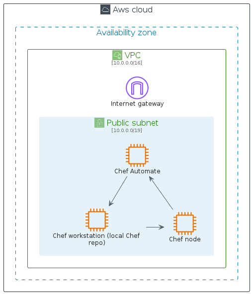
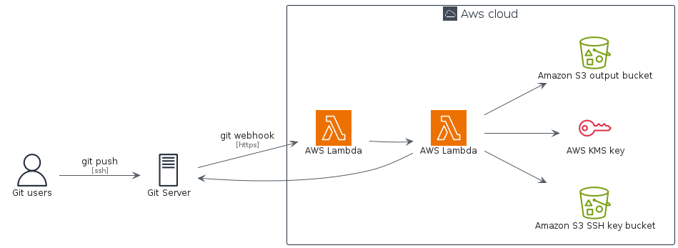

# aws

## Usage

### Bootstrap

The bootstrap may provide PlantUML artifacts like constants, procedures or style statements.

```plantuml
' loads the aws bootstrap
include('aws/bootstrap')
```


# Modules

The package provides 4 modules.

- [aws/Architecture](../aws/Architecture/README.md) with 309 items
- [aws/Category](../aws/Category/README.md) with 25 items
- [aws/Group](../aws/Group/README.md) with 17 items
- [aws/Resource](../aws/Resource/README.md) with 493 items


# Examples

The package provides 2 examples.

## Chef Automate Architecture on AWS

<br>
[The source file.](../aws/chef_automate_architecture_on_aws.puml)

## Git to S3 Webhooks

<br>
[The source file.](../aws/git_to_s3_webhooks.puml)


