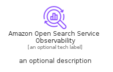
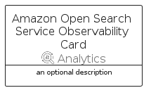

# AmazonOpenSearchServiceObservability


```text
aws/Resource/Analytics/AmazonOpenSearchServiceObservability
```

```text
include('aws/Resource/Analytics/AmazonOpenSearchServiceObservability')
```


| Illustration | AmazonOpenSearchServiceObservability | AmazonOpenSearchServiceObservabilityCard | AmazonOpenSearchServiceObservabilityGroup |
| :---: | :---: | :---: | :---: |
|  |  |  |  |


## Sprites
The item provides the following sriptes:

- `<$AmazonOpenSearchServiceObservabilityXs>`
- `<$AmazonOpenSearchServiceObservabilitySm>`
- `<$AmazonOpenSearchServiceObservabilityMd>`
- `<$AmazonOpenSearchServiceObservabilityLg>`


## AmazonOpenSearchServiceObservability

### Load remotely
```plantuml
@startuml
' configures the library
!global $LIB_BASE_LOCATION="https://raw.githubusercontent.com/tmorin/plantuml-libs/master/distribution"

' loads the library's bootstrap
!include $LIB_BASE_LOCATION/bootstrap.puml

' loads the package bootstrap
include('aws/bootstrap')

' loads the Item which embeds the element AmazonOpenSearchServiceObservability
include('aws/Resource/Analytics/AmazonOpenSearchServiceObservability')

' renders the element
AmazonOpenSearchServiceObservability('AmazonOpenSearchServiceObservability', 'Amazon Open Search Service Observability', 'an optional tech label', 'an optional description')
@enduml
```

### Load locally
```plantuml
@startuml
' configures the library
!global $INCLUSION_MODE="local"
!global $LIB_BASE_LOCATION="../../.."

' loads the library's bootstrap
!include $LIB_BASE_LOCATION/bootstrap.puml

' loads the package bootstrap
include('aws/bootstrap')

' loads the Item which embeds the element AmazonOpenSearchServiceObservability
include('aws/Resource/Analytics/AmazonOpenSearchServiceObservability')

' renders the element
AmazonOpenSearchServiceObservability('AmazonOpenSearchServiceObservability', 'Amazon Open Search Service Observability', 'an optional tech label', 'an optional description')
@enduml
```

## AmazonOpenSearchServiceObservabilityCard

### Load remotely
```plantuml
@startuml
' configures the library
!global $LIB_BASE_LOCATION="https://raw.githubusercontent.com/tmorin/plantuml-libs/master/distribution"

' loads the library's bootstrap
!include $LIB_BASE_LOCATION/bootstrap.puml

' loads the package bootstrap
include('aws/bootstrap')

' loads the Item which embeds the element AmazonOpenSearchServiceObservabilityCard
include('aws/Resource/Analytics/AmazonOpenSearchServiceObservability')

' renders the element
AmazonOpenSearchServiceObservabilityCard('AmazonOpenSearchServiceObservabilityCard', 'Amazon Open Search Service Observability Card', 'an optional description')
@enduml
```

### Load locally
```plantuml
@startuml
' configures the library
!global $INCLUSION_MODE="local"
!global $LIB_BASE_LOCATION="../../.."

' loads the library's bootstrap
!include $LIB_BASE_LOCATION/bootstrap.puml

' loads the package bootstrap
include('aws/bootstrap')

' loads the Item which embeds the element AmazonOpenSearchServiceObservabilityCard
include('aws/Resource/Analytics/AmazonOpenSearchServiceObservability')

' renders the element
AmazonOpenSearchServiceObservabilityCard('AmazonOpenSearchServiceObservabilityCard', 'Amazon Open Search Service Observability Card', 'an optional description')
@enduml
```

## AmazonOpenSearchServiceObservabilityGroup

### Load remotely
```plantuml
@startuml
' configures the library
!global $LIB_BASE_LOCATION="https://raw.githubusercontent.com/tmorin/plantuml-libs/master/distribution"

' loads the library's bootstrap
!include $LIB_BASE_LOCATION/bootstrap.puml

' loads the package bootstrap
include('aws/bootstrap')

' loads the Item which embeds the element AmazonOpenSearchServiceObservabilityGroup
include('aws/Resource/Analytics/AmazonOpenSearchServiceObservability')

' renders the element
AmazonOpenSearchServiceObservabilityGroup('AmazonOpenSearchServiceObservabilityGroup', 'Amazon Open Search Service Observability Group', 'an optional tech label') {
    note as note
        the content of the group
    end note
}
@enduml
```

### Load locally
```plantuml
@startuml
' configures the library
!global $INCLUSION_MODE="local"
!global $LIB_BASE_LOCATION="../../.."

' loads the library's bootstrap
!include $LIB_BASE_LOCATION/bootstrap.puml

' loads the package bootstrap
include('aws/bootstrap')

' loads the Item which embeds the element AmazonOpenSearchServiceObservabilityGroup
include('aws/Resource/Analytics/AmazonOpenSearchServiceObservability')

' renders the element
AmazonOpenSearchServiceObservabilityGroup('AmazonOpenSearchServiceObservabilityGroup', 'Amazon Open Search Service Observability Group', 'an optional tech label') {
    note as note
        the content of the group
    end note
}
@enduml
```

