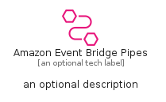
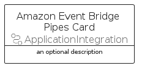
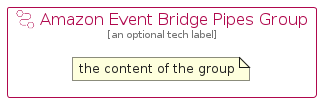

# AmazonEventBridgePipes


```text
aws/Resource/ApplicationIntegration/AmazonEventBridgePipes
```

```text
include('aws/Resource/ApplicationIntegration/AmazonEventBridgePipes')
```


| Illustration | AmazonEventBridgePipes | AmazonEventBridgePipesCard | AmazonEventBridgePipesGroup |
| :---: | :---: | :---: | :---: |
|  |  |  |  |


## Sprites
The item provides the following sriptes:

- `<$AmazonEventBridgePipesXs>`
- `<$AmazonEventBridgePipesSm>`
- `<$AmazonEventBridgePipesMd>`
- `<$AmazonEventBridgePipesLg>`


## AmazonEventBridgePipes

### Load remotely
```plantuml
@startuml
' configures the library
!global $LIB_BASE_LOCATION="https://raw.githubusercontent.com/tmorin/plantuml-libs/master/distribution"

' loads the library's bootstrap
!include $LIB_BASE_LOCATION/bootstrap.puml

' loads the package bootstrap
include('aws/bootstrap')

' loads the Item which embeds the element AmazonEventBridgePipes
include('aws/Resource/ApplicationIntegration/AmazonEventBridgePipes')

' renders the element
AmazonEventBridgePipes('AmazonEventBridgePipes', 'Amazon Event Bridge Pipes', 'an optional tech label', 'an optional description')
@enduml
```

### Load locally
```plantuml
@startuml
' configures the library
!global $INCLUSION_MODE="local"
!global $LIB_BASE_LOCATION="../../.."

' loads the library's bootstrap
!include $LIB_BASE_LOCATION/bootstrap.puml

' loads the package bootstrap
include('aws/bootstrap')

' loads the Item which embeds the element AmazonEventBridgePipes
include('aws/Resource/ApplicationIntegration/AmazonEventBridgePipes')

' renders the element
AmazonEventBridgePipes('AmazonEventBridgePipes', 'Amazon Event Bridge Pipes', 'an optional tech label', 'an optional description')
@enduml
```

## AmazonEventBridgePipesCard

### Load remotely
```plantuml
@startuml
' configures the library
!global $LIB_BASE_LOCATION="https://raw.githubusercontent.com/tmorin/plantuml-libs/master/distribution"

' loads the library's bootstrap
!include $LIB_BASE_LOCATION/bootstrap.puml

' loads the package bootstrap
include('aws/bootstrap')

' loads the Item which embeds the element AmazonEventBridgePipesCard
include('aws/Resource/ApplicationIntegration/AmazonEventBridgePipes')

' renders the element
AmazonEventBridgePipesCard('AmazonEventBridgePipesCard', 'Amazon Event Bridge Pipes Card', 'an optional description')
@enduml
```

### Load locally
```plantuml
@startuml
' configures the library
!global $INCLUSION_MODE="local"
!global $LIB_BASE_LOCATION="../../.."

' loads the library's bootstrap
!include $LIB_BASE_LOCATION/bootstrap.puml

' loads the package bootstrap
include('aws/bootstrap')

' loads the Item which embeds the element AmazonEventBridgePipesCard
include('aws/Resource/ApplicationIntegration/AmazonEventBridgePipes')

' renders the element
AmazonEventBridgePipesCard('AmazonEventBridgePipesCard', 'Amazon Event Bridge Pipes Card', 'an optional description')
@enduml
```

## AmazonEventBridgePipesGroup

### Load remotely
```plantuml
@startuml
' configures the library
!global $LIB_BASE_LOCATION="https://raw.githubusercontent.com/tmorin/plantuml-libs/master/distribution"

' loads the library's bootstrap
!include $LIB_BASE_LOCATION/bootstrap.puml

' loads the package bootstrap
include('aws/bootstrap')

' loads the Item which embeds the element AmazonEventBridgePipesGroup
include('aws/Resource/ApplicationIntegration/AmazonEventBridgePipes')

' renders the element
AmazonEventBridgePipesGroup('AmazonEventBridgePipesGroup', 'Amazon Event Bridge Pipes Group', 'an optional tech label') {
    note as note
        the content of the group
    end note
}
@enduml
```

### Load locally
```plantuml
@startuml
' configures the library
!global $INCLUSION_MODE="local"
!global $LIB_BASE_LOCATION="../../.."

' loads the library's bootstrap
!include $LIB_BASE_LOCATION/bootstrap.puml

' loads the package bootstrap
include('aws/bootstrap')

' loads the Item which embeds the element AmazonEventBridgePipesGroup
include('aws/Resource/ApplicationIntegration/AmazonEventBridgePipes')

' renders the element
AmazonEventBridgePipesGroup('AmazonEventBridgePipesGroup', 'Amazon Event Bridge Pipes Group', 'an optional tech label') {
    note as note
        the content of the group
    end note
}
@enduml
```

