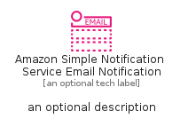
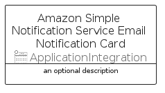

# AmazonSimpleNotificationServiceEmailNotification


```text
aws/Resource/ApplicationIntegration/AmazonSimpleNotificationServiceEmailNotification
```

```text
include('aws/Resource/ApplicationIntegration/AmazonSimpleNotificationServiceEmailNotification')
```


| Illustration | AmazonSimpleNotificationServiceEmailNotification | AmazonSimpleNotificationServiceEmailNotificationCard | AmazonSimpleNotificationServiceEmailNotificationGroup |
| :---: | :---: | :---: | :---: |
|  |  |  |  |


## Sprites
The item provides the following sriptes:

- `<$AmazonSimpleNotificationServiceEmailNotificationXs>`
- `<$AmazonSimpleNotificationServiceEmailNotificationSm>`
- `<$AmazonSimpleNotificationServiceEmailNotificationMd>`
- `<$AmazonSimpleNotificationServiceEmailNotificationLg>`


## AmazonSimpleNotificationServiceEmailNotification

### Load remotely
```plantuml
@startuml
' configures the library
!global $LIB_BASE_LOCATION="https://raw.githubusercontent.com/tmorin/plantuml-libs/master/distribution"

' loads the library's bootstrap
!include $LIB_BASE_LOCATION/bootstrap.puml

' loads the package bootstrap
include('aws/bootstrap')

' loads the Item which embeds the element AmazonSimpleNotificationServiceEmailNotification
include('aws/Resource/ApplicationIntegration/AmazonSimpleNotificationServiceEmailNotification')

' renders the element
AmazonSimpleNotificationServiceEmailNotification('AmazonSimpleNotificationServiceEmailNotification', 'Amazon Simple Notification Service Email Notification', 'an optional tech label', 'an optional description')
@enduml
```

### Load locally
```plantuml
@startuml
' configures the library
!global $INCLUSION_MODE="local"
!global $LIB_BASE_LOCATION="../../.."

' loads the library's bootstrap
!include $LIB_BASE_LOCATION/bootstrap.puml

' loads the package bootstrap
include('aws/bootstrap')

' loads the Item which embeds the element AmazonSimpleNotificationServiceEmailNotification
include('aws/Resource/ApplicationIntegration/AmazonSimpleNotificationServiceEmailNotification')

' renders the element
AmazonSimpleNotificationServiceEmailNotification('AmazonSimpleNotificationServiceEmailNotification', 'Amazon Simple Notification Service Email Notification', 'an optional tech label', 'an optional description')
@enduml
```

## AmazonSimpleNotificationServiceEmailNotificationCard

### Load remotely
```plantuml
@startuml
' configures the library
!global $LIB_BASE_LOCATION="https://raw.githubusercontent.com/tmorin/plantuml-libs/master/distribution"

' loads the library's bootstrap
!include $LIB_BASE_LOCATION/bootstrap.puml

' loads the package bootstrap
include('aws/bootstrap')

' loads the Item which embeds the element AmazonSimpleNotificationServiceEmailNotificationCard
include('aws/Resource/ApplicationIntegration/AmazonSimpleNotificationServiceEmailNotification')

' renders the element
AmazonSimpleNotificationServiceEmailNotificationCard('AmazonSimpleNotificationServiceEmailNotificationCard', 'Amazon Simple Notification Service Email Notification Card', 'an optional description')
@enduml
```

### Load locally
```plantuml
@startuml
' configures the library
!global $INCLUSION_MODE="local"
!global $LIB_BASE_LOCATION="../../.."

' loads the library's bootstrap
!include $LIB_BASE_LOCATION/bootstrap.puml

' loads the package bootstrap
include('aws/bootstrap')

' loads the Item which embeds the element AmazonSimpleNotificationServiceEmailNotificationCard
include('aws/Resource/ApplicationIntegration/AmazonSimpleNotificationServiceEmailNotification')

' renders the element
AmazonSimpleNotificationServiceEmailNotificationCard('AmazonSimpleNotificationServiceEmailNotificationCard', 'Amazon Simple Notification Service Email Notification Card', 'an optional description')
@enduml
```

## AmazonSimpleNotificationServiceEmailNotificationGroup

### Load remotely
```plantuml
@startuml
' configures the library
!global $LIB_BASE_LOCATION="https://raw.githubusercontent.com/tmorin/plantuml-libs/master/distribution"

' loads the library's bootstrap
!include $LIB_BASE_LOCATION/bootstrap.puml

' loads the package bootstrap
include('aws/bootstrap')

' loads the Item which embeds the element AmazonSimpleNotificationServiceEmailNotificationGroup
include('aws/Resource/ApplicationIntegration/AmazonSimpleNotificationServiceEmailNotification')

' renders the element
AmazonSimpleNotificationServiceEmailNotificationGroup('AmazonSimpleNotificationServiceEmailNotificationGroup', 'Amazon Simple Notification Service Email Notification Group', 'an optional tech label') {
    note as note
        the content of the group
    end note
}
@enduml
```

### Load locally
```plantuml
@startuml
' configures the library
!global $INCLUSION_MODE="local"
!global $LIB_BASE_LOCATION="../../.."

' loads the library's bootstrap
!include $LIB_BASE_LOCATION/bootstrap.puml

' loads the package bootstrap
include('aws/bootstrap')

' loads the Item which embeds the element AmazonSimpleNotificationServiceEmailNotificationGroup
include('aws/Resource/ApplicationIntegration/AmazonSimpleNotificationServiceEmailNotification')

' renders the element
AmazonSimpleNotificationServiceEmailNotificationGroup('AmazonSimpleNotificationServiceEmailNotificationGroup', 'Amazon Simple Notification Service Email Notification Group', 'an optional tech label') {
    note as note
        the content of the group
    end note
}
@enduml
```

