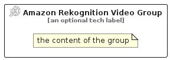

# AmazonRekognitionVideo


```text
aws/Resource/ArtificialIntelligence/AmazonRekognitionVideo
```

```text
include('aws/Resource/ArtificialIntelligence/AmazonRekognitionVideo')
```


| Illustration | AmazonRekognitionVideo | AmazonRekognitionVideoCard | AmazonRekognitionVideoGroup |
| :---: | :---: | :---: | :---: |
|  |  |  |  |


## Sprites
The item provides the following sriptes:

- `<$AmazonRekognitionVideoXs>`
- `<$AmazonRekognitionVideoSm>`
- `<$AmazonRekognitionVideoMd>`
- `<$AmazonRekognitionVideoLg>`


## AmazonRekognitionVideo

### Load remotely
```plantuml
@startuml
' configures the library
!global $LIB_BASE_LOCATION="https://raw.githubusercontent.com/tmorin/plantuml-libs/master/distribution"

' loads the library's bootstrap
!include $LIB_BASE_LOCATION/bootstrap.puml

' loads the package bootstrap
include('aws/bootstrap')

' loads the Item which embeds the element AmazonRekognitionVideo
include('aws/Resource/ArtificialIntelligence/AmazonRekognitionVideo')

' renders the element
AmazonRekognitionVideo('AmazonRekognitionVideo', 'Amazon Rekognition Video', 'an optional tech label', 'an optional description')
@enduml
```

### Load locally
```plantuml
@startuml
' configures the library
!global $INCLUSION_MODE="local"
!global $LIB_BASE_LOCATION="../../.."

' loads the library's bootstrap
!include $LIB_BASE_LOCATION/bootstrap.puml

' loads the package bootstrap
include('aws/bootstrap')

' loads the Item which embeds the element AmazonRekognitionVideo
include('aws/Resource/ArtificialIntelligence/AmazonRekognitionVideo')

' renders the element
AmazonRekognitionVideo('AmazonRekognitionVideo', 'Amazon Rekognition Video', 'an optional tech label', 'an optional description')
@enduml
```

## AmazonRekognitionVideoCard

### Load remotely
```plantuml
@startuml
' configures the library
!global $LIB_BASE_LOCATION="https://raw.githubusercontent.com/tmorin/plantuml-libs/master/distribution"

' loads the library's bootstrap
!include $LIB_BASE_LOCATION/bootstrap.puml

' loads the package bootstrap
include('aws/bootstrap')

' loads the Item which embeds the element AmazonRekognitionVideoCard
include('aws/Resource/ArtificialIntelligence/AmazonRekognitionVideo')

' renders the element
AmazonRekognitionVideoCard('AmazonRekognitionVideoCard', 'Amazon Rekognition Video Card', 'an optional description')
@enduml
```

### Load locally
```plantuml
@startuml
' configures the library
!global $INCLUSION_MODE="local"
!global $LIB_BASE_LOCATION="../../.."

' loads the library's bootstrap
!include $LIB_BASE_LOCATION/bootstrap.puml

' loads the package bootstrap
include('aws/bootstrap')

' loads the Item which embeds the element AmazonRekognitionVideoCard
include('aws/Resource/ArtificialIntelligence/AmazonRekognitionVideo')

' renders the element
AmazonRekognitionVideoCard('AmazonRekognitionVideoCard', 'Amazon Rekognition Video Card', 'an optional description')
@enduml
```

## AmazonRekognitionVideoGroup

### Load remotely
```plantuml
@startuml
' configures the library
!global $LIB_BASE_LOCATION="https://raw.githubusercontent.com/tmorin/plantuml-libs/master/distribution"

' loads the library's bootstrap
!include $LIB_BASE_LOCATION/bootstrap.puml

' loads the package bootstrap
include('aws/bootstrap')

' loads the Item which embeds the element AmazonRekognitionVideoGroup
include('aws/Resource/ArtificialIntelligence/AmazonRekognitionVideo')

' renders the element
AmazonRekognitionVideoGroup('AmazonRekognitionVideoGroup', 'Amazon Rekognition Video Group', 'an optional tech label') {
    note as note
        the content of the group
    end note
}
@enduml
```

### Load locally
```plantuml
@startuml
' configures the library
!global $INCLUSION_MODE="local"
!global $LIB_BASE_LOCATION="../../.."

' loads the library's bootstrap
!include $LIB_BASE_LOCATION/bootstrap.puml

' loads the package bootstrap
include('aws/bootstrap')

' loads the Item which embeds the element AmazonRekognitionVideoGroup
include('aws/Resource/ArtificialIntelligence/AmazonRekognitionVideo')

' renders the element
AmazonRekognitionVideoGroup('AmazonRekognitionVideoGroup', 'Amazon Rekognition Video Group', 'an optional tech label') {
    note as note
        the content of the group
    end note
}
@enduml
```

