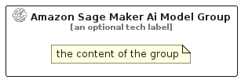

# AmazonSageMakerAiModel


```text
aws/Resource/ArtificialIntelligence/AmazonSageMakerAiModel
```

```text
include('aws/Resource/ArtificialIntelligence/AmazonSageMakerAiModel')
```


| Illustration | AmazonSageMakerAiModel | AmazonSageMakerAiModelCard | AmazonSageMakerAiModelGroup |
| :---: | :---: | :---: | :---: |
|  |  |  |  |


## Sprites
The item provides the following sriptes:

- `<$AmazonSageMakerAiModelXs>`
- `<$AmazonSageMakerAiModelSm>`
- `<$AmazonSageMakerAiModelMd>`
- `<$AmazonSageMakerAiModelLg>`


## AmazonSageMakerAiModel

### Load remotely
```plantuml
@startuml
' configures the library
!global $LIB_BASE_LOCATION="https://raw.githubusercontent.com/tmorin/plantuml-libs/master/distribution"

' loads the library's bootstrap
!include $LIB_BASE_LOCATION/bootstrap.puml

' loads the package bootstrap
include('aws/bootstrap')

' loads the Item which embeds the element AmazonSageMakerAiModel
include('aws/Resource/ArtificialIntelligence/AmazonSageMakerAiModel')

' renders the element
AmazonSageMakerAiModel('AmazonSageMakerAiModel', 'Amazon Sage Maker Ai Model', 'an optional tech label', 'an optional description')
@enduml
```

### Load locally
```plantuml
@startuml
' configures the library
!global $INCLUSION_MODE="local"
!global $LIB_BASE_LOCATION="../../.."

' loads the library's bootstrap
!include $LIB_BASE_LOCATION/bootstrap.puml

' loads the package bootstrap
include('aws/bootstrap')

' loads the Item which embeds the element AmazonSageMakerAiModel
include('aws/Resource/ArtificialIntelligence/AmazonSageMakerAiModel')

' renders the element
AmazonSageMakerAiModel('AmazonSageMakerAiModel', 'Amazon Sage Maker Ai Model', 'an optional tech label', 'an optional description')
@enduml
```

## AmazonSageMakerAiModelCard

### Load remotely
```plantuml
@startuml
' configures the library
!global $LIB_BASE_LOCATION="https://raw.githubusercontent.com/tmorin/plantuml-libs/master/distribution"

' loads the library's bootstrap
!include $LIB_BASE_LOCATION/bootstrap.puml

' loads the package bootstrap
include('aws/bootstrap')

' loads the Item which embeds the element AmazonSageMakerAiModelCard
include('aws/Resource/ArtificialIntelligence/AmazonSageMakerAiModel')

' renders the element
AmazonSageMakerAiModelCard('AmazonSageMakerAiModelCard', 'Amazon Sage Maker Ai Model Card', 'an optional description')
@enduml
```

### Load locally
```plantuml
@startuml
' configures the library
!global $INCLUSION_MODE="local"
!global $LIB_BASE_LOCATION="../../.."

' loads the library's bootstrap
!include $LIB_BASE_LOCATION/bootstrap.puml

' loads the package bootstrap
include('aws/bootstrap')

' loads the Item which embeds the element AmazonSageMakerAiModelCard
include('aws/Resource/ArtificialIntelligence/AmazonSageMakerAiModel')

' renders the element
AmazonSageMakerAiModelCard('AmazonSageMakerAiModelCard', 'Amazon Sage Maker Ai Model Card', 'an optional description')
@enduml
```

## AmazonSageMakerAiModelGroup

### Load remotely
```plantuml
@startuml
' configures the library
!global $LIB_BASE_LOCATION="https://raw.githubusercontent.com/tmorin/plantuml-libs/master/distribution"

' loads the library's bootstrap
!include $LIB_BASE_LOCATION/bootstrap.puml

' loads the package bootstrap
include('aws/bootstrap')

' loads the Item which embeds the element AmazonSageMakerAiModelGroup
include('aws/Resource/ArtificialIntelligence/AmazonSageMakerAiModel')

' renders the element
AmazonSageMakerAiModelGroup('AmazonSageMakerAiModelGroup', 'Amazon Sage Maker Ai Model Group', 'an optional tech label') {
    note as note
        the content of the group
    end note
}
@enduml
```

### Load locally
```plantuml
@startuml
' configures the library
!global $INCLUSION_MODE="local"
!global $LIB_BASE_LOCATION="../../.."

' loads the library's bootstrap
!include $LIB_BASE_LOCATION/bootstrap.puml

' loads the package bootstrap
include('aws/bootstrap')

' loads the Item which embeds the element AmazonSageMakerAiModelGroup
include('aws/Resource/ArtificialIntelligence/AmazonSageMakerAiModel')

' renders the element
AmazonSageMakerAiModelGroup('AmazonSageMakerAiModelGroup', 'Amazon Sage Maker Ai Model Group', 'an optional tech label') {
    note as note
        the content of the group
    end note
}
@enduml
```

