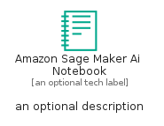
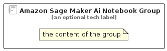

# AmazonSageMakerAiNotebook


```text
aws/Resource/ArtificialIntelligence/AmazonSageMakerAiNotebook
```

```text
include('aws/Resource/ArtificialIntelligence/AmazonSageMakerAiNotebook')
```


| Illustration | AmazonSageMakerAiNotebook | AmazonSageMakerAiNotebookCard | AmazonSageMakerAiNotebookGroup |
| :---: | :---: | :---: | :---: |
|  |  |  |  |


## Sprites
The item provides the following sriptes:

- `<$AmazonSageMakerAiNotebookXs>`
- `<$AmazonSageMakerAiNotebookSm>`
- `<$AmazonSageMakerAiNotebookMd>`
- `<$AmazonSageMakerAiNotebookLg>`


## AmazonSageMakerAiNotebook

### Load remotely
```plantuml
@startuml
' configures the library
!global $LIB_BASE_LOCATION="https://raw.githubusercontent.com/tmorin/plantuml-libs/master/distribution"

' loads the library's bootstrap
!include $LIB_BASE_LOCATION/bootstrap.puml

' loads the package bootstrap
include('aws/bootstrap')

' loads the Item which embeds the element AmazonSageMakerAiNotebook
include('aws/Resource/ArtificialIntelligence/AmazonSageMakerAiNotebook')

' renders the element
AmazonSageMakerAiNotebook('AmazonSageMakerAiNotebook', 'Amazon Sage Maker Ai Notebook', 'an optional tech label', 'an optional description')
@enduml
```

### Load locally
```plantuml
@startuml
' configures the library
!global $INCLUSION_MODE="local"
!global $LIB_BASE_LOCATION="../../.."

' loads the library's bootstrap
!include $LIB_BASE_LOCATION/bootstrap.puml

' loads the package bootstrap
include('aws/bootstrap')

' loads the Item which embeds the element AmazonSageMakerAiNotebook
include('aws/Resource/ArtificialIntelligence/AmazonSageMakerAiNotebook')

' renders the element
AmazonSageMakerAiNotebook('AmazonSageMakerAiNotebook', 'Amazon Sage Maker Ai Notebook', 'an optional tech label', 'an optional description')
@enduml
```

## AmazonSageMakerAiNotebookCard

### Load remotely
```plantuml
@startuml
' configures the library
!global $LIB_BASE_LOCATION="https://raw.githubusercontent.com/tmorin/plantuml-libs/master/distribution"

' loads the library's bootstrap
!include $LIB_BASE_LOCATION/bootstrap.puml

' loads the package bootstrap
include('aws/bootstrap')

' loads the Item which embeds the element AmazonSageMakerAiNotebookCard
include('aws/Resource/ArtificialIntelligence/AmazonSageMakerAiNotebook')

' renders the element
AmazonSageMakerAiNotebookCard('AmazonSageMakerAiNotebookCard', 'Amazon Sage Maker Ai Notebook Card', 'an optional description')
@enduml
```

### Load locally
```plantuml
@startuml
' configures the library
!global $INCLUSION_MODE="local"
!global $LIB_BASE_LOCATION="../../.."

' loads the library's bootstrap
!include $LIB_BASE_LOCATION/bootstrap.puml

' loads the package bootstrap
include('aws/bootstrap')

' loads the Item which embeds the element AmazonSageMakerAiNotebookCard
include('aws/Resource/ArtificialIntelligence/AmazonSageMakerAiNotebook')

' renders the element
AmazonSageMakerAiNotebookCard('AmazonSageMakerAiNotebookCard', 'Amazon Sage Maker Ai Notebook Card', 'an optional description')
@enduml
```

## AmazonSageMakerAiNotebookGroup

### Load remotely
```plantuml
@startuml
' configures the library
!global $LIB_BASE_LOCATION="https://raw.githubusercontent.com/tmorin/plantuml-libs/master/distribution"

' loads the library's bootstrap
!include $LIB_BASE_LOCATION/bootstrap.puml

' loads the package bootstrap
include('aws/bootstrap')

' loads the Item which embeds the element AmazonSageMakerAiNotebookGroup
include('aws/Resource/ArtificialIntelligence/AmazonSageMakerAiNotebook')

' renders the element
AmazonSageMakerAiNotebookGroup('AmazonSageMakerAiNotebookGroup', 'Amazon Sage Maker Ai Notebook Group', 'an optional tech label') {
    note as note
        the content of the group
    end note
}
@enduml
```

### Load locally
```plantuml
@startuml
' configures the library
!global $INCLUSION_MODE="local"
!global $LIB_BASE_LOCATION="../../.."

' loads the library's bootstrap
!include $LIB_BASE_LOCATION/bootstrap.puml

' loads the package bootstrap
include('aws/bootstrap')

' loads the Item which embeds the element AmazonSageMakerAiNotebookGroup
include('aws/Resource/ArtificialIntelligence/AmazonSageMakerAiNotebook')

' renders the element
AmazonSageMakerAiNotebookGroup('AmazonSageMakerAiNotebookGroup', 'Amazon Sage Maker Ai Notebook Group', 'an optional tech label') {
    note as note
        the content of the group
    end note
}
@enduml
```

