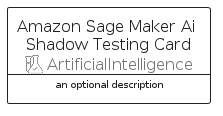
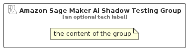

# AmazonSageMakerAiShadowTesting


```text
aws/Resource/ArtificialIntelligence/AmazonSageMakerAiShadowTesting
```

```text
include('aws/Resource/ArtificialIntelligence/AmazonSageMakerAiShadowTesting')
```


| Illustration | AmazonSageMakerAiShadowTesting | AmazonSageMakerAiShadowTestingCard | AmazonSageMakerAiShadowTestingGroup |
| :---: | :---: | :---: | :---: |
|  |  |  |  |


## Sprites
The item provides the following sriptes:

- `<$AmazonSageMakerAiShadowTestingXs>`
- `<$AmazonSageMakerAiShadowTestingSm>`
- `<$AmazonSageMakerAiShadowTestingMd>`
- `<$AmazonSageMakerAiShadowTestingLg>`


## AmazonSageMakerAiShadowTesting

### Load remotely
```plantuml
@startuml
' configures the library
!global $LIB_BASE_LOCATION="https://raw.githubusercontent.com/tmorin/plantuml-libs/master/distribution"

' loads the library's bootstrap
!include $LIB_BASE_LOCATION/bootstrap.puml

' loads the package bootstrap
include('aws/bootstrap')

' loads the Item which embeds the element AmazonSageMakerAiShadowTesting
include('aws/Resource/ArtificialIntelligence/AmazonSageMakerAiShadowTesting')

' renders the element
AmazonSageMakerAiShadowTesting('AmazonSageMakerAiShadowTesting', 'Amazon Sage Maker Ai Shadow Testing', 'an optional tech label', 'an optional description')
@enduml
```

### Load locally
```plantuml
@startuml
' configures the library
!global $INCLUSION_MODE="local"
!global $LIB_BASE_LOCATION="../../.."

' loads the library's bootstrap
!include $LIB_BASE_LOCATION/bootstrap.puml

' loads the package bootstrap
include('aws/bootstrap')

' loads the Item which embeds the element AmazonSageMakerAiShadowTesting
include('aws/Resource/ArtificialIntelligence/AmazonSageMakerAiShadowTesting')

' renders the element
AmazonSageMakerAiShadowTesting('AmazonSageMakerAiShadowTesting', 'Amazon Sage Maker Ai Shadow Testing', 'an optional tech label', 'an optional description')
@enduml
```

## AmazonSageMakerAiShadowTestingCard

### Load remotely
```plantuml
@startuml
' configures the library
!global $LIB_BASE_LOCATION="https://raw.githubusercontent.com/tmorin/plantuml-libs/master/distribution"

' loads the library's bootstrap
!include $LIB_BASE_LOCATION/bootstrap.puml

' loads the package bootstrap
include('aws/bootstrap')

' loads the Item which embeds the element AmazonSageMakerAiShadowTestingCard
include('aws/Resource/ArtificialIntelligence/AmazonSageMakerAiShadowTesting')

' renders the element
AmazonSageMakerAiShadowTestingCard('AmazonSageMakerAiShadowTestingCard', 'Amazon Sage Maker Ai Shadow Testing Card', 'an optional description')
@enduml
```

### Load locally
```plantuml
@startuml
' configures the library
!global $INCLUSION_MODE="local"
!global $LIB_BASE_LOCATION="../../.."

' loads the library's bootstrap
!include $LIB_BASE_LOCATION/bootstrap.puml

' loads the package bootstrap
include('aws/bootstrap')

' loads the Item which embeds the element AmazonSageMakerAiShadowTestingCard
include('aws/Resource/ArtificialIntelligence/AmazonSageMakerAiShadowTesting')

' renders the element
AmazonSageMakerAiShadowTestingCard('AmazonSageMakerAiShadowTestingCard', 'Amazon Sage Maker Ai Shadow Testing Card', 'an optional description')
@enduml
```

## AmazonSageMakerAiShadowTestingGroup

### Load remotely
```plantuml
@startuml
' configures the library
!global $LIB_BASE_LOCATION="https://raw.githubusercontent.com/tmorin/plantuml-libs/master/distribution"

' loads the library's bootstrap
!include $LIB_BASE_LOCATION/bootstrap.puml

' loads the package bootstrap
include('aws/bootstrap')

' loads the Item which embeds the element AmazonSageMakerAiShadowTestingGroup
include('aws/Resource/ArtificialIntelligence/AmazonSageMakerAiShadowTesting')

' renders the element
AmazonSageMakerAiShadowTestingGroup('AmazonSageMakerAiShadowTestingGroup', 'Amazon Sage Maker Ai Shadow Testing Group', 'an optional tech label') {
    note as note
        the content of the group
    end note
}
@enduml
```

### Load locally
```plantuml
@startuml
' configures the library
!global $INCLUSION_MODE="local"
!global $LIB_BASE_LOCATION="../../.."

' loads the library's bootstrap
!include $LIB_BASE_LOCATION/bootstrap.puml

' loads the package bootstrap
include('aws/bootstrap')

' loads the Item which embeds the element AmazonSageMakerAiShadowTestingGroup
include('aws/Resource/ArtificialIntelligence/AmazonSageMakerAiShadowTesting')

' renders the element
AmazonSageMakerAiShadowTestingGroup('AmazonSageMakerAiShadowTestingGroup', 'Amazon Sage Maker Ai Shadow Testing Group', 'an optional tech label') {
    note as note
        the content of the group
    end note
}
@enduml
```

