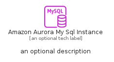
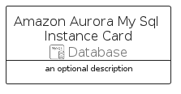

# AmazonAuroraMySqlInstance


```text
aws/Resource/Database/AmazonAuroraMySqlInstance
```

```text
include('aws/Resource/Database/AmazonAuroraMySqlInstance')
```


| Illustration | AmazonAuroraMySqlInstance | AmazonAuroraMySqlInstanceCard | AmazonAuroraMySqlInstanceGroup |
| :---: | :---: | :---: | :---: |
|  |  |  |  |


## Sprites
The item provides the following sriptes:

- `<$AmazonAuroraMySqlInstanceXs>`
- `<$AmazonAuroraMySqlInstanceSm>`
- `<$AmazonAuroraMySqlInstanceMd>`
- `<$AmazonAuroraMySqlInstanceLg>`


## AmazonAuroraMySqlInstance

### Load remotely
```plantuml
@startuml
' configures the library
!global $LIB_BASE_LOCATION="https://raw.githubusercontent.com/tmorin/plantuml-libs/master/distribution"

' loads the library's bootstrap
!include $LIB_BASE_LOCATION/bootstrap.puml

' loads the package bootstrap
include('aws/bootstrap')

' loads the Item which embeds the element AmazonAuroraMySqlInstance
include('aws/Resource/Database/AmazonAuroraMySqlInstance')

' renders the element
AmazonAuroraMySqlInstance('AmazonAuroraMySqlInstance', 'Amazon Aurora My Sql Instance', 'an optional tech label', 'an optional description')
@enduml
```

### Load locally
```plantuml
@startuml
' configures the library
!global $INCLUSION_MODE="local"
!global $LIB_BASE_LOCATION="../../.."

' loads the library's bootstrap
!include $LIB_BASE_LOCATION/bootstrap.puml

' loads the package bootstrap
include('aws/bootstrap')

' loads the Item which embeds the element AmazonAuroraMySqlInstance
include('aws/Resource/Database/AmazonAuroraMySqlInstance')

' renders the element
AmazonAuroraMySqlInstance('AmazonAuroraMySqlInstance', 'Amazon Aurora My Sql Instance', 'an optional tech label', 'an optional description')
@enduml
```

## AmazonAuroraMySqlInstanceCard

### Load remotely
```plantuml
@startuml
' configures the library
!global $LIB_BASE_LOCATION="https://raw.githubusercontent.com/tmorin/plantuml-libs/master/distribution"

' loads the library's bootstrap
!include $LIB_BASE_LOCATION/bootstrap.puml

' loads the package bootstrap
include('aws/bootstrap')

' loads the Item which embeds the element AmazonAuroraMySqlInstanceCard
include('aws/Resource/Database/AmazonAuroraMySqlInstance')

' renders the element
AmazonAuroraMySqlInstanceCard('AmazonAuroraMySqlInstanceCard', 'Amazon Aurora My Sql Instance Card', 'an optional description')
@enduml
```

### Load locally
```plantuml
@startuml
' configures the library
!global $INCLUSION_MODE="local"
!global $LIB_BASE_LOCATION="../../.."

' loads the library's bootstrap
!include $LIB_BASE_LOCATION/bootstrap.puml

' loads the package bootstrap
include('aws/bootstrap')

' loads the Item which embeds the element AmazonAuroraMySqlInstanceCard
include('aws/Resource/Database/AmazonAuroraMySqlInstance')

' renders the element
AmazonAuroraMySqlInstanceCard('AmazonAuroraMySqlInstanceCard', 'Amazon Aurora My Sql Instance Card', 'an optional description')
@enduml
```

## AmazonAuroraMySqlInstanceGroup

### Load remotely
```plantuml
@startuml
' configures the library
!global $LIB_BASE_LOCATION="https://raw.githubusercontent.com/tmorin/plantuml-libs/master/distribution"

' loads the library's bootstrap
!include $LIB_BASE_LOCATION/bootstrap.puml

' loads the package bootstrap
include('aws/bootstrap')

' loads the Item which embeds the element AmazonAuroraMySqlInstanceGroup
include('aws/Resource/Database/AmazonAuroraMySqlInstance')

' renders the element
AmazonAuroraMySqlInstanceGroup('AmazonAuroraMySqlInstanceGroup', 'Amazon Aurora My Sql Instance Group', 'an optional tech label') {
    note as note
        the content of the group
    end note
}
@enduml
```

### Load locally
```plantuml
@startuml
' configures the library
!global $INCLUSION_MODE="local"
!global $LIB_BASE_LOCATION="../../.."

' loads the library's bootstrap
!include $LIB_BASE_LOCATION/bootstrap.puml

' loads the package bootstrap
include('aws/bootstrap')

' loads the Item which embeds the element AmazonAuroraMySqlInstanceGroup
include('aws/Resource/Database/AmazonAuroraMySqlInstance')

' renders the element
AmazonAuroraMySqlInstanceGroup('AmazonAuroraMySqlInstanceGroup', 'Amazon Aurora My Sql Instance Group', 'an optional tech label') {
    note as note
        the content of the group
    end note
}
@enduml
```

