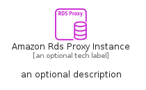
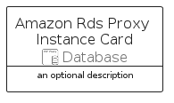
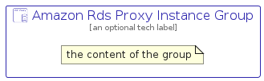

# AmazonRdsProxyInstance


```text
aws/Resource/Database/AmazonRdsProxyInstance
```

```text
include('aws/Resource/Database/AmazonRdsProxyInstance')
```


| Illustration | AmazonRdsProxyInstance | AmazonRdsProxyInstanceCard | AmazonRdsProxyInstanceGroup |
| :---: | :---: | :---: | :---: |
|  |  |  |  |


## Sprites
The item provides the following sriptes:

- `<$AmazonRdsProxyInstanceXs>`
- `<$AmazonRdsProxyInstanceSm>`
- `<$AmazonRdsProxyInstanceMd>`
- `<$AmazonRdsProxyInstanceLg>`


## AmazonRdsProxyInstance

### Load remotely
```plantuml
@startuml
' configures the library
!global $LIB_BASE_LOCATION="https://raw.githubusercontent.com/tmorin/plantuml-libs/master/distribution"

' loads the library's bootstrap
!include $LIB_BASE_LOCATION/bootstrap.puml

' loads the package bootstrap
include('aws/bootstrap')

' loads the Item which embeds the element AmazonRdsProxyInstance
include('aws/Resource/Database/AmazonRdsProxyInstance')

' renders the element
AmazonRdsProxyInstance('AmazonRdsProxyInstance', 'Amazon Rds Proxy Instance', 'an optional tech label', 'an optional description')
@enduml
```

### Load locally
```plantuml
@startuml
' configures the library
!global $INCLUSION_MODE="local"
!global $LIB_BASE_LOCATION="../../.."

' loads the library's bootstrap
!include $LIB_BASE_LOCATION/bootstrap.puml

' loads the package bootstrap
include('aws/bootstrap')

' loads the Item which embeds the element AmazonRdsProxyInstance
include('aws/Resource/Database/AmazonRdsProxyInstance')

' renders the element
AmazonRdsProxyInstance('AmazonRdsProxyInstance', 'Amazon Rds Proxy Instance', 'an optional tech label', 'an optional description')
@enduml
```

## AmazonRdsProxyInstanceCard

### Load remotely
```plantuml
@startuml
' configures the library
!global $LIB_BASE_LOCATION="https://raw.githubusercontent.com/tmorin/plantuml-libs/master/distribution"

' loads the library's bootstrap
!include $LIB_BASE_LOCATION/bootstrap.puml

' loads the package bootstrap
include('aws/bootstrap')

' loads the Item which embeds the element AmazonRdsProxyInstanceCard
include('aws/Resource/Database/AmazonRdsProxyInstance')

' renders the element
AmazonRdsProxyInstanceCard('AmazonRdsProxyInstanceCard', 'Amazon Rds Proxy Instance Card', 'an optional description')
@enduml
```

### Load locally
```plantuml
@startuml
' configures the library
!global $INCLUSION_MODE="local"
!global $LIB_BASE_LOCATION="../../.."

' loads the library's bootstrap
!include $LIB_BASE_LOCATION/bootstrap.puml

' loads the package bootstrap
include('aws/bootstrap')

' loads the Item which embeds the element AmazonRdsProxyInstanceCard
include('aws/Resource/Database/AmazonRdsProxyInstance')

' renders the element
AmazonRdsProxyInstanceCard('AmazonRdsProxyInstanceCard', 'Amazon Rds Proxy Instance Card', 'an optional description')
@enduml
```

## AmazonRdsProxyInstanceGroup

### Load remotely
```plantuml
@startuml
' configures the library
!global $LIB_BASE_LOCATION="https://raw.githubusercontent.com/tmorin/plantuml-libs/master/distribution"

' loads the library's bootstrap
!include $LIB_BASE_LOCATION/bootstrap.puml

' loads the package bootstrap
include('aws/bootstrap')

' loads the Item which embeds the element AmazonRdsProxyInstanceGroup
include('aws/Resource/Database/AmazonRdsProxyInstance')

' renders the element
AmazonRdsProxyInstanceGroup('AmazonRdsProxyInstanceGroup', 'Amazon Rds Proxy Instance Group', 'an optional tech label') {
    note as note
        the content of the group
    end note
}
@enduml
```

### Load locally
```plantuml
@startuml
' configures the library
!global $INCLUSION_MODE="local"
!global $LIB_BASE_LOCATION="../../.."

' loads the library's bootstrap
!include $LIB_BASE_LOCATION/bootstrap.puml

' loads the package bootstrap
include('aws/bootstrap')

' loads the Item which embeds the element AmazonRdsProxyInstanceGroup
include('aws/Resource/Database/AmazonRdsProxyInstance')

' renders the element
AmazonRdsProxyInstanceGroup('AmazonRdsProxyInstanceGroup', 'Amazon Rds Proxy Instance Group', 'an optional tech label') {
    note as note
        the content of the group
    end note
}
@enduml
```

