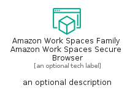
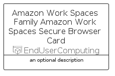
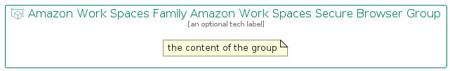

# AmazonWorkSpacesFamilyAmazonWorkSpacesSecureBrowser


```text
aws/Resource/EndUserComputing/AmazonWorkSpacesFamilyAmazonWorkSpacesSecureBrowser
```

```text
include('aws/Resource/EndUserComputing/AmazonWorkSpacesFamilyAmazonWorkSpacesSecureBrowser')
```


| Illustration | AmazonWorkSpacesFamilyAmazonWorkSpacesSecureBrowser | AmazonWorkSpacesFamilyAmazonWorkSpacesSecureBrowserCard | AmazonWorkSpacesFamilyAmazonWorkSpacesSecureBrowserGroup |
| :---: | :---: | :---: | :---: |
|  |  |  |  |


## Sprites
The item provides the following sriptes:

- `<$AmazonWorkSpacesFamilyAmazonWorkSpacesSecureBrowserXs>`
- `<$AmazonWorkSpacesFamilyAmazonWorkSpacesSecureBrowserSm>`
- `<$AmazonWorkSpacesFamilyAmazonWorkSpacesSecureBrowserMd>`
- `<$AmazonWorkSpacesFamilyAmazonWorkSpacesSecureBrowserLg>`


## AmazonWorkSpacesFamilyAmazonWorkSpacesSecureBrowser

### Load remotely
```plantuml
@startuml
' configures the library
!global $LIB_BASE_LOCATION="https://raw.githubusercontent.com/tmorin/plantuml-libs/master/distribution"

' loads the library's bootstrap
!include $LIB_BASE_LOCATION/bootstrap.puml

' loads the package bootstrap
include('aws/bootstrap')

' loads the Item which embeds the element AmazonWorkSpacesFamilyAmazonWorkSpacesSecureBrowser
include('aws/Resource/EndUserComputing/AmazonWorkSpacesFamilyAmazonWorkSpacesSecureBrowser')

' renders the element
AmazonWorkSpacesFamilyAmazonWorkSpacesSecureBrowser('AmazonWorkSpacesFamilyAmazonWorkSpacesSecureBrowser', 'Amazon Work Spaces Family Amazon Work Spaces Secure Browser', 'an optional tech label', 'an optional description')
@enduml
```

### Load locally
```plantuml
@startuml
' configures the library
!global $INCLUSION_MODE="local"
!global $LIB_BASE_LOCATION="../../.."

' loads the library's bootstrap
!include $LIB_BASE_LOCATION/bootstrap.puml

' loads the package bootstrap
include('aws/bootstrap')

' loads the Item which embeds the element AmazonWorkSpacesFamilyAmazonWorkSpacesSecureBrowser
include('aws/Resource/EndUserComputing/AmazonWorkSpacesFamilyAmazonWorkSpacesSecureBrowser')

' renders the element
AmazonWorkSpacesFamilyAmazonWorkSpacesSecureBrowser('AmazonWorkSpacesFamilyAmazonWorkSpacesSecureBrowser', 'Amazon Work Spaces Family Amazon Work Spaces Secure Browser', 'an optional tech label', 'an optional description')
@enduml
```

## AmazonWorkSpacesFamilyAmazonWorkSpacesSecureBrowserCard

### Load remotely
```plantuml
@startuml
' configures the library
!global $LIB_BASE_LOCATION="https://raw.githubusercontent.com/tmorin/plantuml-libs/master/distribution"

' loads the library's bootstrap
!include $LIB_BASE_LOCATION/bootstrap.puml

' loads the package bootstrap
include('aws/bootstrap')

' loads the Item which embeds the element AmazonWorkSpacesFamilyAmazonWorkSpacesSecureBrowserCard
include('aws/Resource/EndUserComputing/AmazonWorkSpacesFamilyAmazonWorkSpacesSecureBrowser')

' renders the element
AmazonWorkSpacesFamilyAmazonWorkSpacesSecureBrowserCard('AmazonWorkSpacesFamilyAmazonWorkSpacesSecureBrowserCard', 'Amazon Work Spaces Family Amazon Work Spaces Secure Browser Card', 'an optional description')
@enduml
```

### Load locally
```plantuml
@startuml
' configures the library
!global $INCLUSION_MODE="local"
!global $LIB_BASE_LOCATION="../../.."

' loads the library's bootstrap
!include $LIB_BASE_LOCATION/bootstrap.puml

' loads the package bootstrap
include('aws/bootstrap')

' loads the Item which embeds the element AmazonWorkSpacesFamilyAmazonWorkSpacesSecureBrowserCard
include('aws/Resource/EndUserComputing/AmazonWorkSpacesFamilyAmazonWorkSpacesSecureBrowser')

' renders the element
AmazonWorkSpacesFamilyAmazonWorkSpacesSecureBrowserCard('AmazonWorkSpacesFamilyAmazonWorkSpacesSecureBrowserCard', 'Amazon Work Spaces Family Amazon Work Spaces Secure Browser Card', 'an optional description')
@enduml
```

## AmazonWorkSpacesFamilyAmazonWorkSpacesSecureBrowserGroup

### Load remotely
```plantuml
@startuml
' configures the library
!global $LIB_BASE_LOCATION="https://raw.githubusercontent.com/tmorin/plantuml-libs/master/distribution"

' loads the library's bootstrap
!include $LIB_BASE_LOCATION/bootstrap.puml

' loads the package bootstrap
include('aws/bootstrap')

' loads the Item which embeds the element AmazonWorkSpacesFamilyAmazonWorkSpacesSecureBrowserGroup
include('aws/Resource/EndUserComputing/AmazonWorkSpacesFamilyAmazonWorkSpacesSecureBrowser')

' renders the element
AmazonWorkSpacesFamilyAmazonWorkSpacesSecureBrowserGroup('AmazonWorkSpacesFamilyAmazonWorkSpacesSecureBrowserGroup', 'Amazon Work Spaces Family Amazon Work Spaces Secure Browser Group', 'an optional tech label') {
    note as note
        the content of the group
    end note
}
@enduml
```

### Load locally
```plantuml
@startuml
' configures the library
!global $INCLUSION_MODE="local"
!global $LIB_BASE_LOCATION="../../.."

' loads the library's bootstrap
!include $LIB_BASE_LOCATION/bootstrap.puml

' loads the package bootstrap
include('aws/bootstrap')

' loads the Item which embeds the element AmazonWorkSpacesFamilyAmazonWorkSpacesSecureBrowserGroup
include('aws/Resource/EndUserComputing/AmazonWorkSpacesFamilyAmazonWorkSpacesSecureBrowser')

' renders the element
AmazonWorkSpacesFamilyAmazonWorkSpacesSecureBrowserGroup('AmazonWorkSpacesFamilyAmazonWorkSpacesSecureBrowserGroup', 'Amazon Work Spaces Family Amazon Work Spaces Secure Browser Group', 'an optional tech label') {
    note as note
        the content of the group
    end note
}
@enduml
```

