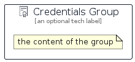

# Credentials


```text
aws/Resource/GeneralIcons/Credentials
```

```text
include('aws/Resource/GeneralIcons/Credentials')
```


| Illustration | Credentials | CredentialsCard | CredentialsGroup |
| :---: | :---: | :---: | :---: |
|  |  |  |  |


## Sprites
The item provides the following sriptes:

- `<$CredentialsXs>`
- `<$CredentialsSm>`
- `<$CredentialsMd>`
- `<$CredentialsLg>`


## Credentials

### Load remotely
```plantuml
@startuml
' configures the library
!global $LIB_BASE_LOCATION="https://raw.githubusercontent.com/tmorin/plantuml-libs/master/distribution"

' loads the library's bootstrap
!include $LIB_BASE_LOCATION/bootstrap.puml

' loads the package bootstrap
include('aws/bootstrap')

' loads the Item which embeds the element Credentials
include('aws/Resource/GeneralIcons/Credentials')

' renders the element
Credentials('Credentials', 'Credentials', 'an optional tech label', 'an optional description')
@enduml
```

### Load locally
```plantuml
@startuml
' configures the library
!global $INCLUSION_MODE="local"
!global $LIB_BASE_LOCATION="../../.."

' loads the library's bootstrap
!include $LIB_BASE_LOCATION/bootstrap.puml

' loads the package bootstrap
include('aws/bootstrap')

' loads the Item which embeds the element Credentials
include('aws/Resource/GeneralIcons/Credentials')

' renders the element
Credentials('Credentials', 'Credentials', 'an optional tech label', 'an optional description')
@enduml
```

## CredentialsCard

### Load remotely
```plantuml
@startuml
' configures the library
!global $LIB_BASE_LOCATION="https://raw.githubusercontent.com/tmorin/plantuml-libs/master/distribution"

' loads the library's bootstrap
!include $LIB_BASE_LOCATION/bootstrap.puml

' loads the package bootstrap
include('aws/bootstrap')

' loads the Item which embeds the element CredentialsCard
include('aws/Resource/GeneralIcons/Credentials')

' renders the element
CredentialsCard('CredentialsCard', 'Credentials Card', 'an optional description')
@enduml
```

### Load locally
```plantuml
@startuml
' configures the library
!global $INCLUSION_MODE="local"
!global $LIB_BASE_LOCATION="../../.."

' loads the library's bootstrap
!include $LIB_BASE_LOCATION/bootstrap.puml

' loads the package bootstrap
include('aws/bootstrap')

' loads the Item which embeds the element CredentialsCard
include('aws/Resource/GeneralIcons/Credentials')

' renders the element
CredentialsCard('CredentialsCard', 'Credentials Card', 'an optional description')
@enduml
```

## CredentialsGroup

### Load remotely
```plantuml
@startuml
' configures the library
!global $LIB_BASE_LOCATION="https://raw.githubusercontent.com/tmorin/plantuml-libs/master/distribution"

' loads the library's bootstrap
!include $LIB_BASE_LOCATION/bootstrap.puml

' loads the package bootstrap
include('aws/bootstrap')

' loads the Item which embeds the element CredentialsGroup
include('aws/Resource/GeneralIcons/Credentials')

' renders the element
CredentialsGroup('CredentialsGroup', 'Credentials Group', 'an optional tech label') {
    note as note
        the content of the group
    end note
}
@enduml
```

### Load locally
```plantuml
@startuml
' configures the library
!global $INCLUSION_MODE="local"
!global $LIB_BASE_LOCATION="../../.."

' loads the library's bootstrap
!include $LIB_BASE_LOCATION/bootstrap.puml

' loads the package bootstrap
include('aws/bootstrap')

' loads the Item which embeds the element CredentialsGroup
include('aws/Resource/GeneralIcons/Credentials')

' renders the element
CredentialsGroup('CredentialsGroup', 'Credentials Group', 'an optional tech label') {
    note as note
        the content of the group
    end note
}
@enduml
```

