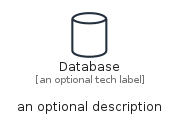
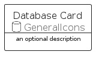
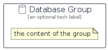

# Database


```text
aws/Resource/GeneralIcons/Database
```

```text
include('aws/Resource/GeneralIcons/Database')
```


| Illustration | Database | DatabaseCard | DatabaseGroup |
| :---: | :---: | :---: | :---: |
|  |  |  |  |


## Sprites
The item provides the following sriptes:

- `<$DatabaseXs>`
- `<$DatabaseSm>`
- `<$DatabaseMd>`
- `<$DatabaseLg>`


## Database

### Load remotely
```plantuml
@startuml
' configures the library
!global $LIB_BASE_LOCATION="https://raw.githubusercontent.com/tmorin/plantuml-libs/master/distribution"

' loads the library's bootstrap
!include $LIB_BASE_LOCATION/bootstrap.puml

' loads the package bootstrap
include('aws/bootstrap')

' loads the Item which embeds the element Database
include('aws/Resource/GeneralIcons/Database')

' renders the element
Database('Database', 'Database', 'an optional tech label', 'an optional description')
@enduml
```

### Load locally
```plantuml
@startuml
' configures the library
!global $INCLUSION_MODE="local"
!global $LIB_BASE_LOCATION="../../.."

' loads the library's bootstrap
!include $LIB_BASE_LOCATION/bootstrap.puml

' loads the package bootstrap
include('aws/bootstrap')

' loads the Item which embeds the element Database
include('aws/Resource/GeneralIcons/Database')

' renders the element
Database('Database', 'Database', 'an optional tech label', 'an optional description')
@enduml
```

## DatabaseCard

### Load remotely
```plantuml
@startuml
' configures the library
!global $LIB_BASE_LOCATION="https://raw.githubusercontent.com/tmorin/plantuml-libs/master/distribution"

' loads the library's bootstrap
!include $LIB_BASE_LOCATION/bootstrap.puml

' loads the package bootstrap
include('aws/bootstrap')

' loads the Item which embeds the element DatabaseCard
include('aws/Resource/GeneralIcons/Database')

' renders the element
DatabaseCard('DatabaseCard', 'Database Card', 'an optional description')
@enduml
```

### Load locally
```plantuml
@startuml
' configures the library
!global $INCLUSION_MODE="local"
!global $LIB_BASE_LOCATION="../../.."

' loads the library's bootstrap
!include $LIB_BASE_LOCATION/bootstrap.puml

' loads the package bootstrap
include('aws/bootstrap')

' loads the Item which embeds the element DatabaseCard
include('aws/Resource/GeneralIcons/Database')

' renders the element
DatabaseCard('DatabaseCard', 'Database Card', 'an optional description')
@enduml
```

## DatabaseGroup

### Load remotely
```plantuml
@startuml
' configures the library
!global $LIB_BASE_LOCATION="https://raw.githubusercontent.com/tmorin/plantuml-libs/master/distribution"

' loads the library's bootstrap
!include $LIB_BASE_LOCATION/bootstrap.puml

' loads the package bootstrap
include('aws/bootstrap')

' loads the Item which embeds the element DatabaseGroup
include('aws/Resource/GeneralIcons/Database')

' renders the element
DatabaseGroup('DatabaseGroup', 'Database Group', 'an optional tech label') {
    note as note
        the content of the group
    end note
}
@enduml
```

### Load locally
```plantuml
@startuml
' configures the library
!global $INCLUSION_MODE="local"
!global $LIB_BASE_LOCATION="../../.."

' loads the library's bootstrap
!include $LIB_BASE_LOCATION/bootstrap.puml

' loads the package bootstrap
include('aws/bootstrap')

' loads the Item which embeds the element DatabaseGroup
include('aws/Resource/GeneralIcons/Database')

' renders the element
DatabaseGroup('DatabaseGroup', 'Database Group', 'an optional tech label') {
    note as note
        the content of the group
    end note
}
@enduml
```

