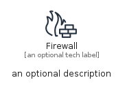
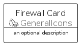
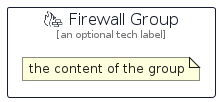

# Firewall


```text
aws/Resource/GeneralIcons/Firewall
```

```text
include('aws/Resource/GeneralIcons/Firewall')
```


| Illustration | Firewall | FirewallCard | FirewallGroup |
| :---: | :---: | :---: | :---: |
|  |  |  |  |


## Sprites
The item provides the following sriptes:

- `<$FirewallXs>`
- `<$FirewallSm>`
- `<$FirewallMd>`
- `<$FirewallLg>`


## Firewall

### Load remotely
```plantuml
@startuml
' configures the library
!global $LIB_BASE_LOCATION="https://raw.githubusercontent.com/tmorin/plantuml-libs/master/distribution"

' loads the library's bootstrap
!include $LIB_BASE_LOCATION/bootstrap.puml

' loads the package bootstrap
include('aws/bootstrap')

' loads the Item which embeds the element Firewall
include('aws/Resource/GeneralIcons/Firewall')

' renders the element
Firewall('Firewall', 'Firewall', 'an optional tech label', 'an optional description')
@enduml
```

### Load locally
```plantuml
@startuml
' configures the library
!global $INCLUSION_MODE="local"
!global $LIB_BASE_LOCATION="../../.."

' loads the library's bootstrap
!include $LIB_BASE_LOCATION/bootstrap.puml

' loads the package bootstrap
include('aws/bootstrap')

' loads the Item which embeds the element Firewall
include('aws/Resource/GeneralIcons/Firewall')

' renders the element
Firewall('Firewall', 'Firewall', 'an optional tech label', 'an optional description')
@enduml
```

## FirewallCard

### Load remotely
```plantuml
@startuml
' configures the library
!global $LIB_BASE_LOCATION="https://raw.githubusercontent.com/tmorin/plantuml-libs/master/distribution"

' loads the library's bootstrap
!include $LIB_BASE_LOCATION/bootstrap.puml

' loads the package bootstrap
include('aws/bootstrap')

' loads the Item which embeds the element FirewallCard
include('aws/Resource/GeneralIcons/Firewall')

' renders the element
FirewallCard('FirewallCard', 'Firewall Card', 'an optional description')
@enduml
```

### Load locally
```plantuml
@startuml
' configures the library
!global $INCLUSION_MODE="local"
!global $LIB_BASE_LOCATION="../../.."

' loads the library's bootstrap
!include $LIB_BASE_LOCATION/bootstrap.puml

' loads the package bootstrap
include('aws/bootstrap')

' loads the Item which embeds the element FirewallCard
include('aws/Resource/GeneralIcons/Firewall')

' renders the element
FirewallCard('FirewallCard', 'Firewall Card', 'an optional description')
@enduml
```

## FirewallGroup

### Load remotely
```plantuml
@startuml
' configures the library
!global $LIB_BASE_LOCATION="https://raw.githubusercontent.com/tmorin/plantuml-libs/master/distribution"

' loads the library's bootstrap
!include $LIB_BASE_LOCATION/bootstrap.puml

' loads the package bootstrap
include('aws/bootstrap')

' loads the Item which embeds the element FirewallGroup
include('aws/Resource/GeneralIcons/Firewall')

' renders the element
FirewallGroup('FirewallGroup', 'Firewall Group', 'an optional tech label') {
    note as note
        the content of the group
    end note
}
@enduml
```

### Load locally
```plantuml
@startuml
' configures the library
!global $INCLUSION_MODE="local"
!global $LIB_BASE_LOCATION="../../.."

' loads the library's bootstrap
!include $LIB_BASE_LOCATION/bootstrap.puml

' loads the package bootstrap
include('aws/bootstrap')

' loads the Item which embeds the element FirewallGroup
include('aws/Resource/GeneralIcons/Firewall')

' renders the element
FirewallGroup('FirewallGroup', 'Firewall Group', 'an optional tech label') {
    note as note
        the content of the group
    end note
}
@enduml
```

