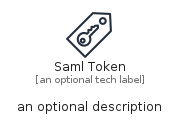
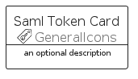
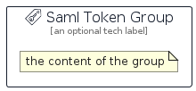

# SamlToken


```text
aws/Resource/GeneralIcons/SamlToken
```

```text
include('aws/Resource/GeneralIcons/SamlToken')
```


| Illustration | SamlToken | SamlTokenCard | SamlTokenGroup |
| :---: | :---: | :---: | :---: |
|  |  |  |  |


## Sprites
The item provides the following sriptes:

- `<$SamlTokenXs>`
- `<$SamlTokenSm>`
- `<$SamlTokenMd>`
- `<$SamlTokenLg>`


## SamlToken

### Load remotely
```plantuml
@startuml
' configures the library
!global $LIB_BASE_LOCATION="https://raw.githubusercontent.com/tmorin/plantuml-libs/master/distribution"

' loads the library's bootstrap
!include $LIB_BASE_LOCATION/bootstrap.puml

' loads the package bootstrap
include('aws/bootstrap')

' loads the Item which embeds the element SamlToken
include('aws/Resource/GeneralIcons/SamlToken')

' renders the element
SamlToken('SamlToken', 'Saml Token', 'an optional tech label', 'an optional description')
@enduml
```

### Load locally
```plantuml
@startuml
' configures the library
!global $INCLUSION_MODE="local"
!global $LIB_BASE_LOCATION="../../.."

' loads the library's bootstrap
!include $LIB_BASE_LOCATION/bootstrap.puml

' loads the package bootstrap
include('aws/bootstrap')

' loads the Item which embeds the element SamlToken
include('aws/Resource/GeneralIcons/SamlToken')

' renders the element
SamlToken('SamlToken', 'Saml Token', 'an optional tech label', 'an optional description')
@enduml
```

## SamlTokenCard

### Load remotely
```plantuml
@startuml
' configures the library
!global $LIB_BASE_LOCATION="https://raw.githubusercontent.com/tmorin/plantuml-libs/master/distribution"

' loads the library's bootstrap
!include $LIB_BASE_LOCATION/bootstrap.puml

' loads the package bootstrap
include('aws/bootstrap')

' loads the Item which embeds the element SamlTokenCard
include('aws/Resource/GeneralIcons/SamlToken')

' renders the element
SamlTokenCard('SamlTokenCard', 'Saml Token Card', 'an optional description')
@enduml
```

### Load locally
```plantuml
@startuml
' configures the library
!global $INCLUSION_MODE="local"
!global $LIB_BASE_LOCATION="../../.."

' loads the library's bootstrap
!include $LIB_BASE_LOCATION/bootstrap.puml

' loads the package bootstrap
include('aws/bootstrap')

' loads the Item which embeds the element SamlTokenCard
include('aws/Resource/GeneralIcons/SamlToken')

' renders the element
SamlTokenCard('SamlTokenCard', 'Saml Token Card', 'an optional description')
@enduml
```

## SamlTokenGroup

### Load remotely
```plantuml
@startuml
' configures the library
!global $LIB_BASE_LOCATION="https://raw.githubusercontent.com/tmorin/plantuml-libs/master/distribution"

' loads the library's bootstrap
!include $LIB_BASE_LOCATION/bootstrap.puml

' loads the package bootstrap
include('aws/bootstrap')

' loads the Item which embeds the element SamlTokenGroup
include('aws/Resource/GeneralIcons/SamlToken')

' renders the element
SamlTokenGroup('SamlTokenGroup', 'Saml Token Group', 'an optional tech label') {
    note as note
        the content of the group
    end note
}
@enduml
```

### Load locally
```plantuml
@startuml
' configures the library
!global $INCLUSION_MODE="local"
!global $LIB_BASE_LOCATION="../../.."

' loads the library's bootstrap
!include $LIB_BASE_LOCATION/bootstrap.puml

' loads the package bootstrap
include('aws/bootstrap')

' loads the Item which embeds the element SamlTokenGroup
include('aws/Resource/GeneralIcons/SamlToken')

' renders the element
SamlTokenGroup('SamlTokenGroup', 'Saml Token Group', 'an optional tech label') {
    note as note
        the content of the group
    end note
}
@enduml
```

