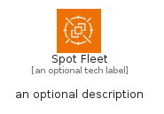
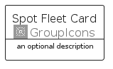
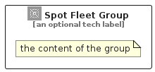

# SpotFleet


```text
aws/Resource/GroupIcons/SpotFleet
```

```text
include('aws/Resource/GroupIcons/SpotFleet')
```


| Illustration | SpotFleet | SpotFleetCard | SpotFleetGroup |
| :---: | :---: | :---: | :---: |
|  |  |  |  |


## Sprites
The item provides the following sriptes:

- `<$SpotFleetXs>`
- `<$SpotFleetSm>`
- `<$SpotFleetMd>`
- `<$SpotFleetLg>`


## SpotFleet

### Load remotely
```plantuml
@startuml
' configures the library
!global $LIB_BASE_LOCATION="https://raw.githubusercontent.com/tmorin/plantuml-libs/master/distribution"

' loads the library's bootstrap
!include $LIB_BASE_LOCATION/bootstrap.puml

' loads the package bootstrap
include('aws/bootstrap')

' loads the Item which embeds the element SpotFleet
include('aws/Resource/GroupIcons/SpotFleet')

' renders the element
SpotFleet('SpotFleet', 'Spot Fleet', 'an optional tech label', 'an optional description')
@enduml
```

### Load locally
```plantuml
@startuml
' configures the library
!global $INCLUSION_MODE="local"
!global $LIB_BASE_LOCATION="../../.."

' loads the library's bootstrap
!include $LIB_BASE_LOCATION/bootstrap.puml

' loads the package bootstrap
include('aws/bootstrap')

' loads the Item which embeds the element SpotFleet
include('aws/Resource/GroupIcons/SpotFleet')

' renders the element
SpotFleet('SpotFleet', 'Spot Fleet', 'an optional tech label', 'an optional description')
@enduml
```

## SpotFleetCard

### Load remotely
```plantuml
@startuml
' configures the library
!global $LIB_BASE_LOCATION="https://raw.githubusercontent.com/tmorin/plantuml-libs/master/distribution"

' loads the library's bootstrap
!include $LIB_BASE_LOCATION/bootstrap.puml

' loads the package bootstrap
include('aws/bootstrap')

' loads the Item which embeds the element SpotFleetCard
include('aws/Resource/GroupIcons/SpotFleet')

' renders the element
SpotFleetCard('SpotFleetCard', 'Spot Fleet Card', 'an optional description')
@enduml
```

### Load locally
```plantuml
@startuml
' configures the library
!global $INCLUSION_MODE="local"
!global $LIB_BASE_LOCATION="../../.."

' loads the library's bootstrap
!include $LIB_BASE_LOCATION/bootstrap.puml

' loads the package bootstrap
include('aws/bootstrap')

' loads the Item which embeds the element SpotFleetCard
include('aws/Resource/GroupIcons/SpotFleet')

' renders the element
SpotFleetCard('SpotFleetCard', 'Spot Fleet Card', 'an optional description')
@enduml
```

## SpotFleetGroup

### Load remotely
```plantuml
@startuml
' configures the library
!global $LIB_BASE_LOCATION="https://raw.githubusercontent.com/tmorin/plantuml-libs/master/distribution"

' loads the library's bootstrap
!include $LIB_BASE_LOCATION/bootstrap.puml

' loads the package bootstrap
include('aws/bootstrap')

' loads the Item which embeds the element SpotFleetGroup
include('aws/Resource/GroupIcons/SpotFleet')

' renders the element
SpotFleetGroup('SpotFleetGroup', 'Spot Fleet Group', 'an optional tech label') {
    note as note
        the content of the group
    end note
}
@enduml
```

### Load locally
```plantuml
@startuml
' configures the library
!global $INCLUSION_MODE="local"
!global $LIB_BASE_LOCATION="../../.."

' loads the library's bootstrap
!include $LIB_BASE_LOCATION/bootstrap.puml

' loads the package bootstrap
include('aws/bootstrap')

' loads the Item which embeds the element SpotFleetGroup
include('aws/Resource/GroupIcons/SpotFleet')

' renders the element
SpotFleetGroup('SpotFleetGroup', 'Spot Fleet Group', 'an optional tech label') {
    note as note
        the content of the group
    end note
}
@enduml
```

