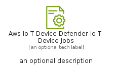
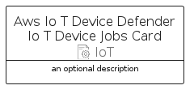
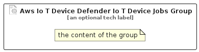

# AwsIoTDeviceDefenderIoTDeviceJobs


```text
aws/Resource/IoT/AwsIoTDeviceDefenderIoTDeviceJobs
```

```text
include('aws/Resource/IoT/AwsIoTDeviceDefenderIoTDeviceJobs')
```


| Illustration | AwsIoTDeviceDefenderIoTDeviceJobs | AwsIoTDeviceDefenderIoTDeviceJobsCard | AwsIoTDeviceDefenderIoTDeviceJobsGroup |
| :---: | :---: | :---: | :---: |
|  |  |  |  |


## Sprites
The item provides the following sriptes:

- `<$AwsIoTDeviceDefenderIoTDeviceJobsXs>`
- `<$AwsIoTDeviceDefenderIoTDeviceJobsSm>`
- `<$AwsIoTDeviceDefenderIoTDeviceJobsMd>`
- `<$AwsIoTDeviceDefenderIoTDeviceJobsLg>`


## AwsIoTDeviceDefenderIoTDeviceJobs

### Load remotely
```plantuml
@startuml
' configures the library
!global $LIB_BASE_LOCATION="https://raw.githubusercontent.com/tmorin/plantuml-libs/master/distribution"

' loads the library's bootstrap
!include $LIB_BASE_LOCATION/bootstrap.puml

' loads the package bootstrap
include('aws/bootstrap')

' loads the Item which embeds the element AwsIoTDeviceDefenderIoTDeviceJobs
include('aws/Resource/IoT/AwsIoTDeviceDefenderIoTDeviceJobs')

' renders the element
AwsIoTDeviceDefenderIoTDeviceJobs('AwsIoTDeviceDefenderIoTDeviceJobs', 'Aws Io T Device Defender Io T Device Jobs', 'an optional tech label', 'an optional description')
@enduml
```

### Load locally
```plantuml
@startuml
' configures the library
!global $INCLUSION_MODE="local"
!global $LIB_BASE_LOCATION="../../.."

' loads the library's bootstrap
!include $LIB_BASE_LOCATION/bootstrap.puml

' loads the package bootstrap
include('aws/bootstrap')

' loads the Item which embeds the element AwsIoTDeviceDefenderIoTDeviceJobs
include('aws/Resource/IoT/AwsIoTDeviceDefenderIoTDeviceJobs')

' renders the element
AwsIoTDeviceDefenderIoTDeviceJobs('AwsIoTDeviceDefenderIoTDeviceJobs', 'Aws Io T Device Defender Io T Device Jobs', 'an optional tech label', 'an optional description')
@enduml
```

## AwsIoTDeviceDefenderIoTDeviceJobsCard

### Load remotely
```plantuml
@startuml
' configures the library
!global $LIB_BASE_LOCATION="https://raw.githubusercontent.com/tmorin/plantuml-libs/master/distribution"

' loads the library's bootstrap
!include $LIB_BASE_LOCATION/bootstrap.puml

' loads the package bootstrap
include('aws/bootstrap')

' loads the Item which embeds the element AwsIoTDeviceDefenderIoTDeviceJobsCard
include('aws/Resource/IoT/AwsIoTDeviceDefenderIoTDeviceJobs')

' renders the element
AwsIoTDeviceDefenderIoTDeviceJobsCard('AwsIoTDeviceDefenderIoTDeviceJobsCard', 'Aws Io T Device Defender Io T Device Jobs Card', 'an optional description')
@enduml
```

### Load locally
```plantuml
@startuml
' configures the library
!global $INCLUSION_MODE="local"
!global $LIB_BASE_LOCATION="../../.."

' loads the library's bootstrap
!include $LIB_BASE_LOCATION/bootstrap.puml

' loads the package bootstrap
include('aws/bootstrap')

' loads the Item which embeds the element AwsIoTDeviceDefenderIoTDeviceJobsCard
include('aws/Resource/IoT/AwsIoTDeviceDefenderIoTDeviceJobs')

' renders the element
AwsIoTDeviceDefenderIoTDeviceJobsCard('AwsIoTDeviceDefenderIoTDeviceJobsCard', 'Aws Io T Device Defender Io T Device Jobs Card', 'an optional description')
@enduml
```

## AwsIoTDeviceDefenderIoTDeviceJobsGroup

### Load remotely
```plantuml
@startuml
' configures the library
!global $LIB_BASE_LOCATION="https://raw.githubusercontent.com/tmorin/plantuml-libs/master/distribution"

' loads the library's bootstrap
!include $LIB_BASE_LOCATION/bootstrap.puml

' loads the package bootstrap
include('aws/bootstrap')

' loads the Item which embeds the element AwsIoTDeviceDefenderIoTDeviceJobsGroup
include('aws/Resource/IoT/AwsIoTDeviceDefenderIoTDeviceJobs')

' renders the element
AwsIoTDeviceDefenderIoTDeviceJobsGroup('AwsIoTDeviceDefenderIoTDeviceJobsGroup', 'Aws Io T Device Defender Io T Device Jobs Group', 'an optional tech label') {
    note as note
        the content of the group
    end note
}
@enduml
```

### Load locally
```plantuml
@startuml
' configures the library
!global $INCLUSION_MODE="local"
!global $LIB_BASE_LOCATION="../../.."

' loads the library's bootstrap
!include $LIB_BASE_LOCATION/bootstrap.puml

' loads the package bootstrap
include('aws/bootstrap')

' loads the Item which embeds the element AwsIoTDeviceDefenderIoTDeviceJobsGroup
include('aws/Resource/IoT/AwsIoTDeviceDefenderIoTDeviceJobs')

' renders the element
AwsIoTDeviceDefenderIoTDeviceJobsGroup('AwsIoTDeviceDefenderIoTDeviceJobsGroup', 'Aws Io T Device Defender Io T Device Jobs Group', 'an optional tech label') {
    note as note
        the content of the group
    end note
}
@enduml
```

