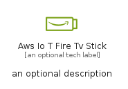
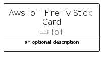
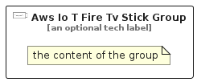

# AwsIoTFireTvStick


```text
aws/Resource/IoT/AwsIoTFireTvStick
```

```text
include('aws/Resource/IoT/AwsIoTFireTvStick')
```


| Illustration | AwsIoTFireTvStick | AwsIoTFireTvStickCard | AwsIoTFireTvStickGroup |
| :---: | :---: | :---: | :---: |
|  |  |  |  |


## Sprites
The item provides the following sriptes:

- `<$AwsIoTFireTvStickXs>`
- `<$AwsIoTFireTvStickSm>`
- `<$AwsIoTFireTvStickMd>`
- `<$AwsIoTFireTvStickLg>`


## AwsIoTFireTvStick

### Load remotely
```plantuml
@startuml
' configures the library
!global $LIB_BASE_LOCATION="https://raw.githubusercontent.com/tmorin/plantuml-libs/master/distribution"

' loads the library's bootstrap
!include $LIB_BASE_LOCATION/bootstrap.puml

' loads the package bootstrap
include('aws/bootstrap')

' loads the Item which embeds the element AwsIoTFireTvStick
include('aws/Resource/IoT/AwsIoTFireTvStick')

' renders the element
AwsIoTFireTvStick('AwsIoTFireTvStick', 'Aws Io T Fire Tv Stick', 'an optional tech label', 'an optional description')
@enduml
```

### Load locally
```plantuml
@startuml
' configures the library
!global $INCLUSION_MODE="local"
!global $LIB_BASE_LOCATION="../../.."

' loads the library's bootstrap
!include $LIB_BASE_LOCATION/bootstrap.puml

' loads the package bootstrap
include('aws/bootstrap')

' loads the Item which embeds the element AwsIoTFireTvStick
include('aws/Resource/IoT/AwsIoTFireTvStick')

' renders the element
AwsIoTFireTvStick('AwsIoTFireTvStick', 'Aws Io T Fire Tv Stick', 'an optional tech label', 'an optional description')
@enduml
```

## AwsIoTFireTvStickCard

### Load remotely
```plantuml
@startuml
' configures the library
!global $LIB_BASE_LOCATION="https://raw.githubusercontent.com/tmorin/plantuml-libs/master/distribution"

' loads the library's bootstrap
!include $LIB_BASE_LOCATION/bootstrap.puml

' loads the package bootstrap
include('aws/bootstrap')

' loads the Item which embeds the element AwsIoTFireTvStickCard
include('aws/Resource/IoT/AwsIoTFireTvStick')

' renders the element
AwsIoTFireTvStickCard('AwsIoTFireTvStickCard', 'Aws Io T Fire Tv Stick Card', 'an optional description')
@enduml
```

### Load locally
```plantuml
@startuml
' configures the library
!global $INCLUSION_MODE="local"
!global $LIB_BASE_LOCATION="../../.."

' loads the library's bootstrap
!include $LIB_BASE_LOCATION/bootstrap.puml

' loads the package bootstrap
include('aws/bootstrap')

' loads the Item which embeds the element AwsIoTFireTvStickCard
include('aws/Resource/IoT/AwsIoTFireTvStick')

' renders the element
AwsIoTFireTvStickCard('AwsIoTFireTvStickCard', 'Aws Io T Fire Tv Stick Card', 'an optional description')
@enduml
```

## AwsIoTFireTvStickGroup

### Load remotely
```plantuml
@startuml
' configures the library
!global $LIB_BASE_LOCATION="https://raw.githubusercontent.com/tmorin/plantuml-libs/master/distribution"

' loads the library's bootstrap
!include $LIB_BASE_LOCATION/bootstrap.puml

' loads the package bootstrap
include('aws/bootstrap')

' loads the Item which embeds the element AwsIoTFireTvStickGroup
include('aws/Resource/IoT/AwsIoTFireTvStick')

' renders the element
AwsIoTFireTvStickGroup('AwsIoTFireTvStickGroup', 'Aws Io T Fire Tv Stick Group', 'an optional tech label') {
    note as note
        the content of the group
    end note
}
@enduml
```

### Load locally
```plantuml
@startuml
' configures the library
!global $INCLUSION_MODE="local"
!global $LIB_BASE_LOCATION="../../.."

' loads the library's bootstrap
!include $LIB_BASE_LOCATION/bootstrap.puml

' loads the package bootstrap
include('aws/bootstrap')

' loads the Item which embeds the element AwsIoTFireTvStickGroup
include('aws/Resource/IoT/AwsIoTFireTvStick')

' renders the element
AwsIoTFireTvStickGroup('AwsIoTFireTvStickGroup', 'Aws Io T Fire Tv Stick Group', 'an optional tech label') {
    note as note
        the content of the group
    end note
}
@enduml
```

