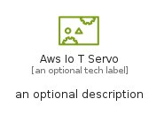
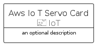
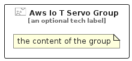

# AwsIoTServo


```text
aws/Resource/IoT/AwsIoTServo
```

```text
include('aws/Resource/IoT/AwsIoTServo')
```


| Illustration | AwsIoTServo | AwsIoTServoCard | AwsIoTServoGroup |
| :---: | :---: | :---: | :---: |
|  |  |  |  |


## Sprites
The item provides the following sriptes:

- `<$AwsIoTServoXs>`
- `<$AwsIoTServoSm>`
- `<$AwsIoTServoMd>`
- `<$AwsIoTServoLg>`


## AwsIoTServo

### Load remotely
```plantuml
@startuml
' configures the library
!global $LIB_BASE_LOCATION="https://raw.githubusercontent.com/tmorin/plantuml-libs/master/distribution"

' loads the library's bootstrap
!include $LIB_BASE_LOCATION/bootstrap.puml

' loads the package bootstrap
include('aws/bootstrap')

' loads the Item which embeds the element AwsIoTServo
include('aws/Resource/IoT/AwsIoTServo')

' renders the element
AwsIoTServo('AwsIoTServo', 'Aws Io T Servo', 'an optional tech label', 'an optional description')
@enduml
```

### Load locally
```plantuml
@startuml
' configures the library
!global $INCLUSION_MODE="local"
!global $LIB_BASE_LOCATION="../../.."

' loads the library's bootstrap
!include $LIB_BASE_LOCATION/bootstrap.puml

' loads the package bootstrap
include('aws/bootstrap')

' loads the Item which embeds the element AwsIoTServo
include('aws/Resource/IoT/AwsIoTServo')

' renders the element
AwsIoTServo('AwsIoTServo', 'Aws Io T Servo', 'an optional tech label', 'an optional description')
@enduml
```

## AwsIoTServoCard

### Load remotely
```plantuml
@startuml
' configures the library
!global $LIB_BASE_LOCATION="https://raw.githubusercontent.com/tmorin/plantuml-libs/master/distribution"

' loads the library's bootstrap
!include $LIB_BASE_LOCATION/bootstrap.puml

' loads the package bootstrap
include('aws/bootstrap')

' loads the Item which embeds the element AwsIoTServoCard
include('aws/Resource/IoT/AwsIoTServo')

' renders the element
AwsIoTServoCard('AwsIoTServoCard', 'Aws Io T Servo Card', 'an optional description')
@enduml
```

### Load locally
```plantuml
@startuml
' configures the library
!global $INCLUSION_MODE="local"
!global $LIB_BASE_LOCATION="../../.."

' loads the library's bootstrap
!include $LIB_BASE_LOCATION/bootstrap.puml

' loads the package bootstrap
include('aws/bootstrap')

' loads the Item which embeds the element AwsIoTServoCard
include('aws/Resource/IoT/AwsIoTServo')

' renders the element
AwsIoTServoCard('AwsIoTServoCard', 'Aws Io T Servo Card', 'an optional description')
@enduml
```

## AwsIoTServoGroup

### Load remotely
```plantuml
@startuml
' configures the library
!global $LIB_BASE_LOCATION="https://raw.githubusercontent.com/tmorin/plantuml-libs/master/distribution"

' loads the library's bootstrap
!include $LIB_BASE_LOCATION/bootstrap.puml

' loads the package bootstrap
include('aws/bootstrap')

' loads the Item which embeds the element AwsIoTServoGroup
include('aws/Resource/IoT/AwsIoTServo')

' renders the element
AwsIoTServoGroup('AwsIoTServoGroup', 'Aws Io T Servo Group', 'an optional tech label') {
    note as note
        the content of the group
    end note
}
@enduml
```

### Load locally
```plantuml
@startuml
' configures the library
!global $INCLUSION_MODE="local"
!global $LIB_BASE_LOCATION="../../.."

' loads the library's bootstrap
!include $LIB_BASE_LOCATION/bootstrap.puml

' loads the package bootstrap
include('aws/bootstrap')

' loads the Item which embeds the element AwsIoTServoGroup
include('aws/Resource/IoT/AwsIoTServo')

' renders the element
AwsIoTServoGroup('AwsIoTServoGroup', 'Aws Io T Servo Group', 'an optional tech label') {
    note as note
        the content of the group
    end note
}
@enduml
```

