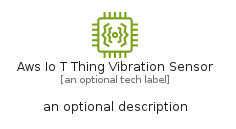
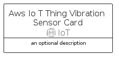
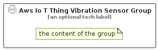

# AwsIoTThingVibrationSensor


```text
aws/Resource/IoT/AwsIoTThingVibrationSensor
```

```text
include('aws/Resource/IoT/AwsIoTThingVibrationSensor')
```


| Illustration | AwsIoTThingVibrationSensor | AwsIoTThingVibrationSensorCard | AwsIoTThingVibrationSensorGroup |
| :---: | :---: | :---: | :---: |
|  |  |  |  |


## Sprites
The item provides the following sriptes:

- `<$AwsIoTThingVibrationSensorXs>`
- `<$AwsIoTThingVibrationSensorSm>`
- `<$AwsIoTThingVibrationSensorMd>`
- `<$AwsIoTThingVibrationSensorLg>`


## AwsIoTThingVibrationSensor

### Load remotely
```plantuml
@startuml
' configures the library
!global $LIB_BASE_LOCATION="https://raw.githubusercontent.com/tmorin/plantuml-libs/master/distribution"

' loads the library's bootstrap
!include $LIB_BASE_LOCATION/bootstrap.puml

' loads the package bootstrap
include('aws/bootstrap')

' loads the Item which embeds the element AwsIoTThingVibrationSensor
include('aws/Resource/IoT/AwsIoTThingVibrationSensor')

' renders the element
AwsIoTThingVibrationSensor('AwsIoTThingVibrationSensor', 'Aws Io T Thing Vibration Sensor', 'an optional tech label', 'an optional description')
@enduml
```

### Load locally
```plantuml
@startuml
' configures the library
!global $INCLUSION_MODE="local"
!global $LIB_BASE_LOCATION="../../.."

' loads the library's bootstrap
!include $LIB_BASE_LOCATION/bootstrap.puml

' loads the package bootstrap
include('aws/bootstrap')

' loads the Item which embeds the element AwsIoTThingVibrationSensor
include('aws/Resource/IoT/AwsIoTThingVibrationSensor')

' renders the element
AwsIoTThingVibrationSensor('AwsIoTThingVibrationSensor', 'Aws Io T Thing Vibration Sensor', 'an optional tech label', 'an optional description')
@enduml
```

## AwsIoTThingVibrationSensorCard

### Load remotely
```plantuml
@startuml
' configures the library
!global $LIB_BASE_LOCATION="https://raw.githubusercontent.com/tmorin/plantuml-libs/master/distribution"

' loads the library's bootstrap
!include $LIB_BASE_LOCATION/bootstrap.puml

' loads the package bootstrap
include('aws/bootstrap')

' loads the Item which embeds the element AwsIoTThingVibrationSensorCard
include('aws/Resource/IoT/AwsIoTThingVibrationSensor')

' renders the element
AwsIoTThingVibrationSensorCard('AwsIoTThingVibrationSensorCard', 'Aws Io T Thing Vibration Sensor Card', 'an optional description')
@enduml
```

### Load locally
```plantuml
@startuml
' configures the library
!global $INCLUSION_MODE="local"
!global $LIB_BASE_LOCATION="../../.."

' loads the library's bootstrap
!include $LIB_BASE_LOCATION/bootstrap.puml

' loads the package bootstrap
include('aws/bootstrap')

' loads the Item which embeds the element AwsIoTThingVibrationSensorCard
include('aws/Resource/IoT/AwsIoTThingVibrationSensor')

' renders the element
AwsIoTThingVibrationSensorCard('AwsIoTThingVibrationSensorCard', 'Aws Io T Thing Vibration Sensor Card', 'an optional description')
@enduml
```

## AwsIoTThingVibrationSensorGroup

### Load remotely
```plantuml
@startuml
' configures the library
!global $LIB_BASE_LOCATION="https://raw.githubusercontent.com/tmorin/plantuml-libs/master/distribution"

' loads the library's bootstrap
!include $LIB_BASE_LOCATION/bootstrap.puml

' loads the package bootstrap
include('aws/bootstrap')

' loads the Item which embeds the element AwsIoTThingVibrationSensorGroup
include('aws/Resource/IoT/AwsIoTThingVibrationSensor')

' renders the element
AwsIoTThingVibrationSensorGroup('AwsIoTThingVibrationSensorGroup', 'Aws Io T Thing Vibration Sensor Group', 'an optional tech label') {
    note as note
        the content of the group
    end note
}
@enduml
```

### Load locally
```plantuml
@startuml
' configures the library
!global $INCLUSION_MODE="local"
!global $LIB_BASE_LOCATION="../../.."

' loads the library's bootstrap
!include $LIB_BASE_LOCATION/bootstrap.puml

' loads the package bootstrap
include('aws/bootstrap')

' loads the Item which embeds the element AwsIoTThingVibrationSensorGroup
include('aws/Resource/IoT/AwsIoTThingVibrationSensor')

' renders the element
AwsIoTThingVibrationSensorGroup('AwsIoTThingVibrationSensorGroup', 'Aws Io T Thing Vibration Sensor Group', 'an optional tech label') {
    note as note
        the content of the group
    end note
}
@enduml
```

