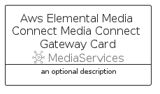

# AwsElementalMediaConnectMediaConnectGateway


```text
aws/Resource/MediaServices/AwsElementalMediaConnectMediaConnectGateway
```

```text
include('aws/Resource/MediaServices/AwsElementalMediaConnectMediaConnectGateway')
```


| Illustration | AwsElementalMediaConnectMediaConnectGateway | AwsElementalMediaConnectMediaConnectGatewayCard | AwsElementalMediaConnectMediaConnectGatewayGroup |
| :---: | :---: | :---: | :---: |
|  |  |  |  |


## Sprites
The item provides the following sriptes:

- `<$AwsElementalMediaConnectMediaConnectGatewayXs>`
- `<$AwsElementalMediaConnectMediaConnectGatewaySm>`
- `<$AwsElementalMediaConnectMediaConnectGatewayMd>`
- `<$AwsElementalMediaConnectMediaConnectGatewayLg>`


## AwsElementalMediaConnectMediaConnectGateway

### Load remotely
```plantuml
@startuml
' configures the library
!global $LIB_BASE_LOCATION="https://raw.githubusercontent.com/tmorin/plantuml-libs/master/distribution"

' loads the library's bootstrap
!include $LIB_BASE_LOCATION/bootstrap.puml

' loads the package bootstrap
include('aws/bootstrap')

' loads the Item which embeds the element AwsElementalMediaConnectMediaConnectGateway
include('aws/Resource/MediaServices/AwsElementalMediaConnectMediaConnectGateway')

' renders the element
AwsElementalMediaConnectMediaConnectGateway('AwsElementalMediaConnectMediaConnectGateway', 'Aws Elemental Media Connect Media Connect Gateway', 'an optional tech label', 'an optional description')
@enduml
```

### Load locally
```plantuml
@startuml
' configures the library
!global $INCLUSION_MODE="local"
!global $LIB_BASE_LOCATION="../../.."

' loads the library's bootstrap
!include $LIB_BASE_LOCATION/bootstrap.puml

' loads the package bootstrap
include('aws/bootstrap')

' loads the Item which embeds the element AwsElementalMediaConnectMediaConnectGateway
include('aws/Resource/MediaServices/AwsElementalMediaConnectMediaConnectGateway')

' renders the element
AwsElementalMediaConnectMediaConnectGateway('AwsElementalMediaConnectMediaConnectGateway', 'Aws Elemental Media Connect Media Connect Gateway', 'an optional tech label', 'an optional description')
@enduml
```

## AwsElementalMediaConnectMediaConnectGatewayCard

### Load remotely
```plantuml
@startuml
' configures the library
!global $LIB_BASE_LOCATION="https://raw.githubusercontent.com/tmorin/plantuml-libs/master/distribution"

' loads the library's bootstrap
!include $LIB_BASE_LOCATION/bootstrap.puml

' loads the package bootstrap
include('aws/bootstrap')

' loads the Item which embeds the element AwsElementalMediaConnectMediaConnectGatewayCard
include('aws/Resource/MediaServices/AwsElementalMediaConnectMediaConnectGateway')

' renders the element
AwsElementalMediaConnectMediaConnectGatewayCard('AwsElementalMediaConnectMediaConnectGatewayCard', 'Aws Elemental Media Connect Media Connect Gateway Card', 'an optional description')
@enduml
```

### Load locally
```plantuml
@startuml
' configures the library
!global $INCLUSION_MODE="local"
!global $LIB_BASE_LOCATION="../../.."

' loads the library's bootstrap
!include $LIB_BASE_LOCATION/bootstrap.puml

' loads the package bootstrap
include('aws/bootstrap')

' loads the Item which embeds the element AwsElementalMediaConnectMediaConnectGatewayCard
include('aws/Resource/MediaServices/AwsElementalMediaConnectMediaConnectGateway')

' renders the element
AwsElementalMediaConnectMediaConnectGatewayCard('AwsElementalMediaConnectMediaConnectGatewayCard', 'Aws Elemental Media Connect Media Connect Gateway Card', 'an optional description')
@enduml
```

## AwsElementalMediaConnectMediaConnectGatewayGroup

### Load remotely
```plantuml
@startuml
' configures the library
!global $LIB_BASE_LOCATION="https://raw.githubusercontent.com/tmorin/plantuml-libs/master/distribution"

' loads the library's bootstrap
!include $LIB_BASE_LOCATION/bootstrap.puml

' loads the package bootstrap
include('aws/bootstrap')

' loads the Item which embeds the element AwsElementalMediaConnectMediaConnectGatewayGroup
include('aws/Resource/MediaServices/AwsElementalMediaConnectMediaConnectGateway')

' renders the element
AwsElementalMediaConnectMediaConnectGatewayGroup('AwsElementalMediaConnectMediaConnectGatewayGroup', 'Aws Elemental Media Connect Media Connect Gateway Group', 'an optional tech label') {
    note as note
        the content of the group
    end note
}
@enduml
```

### Load locally
```plantuml
@startuml
' configures the library
!global $INCLUSION_MODE="local"
!global $LIB_BASE_LOCATION="../../.."

' loads the library's bootstrap
!include $LIB_BASE_LOCATION/bootstrap.puml

' loads the package bootstrap
include('aws/bootstrap')

' loads the Item which embeds the element AwsElementalMediaConnectMediaConnectGatewayGroup
include('aws/Resource/MediaServices/AwsElementalMediaConnectMediaConnectGateway')

' renders the element
AwsElementalMediaConnectMediaConnectGatewayGroup('AwsElementalMediaConnectMediaConnectGatewayGroup', 'Aws Elemental Media Connect Media Connect Gateway Group', 'an optional tech label') {
    note as note
        the content of the group
    end note
}
@enduml
```

