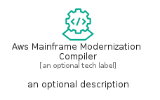
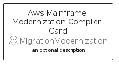
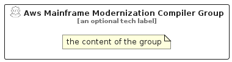

# AwsMainframeModernizationCompiler


```text
aws/Resource/MigrationModernization/AwsMainframeModernizationCompiler
```

```text
include('aws/Resource/MigrationModernization/AwsMainframeModernizationCompiler')
```


| Illustration | AwsMainframeModernizationCompiler | AwsMainframeModernizationCompilerCard | AwsMainframeModernizationCompilerGroup |
| :---: | :---: | :---: | :---: |
|  |  |  |  |


## Sprites
The item provides the following sriptes:

- `<$AwsMainframeModernizationCompilerXs>`
- `<$AwsMainframeModernizationCompilerSm>`
- `<$AwsMainframeModernizationCompilerMd>`
- `<$AwsMainframeModernizationCompilerLg>`


## AwsMainframeModernizationCompiler

### Load remotely
```plantuml
@startuml
' configures the library
!global $LIB_BASE_LOCATION="https://raw.githubusercontent.com/tmorin/plantuml-libs/master/distribution"

' loads the library's bootstrap
!include $LIB_BASE_LOCATION/bootstrap.puml

' loads the package bootstrap
include('aws/bootstrap')

' loads the Item which embeds the element AwsMainframeModernizationCompiler
include('aws/Resource/MigrationModernization/AwsMainframeModernizationCompiler')

' renders the element
AwsMainframeModernizationCompiler('AwsMainframeModernizationCompiler', 'Aws Mainframe Modernization Compiler', 'an optional tech label', 'an optional description')
@enduml
```

### Load locally
```plantuml
@startuml
' configures the library
!global $INCLUSION_MODE="local"
!global $LIB_BASE_LOCATION="../../.."

' loads the library's bootstrap
!include $LIB_BASE_LOCATION/bootstrap.puml

' loads the package bootstrap
include('aws/bootstrap')

' loads the Item which embeds the element AwsMainframeModernizationCompiler
include('aws/Resource/MigrationModernization/AwsMainframeModernizationCompiler')

' renders the element
AwsMainframeModernizationCompiler('AwsMainframeModernizationCompiler', 'Aws Mainframe Modernization Compiler', 'an optional tech label', 'an optional description')
@enduml
```

## AwsMainframeModernizationCompilerCard

### Load remotely
```plantuml
@startuml
' configures the library
!global $LIB_BASE_LOCATION="https://raw.githubusercontent.com/tmorin/plantuml-libs/master/distribution"

' loads the library's bootstrap
!include $LIB_BASE_LOCATION/bootstrap.puml

' loads the package bootstrap
include('aws/bootstrap')

' loads the Item which embeds the element AwsMainframeModernizationCompilerCard
include('aws/Resource/MigrationModernization/AwsMainframeModernizationCompiler')

' renders the element
AwsMainframeModernizationCompilerCard('AwsMainframeModernizationCompilerCard', 'Aws Mainframe Modernization Compiler Card', 'an optional description')
@enduml
```

### Load locally
```plantuml
@startuml
' configures the library
!global $INCLUSION_MODE="local"
!global $LIB_BASE_LOCATION="../../.."

' loads the library's bootstrap
!include $LIB_BASE_LOCATION/bootstrap.puml

' loads the package bootstrap
include('aws/bootstrap')

' loads the Item which embeds the element AwsMainframeModernizationCompilerCard
include('aws/Resource/MigrationModernization/AwsMainframeModernizationCompiler')

' renders the element
AwsMainframeModernizationCompilerCard('AwsMainframeModernizationCompilerCard', 'Aws Mainframe Modernization Compiler Card', 'an optional description')
@enduml
```

## AwsMainframeModernizationCompilerGroup

### Load remotely
```plantuml
@startuml
' configures the library
!global $LIB_BASE_LOCATION="https://raw.githubusercontent.com/tmorin/plantuml-libs/master/distribution"

' loads the library's bootstrap
!include $LIB_BASE_LOCATION/bootstrap.puml

' loads the package bootstrap
include('aws/bootstrap')

' loads the Item which embeds the element AwsMainframeModernizationCompilerGroup
include('aws/Resource/MigrationModernization/AwsMainframeModernizationCompiler')

' renders the element
AwsMainframeModernizationCompilerGroup('AwsMainframeModernizationCompilerGroup', 'Aws Mainframe Modernization Compiler Group', 'an optional tech label') {
    note as note
        the content of the group
    end note
}
@enduml
```

### Load locally
```plantuml
@startuml
' configures the library
!global $INCLUSION_MODE="local"
!global $LIB_BASE_LOCATION="../../.."

' loads the library's bootstrap
!include $LIB_BASE_LOCATION/bootstrap.puml

' loads the package bootstrap
include('aws/bootstrap')

' loads the Item which embeds the element AwsMainframeModernizationCompilerGroup
include('aws/Resource/MigrationModernization/AwsMainframeModernizationCompiler')

' renders the element
AwsMainframeModernizationCompilerGroup('AwsMainframeModernizationCompilerGroup', 'Aws Mainframe Modernization Compiler Group', 'an optional tech label') {
    note as note
        the content of the group
    end note
}
@enduml
```

