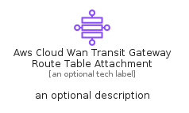
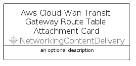

# AwsCloudWanTransitGatewayRouteTableAttachment


```text
aws/Resource/NetworkingContentDelivery/AwsCloudWanTransitGatewayRouteTableAttachment
```

```text
include('aws/Resource/NetworkingContentDelivery/AwsCloudWanTransitGatewayRouteTableAttachment')
```


| Illustration | AwsCloudWanTransitGatewayRouteTableAttachment | AwsCloudWanTransitGatewayRouteTableAttachmentCard | AwsCloudWanTransitGatewayRouteTableAttachmentGroup |
| :---: | :---: | :---: | :---: |
|  |  |  |  |


## Sprites
The item provides the following sriptes:

- `<$AwsCloudWanTransitGatewayRouteTableAttachmentXs>`
- `<$AwsCloudWanTransitGatewayRouteTableAttachmentSm>`
- `<$AwsCloudWanTransitGatewayRouteTableAttachmentMd>`
- `<$AwsCloudWanTransitGatewayRouteTableAttachmentLg>`


## AwsCloudWanTransitGatewayRouteTableAttachment

### Load remotely
```plantuml
@startuml
' configures the library
!global $LIB_BASE_LOCATION="https://raw.githubusercontent.com/tmorin/plantuml-libs/master/distribution"

' loads the library's bootstrap
!include $LIB_BASE_LOCATION/bootstrap.puml

' loads the package bootstrap
include('aws/bootstrap')

' loads the Item which embeds the element AwsCloudWanTransitGatewayRouteTableAttachment
include('aws/Resource/NetworkingContentDelivery/AwsCloudWanTransitGatewayRouteTableAttachment')

' renders the element
AwsCloudWanTransitGatewayRouteTableAttachment('AwsCloudWanTransitGatewayRouteTableAttachment', 'Aws Cloud Wan Transit Gateway Route Table Attachment', 'an optional tech label', 'an optional description')
@enduml
```

### Load locally
```plantuml
@startuml
' configures the library
!global $INCLUSION_MODE="local"
!global $LIB_BASE_LOCATION="../../.."

' loads the library's bootstrap
!include $LIB_BASE_LOCATION/bootstrap.puml

' loads the package bootstrap
include('aws/bootstrap')

' loads the Item which embeds the element AwsCloudWanTransitGatewayRouteTableAttachment
include('aws/Resource/NetworkingContentDelivery/AwsCloudWanTransitGatewayRouteTableAttachment')

' renders the element
AwsCloudWanTransitGatewayRouteTableAttachment('AwsCloudWanTransitGatewayRouteTableAttachment', 'Aws Cloud Wan Transit Gateway Route Table Attachment', 'an optional tech label', 'an optional description')
@enduml
```

## AwsCloudWanTransitGatewayRouteTableAttachmentCard

### Load remotely
```plantuml
@startuml
' configures the library
!global $LIB_BASE_LOCATION="https://raw.githubusercontent.com/tmorin/plantuml-libs/master/distribution"

' loads the library's bootstrap
!include $LIB_BASE_LOCATION/bootstrap.puml

' loads the package bootstrap
include('aws/bootstrap')

' loads the Item which embeds the element AwsCloudWanTransitGatewayRouteTableAttachmentCard
include('aws/Resource/NetworkingContentDelivery/AwsCloudWanTransitGatewayRouteTableAttachment')

' renders the element
AwsCloudWanTransitGatewayRouteTableAttachmentCard('AwsCloudWanTransitGatewayRouteTableAttachmentCard', 'Aws Cloud Wan Transit Gateway Route Table Attachment Card', 'an optional description')
@enduml
```

### Load locally
```plantuml
@startuml
' configures the library
!global $INCLUSION_MODE="local"
!global $LIB_BASE_LOCATION="../../.."

' loads the library's bootstrap
!include $LIB_BASE_LOCATION/bootstrap.puml

' loads the package bootstrap
include('aws/bootstrap')

' loads the Item which embeds the element AwsCloudWanTransitGatewayRouteTableAttachmentCard
include('aws/Resource/NetworkingContentDelivery/AwsCloudWanTransitGatewayRouteTableAttachment')

' renders the element
AwsCloudWanTransitGatewayRouteTableAttachmentCard('AwsCloudWanTransitGatewayRouteTableAttachmentCard', 'Aws Cloud Wan Transit Gateway Route Table Attachment Card', 'an optional description')
@enduml
```

## AwsCloudWanTransitGatewayRouteTableAttachmentGroup

### Load remotely
```plantuml
@startuml
' configures the library
!global $LIB_BASE_LOCATION="https://raw.githubusercontent.com/tmorin/plantuml-libs/master/distribution"

' loads the library's bootstrap
!include $LIB_BASE_LOCATION/bootstrap.puml

' loads the package bootstrap
include('aws/bootstrap')

' loads the Item which embeds the element AwsCloudWanTransitGatewayRouteTableAttachmentGroup
include('aws/Resource/NetworkingContentDelivery/AwsCloudWanTransitGatewayRouteTableAttachment')

' renders the element
AwsCloudWanTransitGatewayRouteTableAttachmentGroup('AwsCloudWanTransitGatewayRouteTableAttachmentGroup', 'Aws Cloud Wan Transit Gateway Route Table Attachment Group', 'an optional tech label') {
    note as note
        the content of the group
    end note
}
@enduml
```

### Load locally
```plantuml
@startuml
' configures the library
!global $INCLUSION_MODE="local"
!global $LIB_BASE_LOCATION="../../.."

' loads the library's bootstrap
!include $LIB_BASE_LOCATION/bootstrap.puml

' loads the package bootstrap
include('aws/bootstrap')

' loads the Item which embeds the element AwsCloudWanTransitGatewayRouteTableAttachmentGroup
include('aws/Resource/NetworkingContentDelivery/AwsCloudWanTransitGatewayRouteTableAttachment')

' renders the element
AwsCloudWanTransitGatewayRouteTableAttachmentGroup('AwsCloudWanTransitGatewayRouteTableAttachmentGroup', 'Aws Cloud Wan Transit Gateway Route Table Attachment Group', 'an optional tech label') {
    note as note
        the content of the group
    end note
}
@enduml
```

