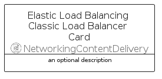

# ElasticLoadBalancingClassicLoadBalancer


```text
aws/Resource/NetworkingContentDelivery/ElasticLoadBalancingClassicLoadBalancer
```

```text
include('aws/Resource/NetworkingContentDelivery/ElasticLoadBalancingClassicLoadBalancer')
```


| Illustration | ElasticLoadBalancingClassicLoadBalancer | ElasticLoadBalancingClassicLoadBalancerCard | ElasticLoadBalancingClassicLoadBalancerGroup |
| :---: | :---: | :---: | :---: |
|  |  |  |  |


## Sprites
The item provides the following sriptes:

- `<$ElasticLoadBalancingClassicLoadBalancerXs>`
- `<$ElasticLoadBalancingClassicLoadBalancerSm>`
- `<$ElasticLoadBalancingClassicLoadBalancerMd>`
- `<$ElasticLoadBalancingClassicLoadBalancerLg>`


## ElasticLoadBalancingClassicLoadBalancer

### Load remotely
```plantuml
@startuml
' configures the library
!global $LIB_BASE_LOCATION="https://raw.githubusercontent.com/tmorin/plantuml-libs/master/distribution"

' loads the library's bootstrap
!include $LIB_BASE_LOCATION/bootstrap.puml

' loads the package bootstrap
include('aws/bootstrap')

' loads the Item which embeds the element ElasticLoadBalancingClassicLoadBalancer
include('aws/Resource/NetworkingContentDelivery/ElasticLoadBalancingClassicLoadBalancer')

' renders the element
ElasticLoadBalancingClassicLoadBalancer('ElasticLoadBalancingClassicLoadBalancer', 'Elastic Load Balancing Classic Load Balancer', 'an optional tech label', 'an optional description')
@enduml
```

### Load locally
```plantuml
@startuml
' configures the library
!global $INCLUSION_MODE="local"
!global $LIB_BASE_LOCATION="../../.."

' loads the library's bootstrap
!include $LIB_BASE_LOCATION/bootstrap.puml

' loads the package bootstrap
include('aws/bootstrap')

' loads the Item which embeds the element ElasticLoadBalancingClassicLoadBalancer
include('aws/Resource/NetworkingContentDelivery/ElasticLoadBalancingClassicLoadBalancer')

' renders the element
ElasticLoadBalancingClassicLoadBalancer('ElasticLoadBalancingClassicLoadBalancer', 'Elastic Load Balancing Classic Load Balancer', 'an optional tech label', 'an optional description')
@enduml
```

## ElasticLoadBalancingClassicLoadBalancerCard

### Load remotely
```plantuml
@startuml
' configures the library
!global $LIB_BASE_LOCATION="https://raw.githubusercontent.com/tmorin/plantuml-libs/master/distribution"

' loads the library's bootstrap
!include $LIB_BASE_LOCATION/bootstrap.puml

' loads the package bootstrap
include('aws/bootstrap')

' loads the Item which embeds the element ElasticLoadBalancingClassicLoadBalancerCard
include('aws/Resource/NetworkingContentDelivery/ElasticLoadBalancingClassicLoadBalancer')

' renders the element
ElasticLoadBalancingClassicLoadBalancerCard('ElasticLoadBalancingClassicLoadBalancerCard', 'Elastic Load Balancing Classic Load Balancer Card', 'an optional description')
@enduml
```

### Load locally
```plantuml
@startuml
' configures the library
!global $INCLUSION_MODE="local"
!global $LIB_BASE_LOCATION="../../.."

' loads the library's bootstrap
!include $LIB_BASE_LOCATION/bootstrap.puml

' loads the package bootstrap
include('aws/bootstrap')

' loads the Item which embeds the element ElasticLoadBalancingClassicLoadBalancerCard
include('aws/Resource/NetworkingContentDelivery/ElasticLoadBalancingClassicLoadBalancer')

' renders the element
ElasticLoadBalancingClassicLoadBalancerCard('ElasticLoadBalancingClassicLoadBalancerCard', 'Elastic Load Balancing Classic Load Balancer Card', 'an optional description')
@enduml
```

## ElasticLoadBalancingClassicLoadBalancerGroup

### Load remotely
```plantuml
@startuml
' configures the library
!global $LIB_BASE_LOCATION="https://raw.githubusercontent.com/tmorin/plantuml-libs/master/distribution"

' loads the library's bootstrap
!include $LIB_BASE_LOCATION/bootstrap.puml

' loads the package bootstrap
include('aws/bootstrap')

' loads the Item which embeds the element ElasticLoadBalancingClassicLoadBalancerGroup
include('aws/Resource/NetworkingContentDelivery/ElasticLoadBalancingClassicLoadBalancer')

' renders the element
ElasticLoadBalancingClassicLoadBalancerGroup('ElasticLoadBalancingClassicLoadBalancerGroup', 'Elastic Load Balancing Classic Load Balancer Group', 'an optional tech label') {
    note as note
        the content of the group
    end note
}
@enduml
```

### Load locally
```plantuml
@startuml
' configures the library
!global $INCLUSION_MODE="local"
!global $LIB_BASE_LOCATION="../../.."

' loads the library's bootstrap
!include $LIB_BASE_LOCATION/bootstrap.puml

' loads the package bootstrap
include('aws/bootstrap')

' loads the Item which embeds the element ElasticLoadBalancingClassicLoadBalancerGroup
include('aws/Resource/NetworkingContentDelivery/ElasticLoadBalancingClassicLoadBalancer')

' renders the element
ElasticLoadBalancingClassicLoadBalancerGroup('ElasticLoadBalancingClassicLoadBalancerGroup', 'Elastic Load Balancing Classic Load Balancer Group', 'an optional tech label') {
    note as note
        the content of the group
    end note
}
@enduml
```

