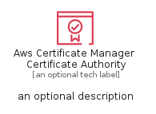
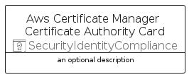

# AwsCertificateManagerCertificateAuthority


```text
aws/Resource/SecurityIdentityCompliance/AwsCertificateManagerCertificateAuthority
```

```text
include('aws/Resource/SecurityIdentityCompliance/AwsCertificateManagerCertificateAuthority')
```


| Illustration | AwsCertificateManagerCertificateAuthority | AwsCertificateManagerCertificateAuthorityCard | AwsCertificateManagerCertificateAuthorityGroup |
| :---: | :---: | :---: | :---: |
|  |  |  |  |


## Sprites
The item provides the following sriptes:

- `<$AwsCertificateManagerCertificateAuthorityXs>`
- `<$AwsCertificateManagerCertificateAuthoritySm>`
- `<$AwsCertificateManagerCertificateAuthorityMd>`
- `<$AwsCertificateManagerCertificateAuthorityLg>`


## AwsCertificateManagerCertificateAuthority

### Load remotely
```plantuml
@startuml
' configures the library
!global $LIB_BASE_LOCATION="https://raw.githubusercontent.com/tmorin/plantuml-libs/master/distribution"

' loads the library's bootstrap
!include $LIB_BASE_LOCATION/bootstrap.puml

' loads the package bootstrap
include('aws/bootstrap')

' loads the Item which embeds the element AwsCertificateManagerCertificateAuthority
include('aws/Resource/SecurityIdentityCompliance/AwsCertificateManagerCertificateAuthority')

' renders the element
AwsCertificateManagerCertificateAuthority('AwsCertificateManagerCertificateAuthority', 'Aws Certificate Manager Certificate Authority', 'an optional tech label', 'an optional description')
@enduml
```

### Load locally
```plantuml
@startuml
' configures the library
!global $INCLUSION_MODE="local"
!global $LIB_BASE_LOCATION="../../.."

' loads the library's bootstrap
!include $LIB_BASE_LOCATION/bootstrap.puml

' loads the package bootstrap
include('aws/bootstrap')

' loads the Item which embeds the element AwsCertificateManagerCertificateAuthority
include('aws/Resource/SecurityIdentityCompliance/AwsCertificateManagerCertificateAuthority')

' renders the element
AwsCertificateManagerCertificateAuthority('AwsCertificateManagerCertificateAuthority', 'Aws Certificate Manager Certificate Authority', 'an optional tech label', 'an optional description')
@enduml
```

## AwsCertificateManagerCertificateAuthorityCard

### Load remotely
```plantuml
@startuml
' configures the library
!global $LIB_BASE_LOCATION="https://raw.githubusercontent.com/tmorin/plantuml-libs/master/distribution"

' loads the library's bootstrap
!include $LIB_BASE_LOCATION/bootstrap.puml

' loads the package bootstrap
include('aws/bootstrap')

' loads the Item which embeds the element AwsCertificateManagerCertificateAuthorityCard
include('aws/Resource/SecurityIdentityCompliance/AwsCertificateManagerCertificateAuthority')

' renders the element
AwsCertificateManagerCertificateAuthorityCard('AwsCertificateManagerCertificateAuthorityCard', 'Aws Certificate Manager Certificate Authority Card', 'an optional description')
@enduml
```

### Load locally
```plantuml
@startuml
' configures the library
!global $INCLUSION_MODE="local"
!global $LIB_BASE_LOCATION="../../.."

' loads the library's bootstrap
!include $LIB_BASE_LOCATION/bootstrap.puml

' loads the package bootstrap
include('aws/bootstrap')

' loads the Item which embeds the element AwsCertificateManagerCertificateAuthorityCard
include('aws/Resource/SecurityIdentityCompliance/AwsCertificateManagerCertificateAuthority')

' renders the element
AwsCertificateManagerCertificateAuthorityCard('AwsCertificateManagerCertificateAuthorityCard', 'Aws Certificate Manager Certificate Authority Card', 'an optional description')
@enduml
```

## AwsCertificateManagerCertificateAuthorityGroup

### Load remotely
```plantuml
@startuml
' configures the library
!global $LIB_BASE_LOCATION="https://raw.githubusercontent.com/tmorin/plantuml-libs/master/distribution"

' loads the library's bootstrap
!include $LIB_BASE_LOCATION/bootstrap.puml

' loads the package bootstrap
include('aws/bootstrap')

' loads the Item which embeds the element AwsCertificateManagerCertificateAuthorityGroup
include('aws/Resource/SecurityIdentityCompliance/AwsCertificateManagerCertificateAuthority')

' renders the element
AwsCertificateManagerCertificateAuthorityGroup('AwsCertificateManagerCertificateAuthorityGroup', 'Aws Certificate Manager Certificate Authority Group', 'an optional tech label') {
    note as note
        the content of the group
    end note
}
@enduml
```

### Load locally
```plantuml
@startuml
' configures the library
!global $INCLUSION_MODE="local"
!global $LIB_BASE_LOCATION="../../.."

' loads the library's bootstrap
!include $LIB_BASE_LOCATION/bootstrap.puml

' loads the package bootstrap
include('aws/bootstrap')

' loads the Item which embeds the element AwsCertificateManagerCertificateAuthorityGroup
include('aws/Resource/SecurityIdentityCompliance/AwsCertificateManagerCertificateAuthority')

' renders the element
AwsCertificateManagerCertificateAuthorityGroup('AwsCertificateManagerCertificateAuthorityGroup', 'Aws Certificate Manager Certificate Authority Group', 'an optional tech label') {
    note as note
        the content of the group
    end note
}
@enduml
```

