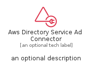
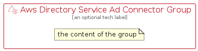

# AwsDirectoryServiceAdConnector


```text
aws/Resource/SecurityIdentityCompliance/AwsDirectoryServiceAdConnector
```

```text
include('aws/Resource/SecurityIdentityCompliance/AwsDirectoryServiceAdConnector')
```


| Illustration | AwsDirectoryServiceAdConnector | AwsDirectoryServiceAdConnectorCard | AwsDirectoryServiceAdConnectorGroup |
| :---: | :---: | :---: | :---: |
|  |  |  |  |


## Sprites
The item provides the following sriptes:

- `<$AwsDirectoryServiceAdConnectorXs>`
- `<$AwsDirectoryServiceAdConnectorSm>`
- `<$AwsDirectoryServiceAdConnectorMd>`
- `<$AwsDirectoryServiceAdConnectorLg>`


## AwsDirectoryServiceAdConnector

### Load remotely
```plantuml
@startuml
' configures the library
!global $LIB_BASE_LOCATION="https://raw.githubusercontent.com/tmorin/plantuml-libs/master/distribution"

' loads the library's bootstrap
!include $LIB_BASE_LOCATION/bootstrap.puml

' loads the package bootstrap
include('aws/bootstrap')

' loads the Item which embeds the element AwsDirectoryServiceAdConnector
include('aws/Resource/SecurityIdentityCompliance/AwsDirectoryServiceAdConnector')

' renders the element
AwsDirectoryServiceAdConnector('AwsDirectoryServiceAdConnector', 'Aws Directory Service Ad Connector', 'an optional tech label', 'an optional description')
@enduml
```

### Load locally
```plantuml
@startuml
' configures the library
!global $INCLUSION_MODE="local"
!global $LIB_BASE_LOCATION="../../.."

' loads the library's bootstrap
!include $LIB_BASE_LOCATION/bootstrap.puml

' loads the package bootstrap
include('aws/bootstrap')

' loads the Item which embeds the element AwsDirectoryServiceAdConnector
include('aws/Resource/SecurityIdentityCompliance/AwsDirectoryServiceAdConnector')

' renders the element
AwsDirectoryServiceAdConnector('AwsDirectoryServiceAdConnector', 'Aws Directory Service Ad Connector', 'an optional tech label', 'an optional description')
@enduml
```

## AwsDirectoryServiceAdConnectorCard

### Load remotely
```plantuml
@startuml
' configures the library
!global $LIB_BASE_LOCATION="https://raw.githubusercontent.com/tmorin/plantuml-libs/master/distribution"

' loads the library's bootstrap
!include $LIB_BASE_LOCATION/bootstrap.puml

' loads the package bootstrap
include('aws/bootstrap')

' loads the Item which embeds the element AwsDirectoryServiceAdConnectorCard
include('aws/Resource/SecurityIdentityCompliance/AwsDirectoryServiceAdConnector')

' renders the element
AwsDirectoryServiceAdConnectorCard('AwsDirectoryServiceAdConnectorCard', 'Aws Directory Service Ad Connector Card', 'an optional description')
@enduml
```

### Load locally
```plantuml
@startuml
' configures the library
!global $INCLUSION_MODE="local"
!global $LIB_BASE_LOCATION="../../.."

' loads the library's bootstrap
!include $LIB_BASE_LOCATION/bootstrap.puml

' loads the package bootstrap
include('aws/bootstrap')

' loads the Item which embeds the element AwsDirectoryServiceAdConnectorCard
include('aws/Resource/SecurityIdentityCompliance/AwsDirectoryServiceAdConnector')

' renders the element
AwsDirectoryServiceAdConnectorCard('AwsDirectoryServiceAdConnectorCard', 'Aws Directory Service Ad Connector Card', 'an optional description')
@enduml
```

## AwsDirectoryServiceAdConnectorGroup

### Load remotely
```plantuml
@startuml
' configures the library
!global $LIB_BASE_LOCATION="https://raw.githubusercontent.com/tmorin/plantuml-libs/master/distribution"

' loads the library's bootstrap
!include $LIB_BASE_LOCATION/bootstrap.puml

' loads the package bootstrap
include('aws/bootstrap')

' loads the Item which embeds the element AwsDirectoryServiceAdConnectorGroup
include('aws/Resource/SecurityIdentityCompliance/AwsDirectoryServiceAdConnector')

' renders the element
AwsDirectoryServiceAdConnectorGroup('AwsDirectoryServiceAdConnectorGroup', 'Aws Directory Service Ad Connector Group', 'an optional tech label') {
    note as note
        the content of the group
    end note
}
@enduml
```

### Load locally
```plantuml
@startuml
' configures the library
!global $INCLUSION_MODE="local"
!global $LIB_BASE_LOCATION="../../.."

' loads the library's bootstrap
!include $LIB_BASE_LOCATION/bootstrap.puml

' loads the package bootstrap
include('aws/bootstrap')

' loads the Item which embeds the element AwsDirectoryServiceAdConnectorGroup
include('aws/Resource/SecurityIdentityCompliance/AwsDirectoryServiceAdConnector')

' renders the element
AwsDirectoryServiceAdConnectorGroup('AwsDirectoryServiceAdConnectorGroup', 'Aws Directory Service Ad Connector Group', 'an optional tech label') {
    note as note
        the content of the group
    end note
}
@enduml
```

