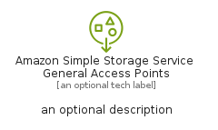
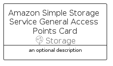

# AmazonSimpleStorageServiceGeneralAccessPoints


```text
aws/Resource/Storage/AmazonSimpleStorageServiceGeneralAccessPoints
```

```text
include('aws/Resource/Storage/AmazonSimpleStorageServiceGeneralAccessPoints')
```


| Illustration | AmazonSimpleStorageServiceGeneralAccessPoints | AmazonSimpleStorageServiceGeneralAccessPointsCard | AmazonSimpleStorageServiceGeneralAccessPointsGroup |
| :---: | :---: | :---: | :---: |
|  |  |  |  |


## Sprites
The item provides the following sriptes:

- `<$AmazonSimpleStorageServiceGeneralAccessPointsXs>`
- `<$AmazonSimpleStorageServiceGeneralAccessPointsSm>`
- `<$AmazonSimpleStorageServiceGeneralAccessPointsMd>`
- `<$AmazonSimpleStorageServiceGeneralAccessPointsLg>`


## AmazonSimpleStorageServiceGeneralAccessPoints

### Load remotely
```plantuml
@startuml
' configures the library
!global $LIB_BASE_LOCATION="https://raw.githubusercontent.com/tmorin/plantuml-libs/master/distribution"

' loads the library's bootstrap
!include $LIB_BASE_LOCATION/bootstrap.puml

' loads the package bootstrap
include('aws/bootstrap')

' loads the Item which embeds the element AmazonSimpleStorageServiceGeneralAccessPoints
include('aws/Resource/Storage/AmazonSimpleStorageServiceGeneralAccessPoints')

' renders the element
AmazonSimpleStorageServiceGeneralAccessPoints('AmazonSimpleStorageServiceGeneralAccessPoints', 'Amazon Simple Storage Service General Access Points', 'an optional tech label', 'an optional description')
@enduml
```

### Load locally
```plantuml
@startuml
' configures the library
!global $INCLUSION_MODE="local"
!global $LIB_BASE_LOCATION="../../.."

' loads the library's bootstrap
!include $LIB_BASE_LOCATION/bootstrap.puml

' loads the package bootstrap
include('aws/bootstrap')

' loads the Item which embeds the element AmazonSimpleStorageServiceGeneralAccessPoints
include('aws/Resource/Storage/AmazonSimpleStorageServiceGeneralAccessPoints')

' renders the element
AmazonSimpleStorageServiceGeneralAccessPoints('AmazonSimpleStorageServiceGeneralAccessPoints', 'Amazon Simple Storage Service General Access Points', 'an optional tech label', 'an optional description')
@enduml
```

## AmazonSimpleStorageServiceGeneralAccessPointsCard

### Load remotely
```plantuml
@startuml
' configures the library
!global $LIB_BASE_LOCATION="https://raw.githubusercontent.com/tmorin/plantuml-libs/master/distribution"

' loads the library's bootstrap
!include $LIB_BASE_LOCATION/bootstrap.puml

' loads the package bootstrap
include('aws/bootstrap')

' loads the Item which embeds the element AmazonSimpleStorageServiceGeneralAccessPointsCard
include('aws/Resource/Storage/AmazonSimpleStorageServiceGeneralAccessPoints')

' renders the element
AmazonSimpleStorageServiceGeneralAccessPointsCard('AmazonSimpleStorageServiceGeneralAccessPointsCard', 'Amazon Simple Storage Service General Access Points Card', 'an optional description')
@enduml
```

### Load locally
```plantuml
@startuml
' configures the library
!global $INCLUSION_MODE="local"
!global $LIB_BASE_LOCATION="../../.."

' loads the library's bootstrap
!include $LIB_BASE_LOCATION/bootstrap.puml

' loads the package bootstrap
include('aws/bootstrap')

' loads the Item which embeds the element AmazonSimpleStorageServiceGeneralAccessPointsCard
include('aws/Resource/Storage/AmazonSimpleStorageServiceGeneralAccessPoints')

' renders the element
AmazonSimpleStorageServiceGeneralAccessPointsCard('AmazonSimpleStorageServiceGeneralAccessPointsCard', 'Amazon Simple Storage Service General Access Points Card', 'an optional description')
@enduml
```

## AmazonSimpleStorageServiceGeneralAccessPointsGroup

### Load remotely
```plantuml
@startuml
' configures the library
!global $LIB_BASE_LOCATION="https://raw.githubusercontent.com/tmorin/plantuml-libs/master/distribution"

' loads the library's bootstrap
!include $LIB_BASE_LOCATION/bootstrap.puml

' loads the package bootstrap
include('aws/bootstrap')

' loads the Item which embeds the element AmazonSimpleStorageServiceGeneralAccessPointsGroup
include('aws/Resource/Storage/AmazonSimpleStorageServiceGeneralAccessPoints')

' renders the element
AmazonSimpleStorageServiceGeneralAccessPointsGroup('AmazonSimpleStorageServiceGeneralAccessPointsGroup', 'Amazon Simple Storage Service General Access Points Group', 'an optional tech label') {
    note as note
        the content of the group
    end note
}
@enduml
```

### Load locally
```plantuml
@startuml
' configures the library
!global $INCLUSION_MODE="local"
!global $LIB_BASE_LOCATION="../../.."

' loads the library's bootstrap
!include $LIB_BASE_LOCATION/bootstrap.puml

' loads the package bootstrap
include('aws/bootstrap')

' loads the Item which embeds the element AmazonSimpleStorageServiceGeneralAccessPointsGroup
include('aws/Resource/Storage/AmazonSimpleStorageServiceGeneralAccessPoints')

' renders the element
AmazonSimpleStorageServiceGeneralAccessPointsGroup('AmazonSimpleStorageServiceGeneralAccessPointsGroup', 'Amazon Simple Storage Service General Access Points Group', 'an optional tech label') {
    note as note
        the content of the group
    end note
}
@enduml
```

