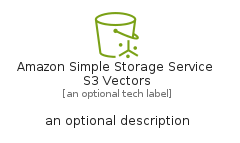
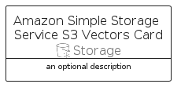

# AmazonSimpleStorageServiceS3Vectors


```text
aws/Resource/Storage/AmazonSimpleStorageServiceS3Vectors
```

```text
include('aws/Resource/Storage/AmazonSimpleStorageServiceS3Vectors')
```


| Illustration | AmazonSimpleStorageServiceS3Vectors | AmazonSimpleStorageServiceS3VectorsCard | AmazonSimpleStorageServiceS3VectorsGroup |
| :---: | :---: | :---: | :---: |
|  |  |  |  |


## Sprites
The item provides the following sriptes:

- `<$AmazonSimpleStorageServiceS3VectorsXs>`
- `<$AmazonSimpleStorageServiceS3VectorsSm>`
- `<$AmazonSimpleStorageServiceS3VectorsMd>`
- `<$AmazonSimpleStorageServiceS3VectorsLg>`


## AmazonSimpleStorageServiceS3Vectors

### Load remotely
```plantuml
@startuml
' configures the library
!global $LIB_BASE_LOCATION="https://raw.githubusercontent.com/tmorin/plantuml-libs/master/distribution"

' loads the library's bootstrap
!include $LIB_BASE_LOCATION/bootstrap.puml

' loads the package bootstrap
include('aws/bootstrap')

' loads the Item which embeds the element AmazonSimpleStorageServiceS3Vectors
include('aws/Resource/Storage/AmazonSimpleStorageServiceS3Vectors')

' renders the element
AmazonSimpleStorageServiceS3Vectors('AmazonSimpleStorageServiceS3Vectors', 'Amazon Simple Storage Service S3 Vectors', 'an optional tech label', 'an optional description')
@enduml
```

### Load locally
```plantuml
@startuml
' configures the library
!global $INCLUSION_MODE="local"
!global $LIB_BASE_LOCATION="../../.."

' loads the library's bootstrap
!include $LIB_BASE_LOCATION/bootstrap.puml

' loads the package bootstrap
include('aws/bootstrap')

' loads the Item which embeds the element AmazonSimpleStorageServiceS3Vectors
include('aws/Resource/Storage/AmazonSimpleStorageServiceS3Vectors')

' renders the element
AmazonSimpleStorageServiceS3Vectors('AmazonSimpleStorageServiceS3Vectors', 'Amazon Simple Storage Service S3 Vectors', 'an optional tech label', 'an optional description')
@enduml
```

## AmazonSimpleStorageServiceS3VectorsCard

### Load remotely
```plantuml
@startuml
' configures the library
!global $LIB_BASE_LOCATION="https://raw.githubusercontent.com/tmorin/plantuml-libs/master/distribution"

' loads the library's bootstrap
!include $LIB_BASE_LOCATION/bootstrap.puml

' loads the package bootstrap
include('aws/bootstrap')

' loads the Item which embeds the element AmazonSimpleStorageServiceS3VectorsCard
include('aws/Resource/Storage/AmazonSimpleStorageServiceS3Vectors')

' renders the element
AmazonSimpleStorageServiceS3VectorsCard('AmazonSimpleStorageServiceS3VectorsCard', 'Amazon Simple Storage Service S3 Vectors Card', 'an optional description')
@enduml
```

### Load locally
```plantuml
@startuml
' configures the library
!global $INCLUSION_MODE="local"
!global $LIB_BASE_LOCATION="../../.."

' loads the library's bootstrap
!include $LIB_BASE_LOCATION/bootstrap.puml

' loads the package bootstrap
include('aws/bootstrap')

' loads the Item which embeds the element AmazonSimpleStorageServiceS3VectorsCard
include('aws/Resource/Storage/AmazonSimpleStorageServiceS3Vectors')

' renders the element
AmazonSimpleStorageServiceS3VectorsCard('AmazonSimpleStorageServiceS3VectorsCard', 'Amazon Simple Storage Service S3 Vectors Card', 'an optional description')
@enduml
```

## AmazonSimpleStorageServiceS3VectorsGroup

### Load remotely
```plantuml
@startuml
' configures the library
!global $LIB_BASE_LOCATION="https://raw.githubusercontent.com/tmorin/plantuml-libs/master/distribution"

' loads the library's bootstrap
!include $LIB_BASE_LOCATION/bootstrap.puml

' loads the package bootstrap
include('aws/bootstrap')

' loads the Item which embeds the element AmazonSimpleStorageServiceS3VectorsGroup
include('aws/Resource/Storage/AmazonSimpleStorageServiceS3Vectors')

' renders the element
AmazonSimpleStorageServiceS3VectorsGroup('AmazonSimpleStorageServiceS3VectorsGroup', 'Amazon Simple Storage Service S3 Vectors Group', 'an optional tech label') {
    note as note
        the content of the group
    end note
}
@enduml
```

### Load locally
```plantuml
@startuml
' configures the library
!global $INCLUSION_MODE="local"
!global $LIB_BASE_LOCATION="../../.."

' loads the library's bootstrap
!include $LIB_BASE_LOCATION/bootstrap.puml

' loads the package bootstrap
include('aws/bootstrap')

' loads the Item which embeds the element AmazonSimpleStorageServiceS3VectorsGroup
include('aws/Resource/Storage/AmazonSimpleStorageServiceS3Vectors')

' renders the element
AmazonSimpleStorageServiceS3VectorsGroup('AmazonSimpleStorageServiceS3VectorsGroup', 'Amazon Simple Storage Service S3 Vectors Group', 'an optional tech label') {
    note as note
        the content of the group
    end note
}
@enduml
```

