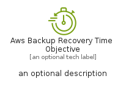
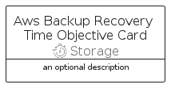

# AwsBackupRecoveryTimeObjective


```text
aws/Resource/Storage/AwsBackupRecoveryTimeObjective
```

```text
include('aws/Resource/Storage/AwsBackupRecoveryTimeObjective')
```


| Illustration | AwsBackupRecoveryTimeObjective | AwsBackupRecoveryTimeObjectiveCard | AwsBackupRecoveryTimeObjectiveGroup |
| :---: | :---: | :---: | :---: |
|  |  |  |  |


## Sprites
The item provides the following sriptes:

- `<$AwsBackupRecoveryTimeObjectiveXs>`
- `<$AwsBackupRecoveryTimeObjectiveSm>`
- `<$AwsBackupRecoveryTimeObjectiveMd>`
- `<$AwsBackupRecoveryTimeObjectiveLg>`


## AwsBackupRecoveryTimeObjective

### Load remotely
```plantuml
@startuml
' configures the library
!global $LIB_BASE_LOCATION="https://raw.githubusercontent.com/tmorin/plantuml-libs/master/distribution"

' loads the library's bootstrap
!include $LIB_BASE_LOCATION/bootstrap.puml

' loads the package bootstrap
include('aws/bootstrap')

' loads the Item which embeds the element AwsBackupRecoveryTimeObjective
include('aws/Resource/Storage/AwsBackupRecoveryTimeObjective')

' renders the element
AwsBackupRecoveryTimeObjective('AwsBackupRecoveryTimeObjective', 'Aws Backup Recovery Time Objective', 'an optional tech label', 'an optional description')
@enduml
```

### Load locally
```plantuml
@startuml
' configures the library
!global $INCLUSION_MODE="local"
!global $LIB_BASE_LOCATION="../../.."

' loads the library's bootstrap
!include $LIB_BASE_LOCATION/bootstrap.puml

' loads the package bootstrap
include('aws/bootstrap')

' loads the Item which embeds the element AwsBackupRecoveryTimeObjective
include('aws/Resource/Storage/AwsBackupRecoveryTimeObjective')

' renders the element
AwsBackupRecoveryTimeObjective('AwsBackupRecoveryTimeObjective', 'Aws Backup Recovery Time Objective', 'an optional tech label', 'an optional description')
@enduml
```

## AwsBackupRecoveryTimeObjectiveCard

### Load remotely
```plantuml
@startuml
' configures the library
!global $LIB_BASE_LOCATION="https://raw.githubusercontent.com/tmorin/plantuml-libs/master/distribution"

' loads the library's bootstrap
!include $LIB_BASE_LOCATION/bootstrap.puml

' loads the package bootstrap
include('aws/bootstrap')

' loads the Item which embeds the element AwsBackupRecoveryTimeObjectiveCard
include('aws/Resource/Storage/AwsBackupRecoveryTimeObjective')

' renders the element
AwsBackupRecoveryTimeObjectiveCard('AwsBackupRecoveryTimeObjectiveCard', 'Aws Backup Recovery Time Objective Card', 'an optional description')
@enduml
```

### Load locally
```plantuml
@startuml
' configures the library
!global $INCLUSION_MODE="local"
!global $LIB_BASE_LOCATION="../../.."

' loads the library's bootstrap
!include $LIB_BASE_LOCATION/bootstrap.puml

' loads the package bootstrap
include('aws/bootstrap')

' loads the Item which embeds the element AwsBackupRecoveryTimeObjectiveCard
include('aws/Resource/Storage/AwsBackupRecoveryTimeObjective')

' renders the element
AwsBackupRecoveryTimeObjectiveCard('AwsBackupRecoveryTimeObjectiveCard', 'Aws Backup Recovery Time Objective Card', 'an optional description')
@enduml
```

## AwsBackupRecoveryTimeObjectiveGroup

### Load remotely
```plantuml
@startuml
' configures the library
!global $LIB_BASE_LOCATION="https://raw.githubusercontent.com/tmorin/plantuml-libs/master/distribution"

' loads the library's bootstrap
!include $LIB_BASE_LOCATION/bootstrap.puml

' loads the package bootstrap
include('aws/bootstrap')

' loads the Item which embeds the element AwsBackupRecoveryTimeObjectiveGroup
include('aws/Resource/Storage/AwsBackupRecoveryTimeObjective')

' renders the element
AwsBackupRecoveryTimeObjectiveGroup('AwsBackupRecoveryTimeObjectiveGroup', 'Aws Backup Recovery Time Objective Group', 'an optional tech label') {
    note as note
        the content of the group
    end note
}
@enduml
```

### Load locally
```plantuml
@startuml
' configures the library
!global $INCLUSION_MODE="local"
!global $LIB_BASE_LOCATION="../../.."

' loads the library's bootstrap
!include $LIB_BASE_LOCATION/bootstrap.puml

' loads the package bootstrap
include('aws/bootstrap')

' loads the Item which embeds the element AwsBackupRecoveryTimeObjectiveGroup
include('aws/Resource/Storage/AwsBackupRecoveryTimeObjective')

' renders the element
AwsBackupRecoveryTimeObjectiveGroup('AwsBackupRecoveryTimeObjectiveGroup', 'Aws Backup Recovery Time Objective Group', 'an optional tech label') {
    note as note
        the content of the group
    end note
}
@enduml
```

