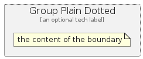

# GroupPlainDotted


```text
azure-11/Group/GroupPlainDotted
```

```text
include('azure-11/Group/GroupPlainDotted')
```


| GroupPlainDotted |
| :---: |
|  |


## GroupPlainDotted

### Load remotely
```plantuml
@startuml
' configures the library
!global $LIB_BASE_LOCATION="https://raw.githubusercontent.com/tmorin/plantuml-libs/master/distribution"

' loads the library's bootstrap
!include $LIB_BASE_LOCATION/bootstrap.puml

' loads the package bootstrap
include('azure-11/bootstrap')

' loads the Item which embeds the element GroupPlainDotted
include('azure-11/Group/GroupPlainDotted')

GroupPlainDotted('GroupPlainDotted', 'Group Plain Dotted', 'an optional tech label') {
  note as note
  the content of the boundary
  end note
}
@enduml
```

### Load locally
```plantuml
@startuml
' configures the library
!global $INCLUSION_MODE="local"
!global $LIB_BASE_LOCATION="../.."

' loads the library's bootstrap
!include $LIB_BASE_LOCATION/bootstrap.puml

' loads the package bootstrap
include('azure-11/bootstrap')

' loads the Item which embeds the element GroupPlainDotted
include('azure-11/Group/GroupPlainDotted')

GroupPlainDotted('GroupPlainDotted', 'Group Plain Dotted', 'an optional tech label') {
  note as note
  the content of the boundary
  end note
}
@enduml
```

