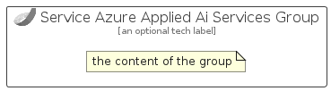

# ServiceAzureAppliedAiServices


```text
azure-11/Item/AiMachineLearning/ServiceAzureAppliedAiServices
```

```text
include('azure-11/Item/AiMachineLearning/ServiceAzureAppliedAiServices')
```


| Illustration | ServiceAzureAppliedAiServices | ServiceAzureAppliedAiServicesCard | ServiceAzureAppliedAiServicesGroup |
| :---: | :---: | :---: | :---: |
|  |  |  |  |


## ServiceAzureAppliedAiServices

### Load remotely
```plantuml
@startuml
' configures the library
!global $LIB_BASE_LOCATION="https://raw.githubusercontent.com/tmorin/plantuml-libs/master/distribution"

' loads the library's bootstrap
!include $LIB_BASE_LOCATION/bootstrap.puml

' loads the package bootstrap
include('azure-11/bootstrap')

' loads the Item which embeds the element ServiceAzureAppliedAiServices
include('azure-11/Item/AiMachineLearning/ServiceAzureAppliedAiServices')

' renders the element
ServiceAzureAppliedAiServices('ServiceAzureAppliedAiServices', 'Service Azure Applied Ai Services', 'an optional tech label', 'an optional description')
@enduml
```

### Load locally
```plantuml
@startuml
' configures the library
!global $INCLUSION_MODE="local"
!global $LIB_BASE_LOCATION="../../.."

' loads the library's bootstrap
!include $LIB_BASE_LOCATION/bootstrap.puml

' loads the package bootstrap
include('azure-11/bootstrap')

' loads the Item which embeds the element ServiceAzureAppliedAiServices
include('azure-11/Item/AiMachineLearning/ServiceAzureAppliedAiServices')

' renders the element
ServiceAzureAppliedAiServices('ServiceAzureAppliedAiServices', 'Service Azure Applied Ai Services', 'an optional tech label', 'an optional description')
@enduml
```

## ServiceAzureAppliedAiServicesCard

### Load remotely
```plantuml
@startuml
' configures the library
!global $LIB_BASE_LOCATION="https://raw.githubusercontent.com/tmorin/plantuml-libs/master/distribution"

' loads the library's bootstrap
!include $LIB_BASE_LOCATION/bootstrap.puml

' loads the package bootstrap
include('azure-11/bootstrap')

' loads the Item which embeds the element ServiceAzureAppliedAiServicesCard
include('azure-11/Item/AiMachineLearning/ServiceAzureAppliedAiServices')

' renders the element
ServiceAzureAppliedAiServicesCard('ServiceAzureAppliedAiServicesCard', 'Service Azure Applied Ai Services Card', 'an optional description')
@enduml
```

### Load locally
```plantuml
@startuml
' configures the library
!global $INCLUSION_MODE="local"
!global $LIB_BASE_LOCATION="../../.."

' loads the library's bootstrap
!include $LIB_BASE_LOCATION/bootstrap.puml

' loads the package bootstrap
include('azure-11/bootstrap')

' loads the Item which embeds the element ServiceAzureAppliedAiServicesCard
include('azure-11/Item/AiMachineLearning/ServiceAzureAppliedAiServices')

' renders the element
ServiceAzureAppliedAiServicesCard('ServiceAzureAppliedAiServicesCard', 'Service Azure Applied Ai Services Card', 'an optional description')
@enduml
```

## ServiceAzureAppliedAiServicesGroup

### Load remotely
```plantuml
@startuml
' configures the library
!global $LIB_BASE_LOCATION="https://raw.githubusercontent.com/tmorin/plantuml-libs/master/distribution"

' loads the library's bootstrap
!include $LIB_BASE_LOCATION/bootstrap.puml

' loads the package bootstrap
include('azure-11/bootstrap')

' loads the Item which embeds the element ServiceAzureAppliedAiServicesGroup
include('azure-11/Item/AiMachineLearning/ServiceAzureAppliedAiServices')

' renders the element
ServiceAzureAppliedAiServicesGroup('ServiceAzureAppliedAiServicesGroup', 'Service Azure Applied Ai Services Group', 'an optional tech label') {
    note as note
        the content of the group
    end note
}
@enduml
```

### Load locally
```plantuml
@startuml
' configures the library
!global $INCLUSION_MODE="local"
!global $LIB_BASE_LOCATION="../../.."

' loads the library's bootstrap
!include $LIB_BASE_LOCATION/bootstrap.puml

' loads the package bootstrap
include('azure-11/bootstrap')

' loads the Item which embeds the element ServiceAzureAppliedAiServicesGroup
include('azure-11/Item/AiMachineLearning/ServiceAzureAppliedAiServices')

' renders the element
ServiceAzureAppliedAiServicesGroup('ServiceAzureAppliedAiServicesGroup', 'Service Azure Applied Ai Services Group', 'an optional tech label') {
    note as note
        the content of the group
    end note
}
@enduml
```

