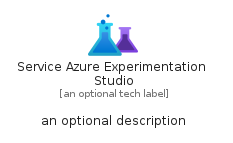

# ServiceAzureExperimentationStudio


```text
azure-11/Item/AiMachineLearning/ServiceAzureExperimentationStudio
```

```text
include('azure-11/Item/AiMachineLearning/ServiceAzureExperimentationStudio')
```


| Illustration | ServiceAzureExperimentationStudio | ServiceAzureExperimentationStudioCard | ServiceAzureExperimentationStudioGroup |
| :---: | :---: | :---: | :---: |
|  |  |  |  |


## ServiceAzureExperimentationStudio

### Load remotely
```plantuml
@startuml
' configures the library
!global $LIB_BASE_LOCATION="https://raw.githubusercontent.com/tmorin/plantuml-libs/master/distribution"

' loads the library's bootstrap
!include $LIB_BASE_LOCATION/bootstrap.puml

' loads the package bootstrap
include('azure-11/bootstrap')

' loads the Item which embeds the element ServiceAzureExperimentationStudio
include('azure-11/Item/AiMachineLearning/ServiceAzureExperimentationStudio')

' renders the element
ServiceAzureExperimentationStudio('ServiceAzureExperimentationStudio', 'Service Azure Experimentation Studio', 'an optional tech label', 'an optional description')
@enduml
```

### Load locally
```plantuml
@startuml
' configures the library
!global $INCLUSION_MODE="local"
!global $LIB_BASE_LOCATION="../../.."

' loads the library's bootstrap
!include $LIB_BASE_LOCATION/bootstrap.puml

' loads the package bootstrap
include('azure-11/bootstrap')

' loads the Item which embeds the element ServiceAzureExperimentationStudio
include('azure-11/Item/AiMachineLearning/ServiceAzureExperimentationStudio')

' renders the element
ServiceAzureExperimentationStudio('ServiceAzureExperimentationStudio', 'Service Azure Experimentation Studio', 'an optional tech label', 'an optional description')
@enduml
```

## ServiceAzureExperimentationStudioCard

### Load remotely
```plantuml
@startuml
' configures the library
!global $LIB_BASE_LOCATION="https://raw.githubusercontent.com/tmorin/plantuml-libs/master/distribution"

' loads the library's bootstrap
!include $LIB_BASE_LOCATION/bootstrap.puml

' loads the package bootstrap
include('azure-11/bootstrap')

' loads the Item which embeds the element ServiceAzureExperimentationStudioCard
include('azure-11/Item/AiMachineLearning/ServiceAzureExperimentationStudio')

' renders the element
ServiceAzureExperimentationStudioCard('ServiceAzureExperimentationStudioCard', 'Service Azure Experimentation Studio Card', 'an optional description')
@enduml
```

### Load locally
```plantuml
@startuml
' configures the library
!global $INCLUSION_MODE="local"
!global $LIB_BASE_LOCATION="../../.."

' loads the library's bootstrap
!include $LIB_BASE_LOCATION/bootstrap.puml

' loads the package bootstrap
include('azure-11/bootstrap')

' loads the Item which embeds the element ServiceAzureExperimentationStudioCard
include('azure-11/Item/AiMachineLearning/ServiceAzureExperimentationStudio')

' renders the element
ServiceAzureExperimentationStudioCard('ServiceAzureExperimentationStudioCard', 'Service Azure Experimentation Studio Card', 'an optional description')
@enduml
```

## ServiceAzureExperimentationStudioGroup

### Load remotely
```plantuml
@startuml
' configures the library
!global $LIB_BASE_LOCATION="https://raw.githubusercontent.com/tmorin/plantuml-libs/master/distribution"

' loads the library's bootstrap
!include $LIB_BASE_LOCATION/bootstrap.puml

' loads the package bootstrap
include('azure-11/bootstrap')

' loads the Item which embeds the element ServiceAzureExperimentationStudioGroup
include('azure-11/Item/AiMachineLearning/ServiceAzureExperimentationStudio')

' renders the element
ServiceAzureExperimentationStudioGroup('ServiceAzureExperimentationStudioGroup', 'Service Azure Experimentation Studio Group', 'an optional tech label') {
    note as note
        the content of the group
    end note
}
@enduml
```

### Load locally
```plantuml
@startuml
' configures the library
!global $INCLUSION_MODE="local"
!global $LIB_BASE_LOCATION="../../.."

' loads the library's bootstrap
!include $LIB_BASE_LOCATION/bootstrap.puml

' loads the package bootstrap
include('azure-11/bootstrap')

' loads the Item which embeds the element ServiceAzureExperimentationStudioGroup
include('azure-11/Item/AiMachineLearning/ServiceAzureExperimentationStudio')

' renders the element
ServiceAzureExperimentationStudioGroup('ServiceAzureExperimentationStudioGroup', 'Service Azure Experimentation Studio Group', 'an optional tech label') {
    note as note
        the content of the group
    end note
}
@enduml
```

