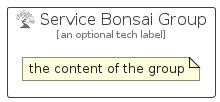

# ServiceBonsai


```text
azure-11/Item/AiMachineLearning/ServiceBonsai
```

```text
include('azure-11/Item/AiMachineLearning/ServiceBonsai')
```


| Illustration | ServiceBonsai | ServiceBonsaiCard | ServiceBonsaiGroup |
| :---: | :---: | :---: | :---: |
|  |  |  |  |


## Sprites
The item provides the following sriptes:

- `<$ServiceBonsaiXs>`
- `<$ServiceBonsaiSm>`
- `<$ServiceBonsaiMd>`
- `<$ServiceBonsaiLg>`


## ServiceBonsai

### Load remotely
```plantuml
@startuml
' configures the library
!global $LIB_BASE_LOCATION="https://raw.githubusercontent.com/tmorin/plantuml-libs/master/distribution"

' loads the library's bootstrap
!include $LIB_BASE_LOCATION/bootstrap.puml

' loads the package bootstrap
include('azure-11/bootstrap')

' loads the Item which embeds the element ServiceBonsai
include('azure-11/Item/AiMachineLearning/ServiceBonsai')

' renders the element
ServiceBonsai('ServiceBonsai', 'Service Bonsai', 'an optional tech label', 'an optional description')
@enduml
```

### Load locally
```plantuml
@startuml
' configures the library
!global $INCLUSION_MODE="local"
!global $LIB_BASE_LOCATION="../../.."

' loads the library's bootstrap
!include $LIB_BASE_LOCATION/bootstrap.puml

' loads the package bootstrap
include('azure-11/bootstrap')

' loads the Item which embeds the element ServiceBonsai
include('azure-11/Item/AiMachineLearning/ServiceBonsai')

' renders the element
ServiceBonsai('ServiceBonsai', 'Service Bonsai', 'an optional tech label', 'an optional description')
@enduml
```

## ServiceBonsaiCard

### Load remotely
```plantuml
@startuml
' configures the library
!global $LIB_BASE_LOCATION="https://raw.githubusercontent.com/tmorin/plantuml-libs/master/distribution"

' loads the library's bootstrap
!include $LIB_BASE_LOCATION/bootstrap.puml

' loads the package bootstrap
include('azure-11/bootstrap')

' loads the Item which embeds the element ServiceBonsaiCard
include('azure-11/Item/AiMachineLearning/ServiceBonsai')

' renders the element
ServiceBonsaiCard('ServiceBonsaiCard', 'Service Bonsai Card', 'an optional description')
@enduml
```

### Load locally
```plantuml
@startuml
' configures the library
!global $INCLUSION_MODE="local"
!global $LIB_BASE_LOCATION="../../.."

' loads the library's bootstrap
!include $LIB_BASE_LOCATION/bootstrap.puml

' loads the package bootstrap
include('azure-11/bootstrap')

' loads the Item which embeds the element ServiceBonsaiCard
include('azure-11/Item/AiMachineLearning/ServiceBonsai')

' renders the element
ServiceBonsaiCard('ServiceBonsaiCard', 'Service Bonsai Card', 'an optional description')
@enduml
```

## ServiceBonsaiGroup

### Load remotely
```plantuml
@startuml
' configures the library
!global $LIB_BASE_LOCATION="https://raw.githubusercontent.com/tmorin/plantuml-libs/master/distribution"

' loads the library's bootstrap
!include $LIB_BASE_LOCATION/bootstrap.puml

' loads the package bootstrap
include('azure-11/bootstrap')

' loads the Item which embeds the element ServiceBonsaiGroup
include('azure-11/Item/AiMachineLearning/ServiceBonsai')

' renders the element
ServiceBonsaiGroup('ServiceBonsaiGroup', 'Service Bonsai Group', 'an optional tech label') {
    note as note
        the content of the group
    end note
}
@enduml
```

### Load locally
```plantuml
@startuml
' configures the library
!global $INCLUSION_MODE="local"
!global $LIB_BASE_LOCATION="../../.."

' loads the library's bootstrap
!include $LIB_BASE_LOCATION/bootstrap.puml

' loads the package bootstrap
include('azure-11/bootstrap')

' loads the Item which embeds the element ServiceBonsaiGroup
include('azure-11/Item/AiMachineLearning/ServiceBonsai')

' renders the element
ServiceBonsaiGroup('ServiceBonsaiGroup', 'Service Bonsai Group', 'an optional tech label') {
    note as note
        the content of the group
    end note
}
@enduml
```

