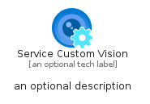
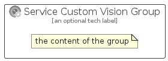

# ServiceCustomVision


```text
azure-11/Item/AiMachineLearning/ServiceCustomVision
```

```text
include('azure-11/Item/AiMachineLearning/ServiceCustomVision')
```


| Illustration | ServiceCustomVision | ServiceCustomVisionCard | ServiceCustomVisionGroup |
| :---: | :---: | :---: | :---: |
|  |  |  |  |


## Sprites
The item provides the following sriptes:

- `<$ServiceCustomVisionXs>`
- `<$ServiceCustomVisionSm>`
- `<$ServiceCustomVisionMd>`
- `<$ServiceCustomVisionLg>`


## ServiceCustomVision

### Load remotely
```plantuml
@startuml
' configures the library
!global $LIB_BASE_LOCATION="https://raw.githubusercontent.com/tmorin/plantuml-libs/master/distribution"

' loads the library's bootstrap
!include $LIB_BASE_LOCATION/bootstrap.puml

' loads the package bootstrap
include('azure-11/bootstrap')

' loads the Item which embeds the element ServiceCustomVision
include('azure-11/Item/AiMachineLearning/ServiceCustomVision')

' renders the element
ServiceCustomVision('ServiceCustomVision', 'Service Custom Vision', 'an optional tech label', 'an optional description')
@enduml
```

### Load locally
```plantuml
@startuml
' configures the library
!global $INCLUSION_MODE="local"
!global $LIB_BASE_LOCATION="../../.."

' loads the library's bootstrap
!include $LIB_BASE_LOCATION/bootstrap.puml

' loads the package bootstrap
include('azure-11/bootstrap')

' loads the Item which embeds the element ServiceCustomVision
include('azure-11/Item/AiMachineLearning/ServiceCustomVision')

' renders the element
ServiceCustomVision('ServiceCustomVision', 'Service Custom Vision', 'an optional tech label', 'an optional description')
@enduml
```

## ServiceCustomVisionCard

### Load remotely
```plantuml
@startuml
' configures the library
!global $LIB_BASE_LOCATION="https://raw.githubusercontent.com/tmorin/plantuml-libs/master/distribution"

' loads the library's bootstrap
!include $LIB_BASE_LOCATION/bootstrap.puml

' loads the package bootstrap
include('azure-11/bootstrap')

' loads the Item which embeds the element ServiceCustomVisionCard
include('azure-11/Item/AiMachineLearning/ServiceCustomVision')

' renders the element
ServiceCustomVisionCard('ServiceCustomVisionCard', 'Service Custom Vision Card', 'an optional description')
@enduml
```

### Load locally
```plantuml
@startuml
' configures the library
!global $INCLUSION_MODE="local"
!global $LIB_BASE_LOCATION="../../.."

' loads the library's bootstrap
!include $LIB_BASE_LOCATION/bootstrap.puml

' loads the package bootstrap
include('azure-11/bootstrap')

' loads the Item which embeds the element ServiceCustomVisionCard
include('azure-11/Item/AiMachineLearning/ServiceCustomVision')

' renders the element
ServiceCustomVisionCard('ServiceCustomVisionCard', 'Service Custom Vision Card', 'an optional description')
@enduml
```

## ServiceCustomVisionGroup

### Load remotely
```plantuml
@startuml
' configures the library
!global $LIB_BASE_LOCATION="https://raw.githubusercontent.com/tmorin/plantuml-libs/master/distribution"

' loads the library's bootstrap
!include $LIB_BASE_LOCATION/bootstrap.puml

' loads the package bootstrap
include('azure-11/bootstrap')

' loads the Item which embeds the element ServiceCustomVisionGroup
include('azure-11/Item/AiMachineLearning/ServiceCustomVision')

' renders the element
ServiceCustomVisionGroup('ServiceCustomVisionGroup', 'Service Custom Vision Group', 'an optional tech label') {
    note as note
        the content of the group
    end note
}
@enduml
```

### Load locally
```plantuml
@startuml
' configures the library
!global $INCLUSION_MODE="local"
!global $LIB_BASE_LOCATION="../../.."

' loads the library's bootstrap
!include $LIB_BASE_LOCATION/bootstrap.puml

' loads the package bootstrap
include('azure-11/bootstrap')

' loads the Item which embeds the element ServiceCustomVisionGroup
include('azure-11/Item/AiMachineLearning/ServiceCustomVision')

' renders the element
ServiceCustomVisionGroup('ServiceCustomVisionGroup', 'Service Custom Vision Group', 'an optional tech label') {
    note as note
        the content of the group
    end note
}
@enduml
```

