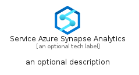
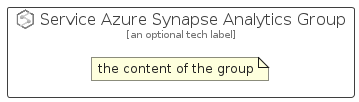

# ServiceAzureSynapseAnalytics


```text
azure-11/Item/Analytics/ServiceAzureSynapseAnalytics
```

```text
include('azure-11/Item/Analytics/ServiceAzureSynapseAnalytics')
```


| Illustration | ServiceAzureSynapseAnalytics | ServiceAzureSynapseAnalyticsCard | ServiceAzureSynapseAnalyticsGroup |
| :---: | :---: | :---: | :---: |
|  |  |  |  |


## ServiceAzureSynapseAnalytics

### Load remotely
```plantuml
@startuml
' configures the library
!global $LIB_BASE_LOCATION="https://raw.githubusercontent.com/tmorin/plantuml-libs/master/distribution"

' loads the library's bootstrap
!include $LIB_BASE_LOCATION/bootstrap.puml

' loads the package bootstrap
include('azure-11/bootstrap')

' loads the Item which embeds the element ServiceAzureSynapseAnalytics
include('azure-11/Item/Analytics/ServiceAzureSynapseAnalytics')

' renders the element
ServiceAzureSynapseAnalytics('ServiceAzureSynapseAnalytics', 'Service Azure Synapse Analytics', 'an optional tech label', 'an optional description')
@enduml
```

### Load locally
```plantuml
@startuml
' configures the library
!global $INCLUSION_MODE="local"
!global $LIB_BASE_LOCATION="../../.."

' loads the library's bootstrap
!include $LIB_BASE_LOCATION/bootstrap.puml

' loads the package bootstrap
include('azure-11/bootstrap')

' loads the Item which embeds the element ServiceAzureSynapseAnalytics
include('azure-11/Item/Analytics/ServiceAzureSynapseAnalytics')

' renders the element
ServiceAzureSynapseAnalytics('ServiceAzureSynapseAnalytics', 'Service Azure Synapse Analytics', 'an optional tech label', 'an optional description')
@enduml
```

## ServiceAzureSynapseAnalyticsCard

### Load remotely
```plantuml
@startuml
' configures the library
!global $LIB_BASE_LOCATION="https://raw.githubusercontent.com/tmorin/plantuml-libs/master/distribution"

' loads the library's bootstrap
!include $LIB_BASE_LOCATION/bootstrap.puml

' loads the package bootstrap
include('azure-11/bootstrap')

' loads the Item which embeds the element ServiceAzureSynapseAnalyticsCard
include('azure-11/Item/Analytics/ServiceAzureSynapseAnalytics')

' renders the element
ServiceAzureSynapseAnalyticsCard('ServiceAzureSynapseAnalyticsCard', 'Service Azure Synapse Analytics Card', 'an optional description')
@enduml
```

### Load locally
```plantuml
@startuml
' configures the library
!global $INCLUSION_MODE="local"
!global $LIB_BASE_LOCATION="../../.."

' loads the library's bootstrap
!include $LIB_BASE_LOCATION/bootstrap.puml

' loads the package bootstrap
include('azure-11/bootstrap')

' loads the Item which embeds the element ServiceAzureSynapseAnalyticsCard
include('azure-11/Item/Analytics/ServiceAzureSynapseAnalytics')

' renders the element
ServiceAzureSynapseAnalyticsCard('ServiceAzureSynapseAnalyticsCard', 'Service Azure Synapse Analytics Card', 'an optional description')
@enduml
```

## ServiceAzureSynapseAnalyticsGroup

### Load remotely
```plantuml
@startuml
' configures the library
!global $LIB_BASE_LOCATION="https://raw.githubusercontent.com/tmorin/plantuml-libs/master/distribution"

' loads the library's bootstrap
!include $LIB_BASE_LOCATION/bootstrap.puml

' loads the package bootstrap
include('azure-11/bootstrap')

' loads the Item which embeds the element ServiceAzureSynapseAnalyticsGroup
include('azure-11/Item/Analytics/ServiceAzureSynapseAnalytics')

' renders the element
ServiceAzureSynapseAnalyticsGroup('ServiceAzureSynapseAnalyticsGroup', 'Service Azure Synapse Analytics Group', 'an optional tech label') {
    note as note
        the content of the group
    end note
}
@enduml
```

### Load locally
```plantuml
@startuml
' configures the library
!global $INCLUSION_MODE="local"
!global $LIB_BASE_LOCATION="../../.."

' loads the library's bootstrap
!include $LIB_BASE_LOCATION/bootstrap.puml

' loads the package bootstrap
include('azure-11/bootstrap')

' loads the Item which embeds the element ServiceAzureSynapseAnalyticsGroup
include('azure-11/Item/Analytics/ServiceAzureSynapseAnalytics')

' renders the element
ServiceAzureSynapseAnalyticsGroup('ServiceAzureSynapseAnalyticsGroup', 'Service Azure Synapse Analytics Group', 'an optional tech label') {
    note as note
        the content of the group
    end note
}
@enduml
```

